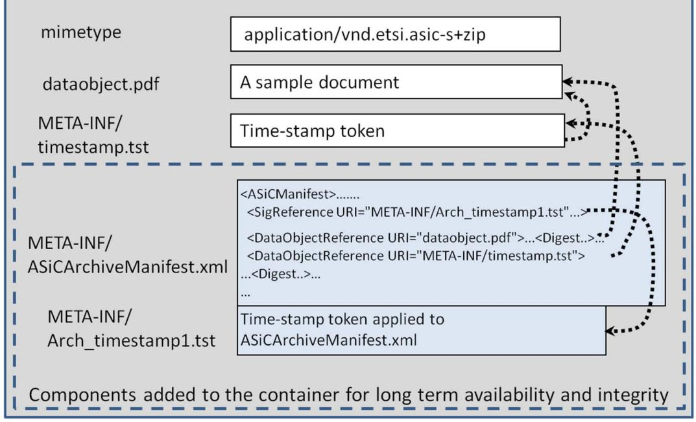
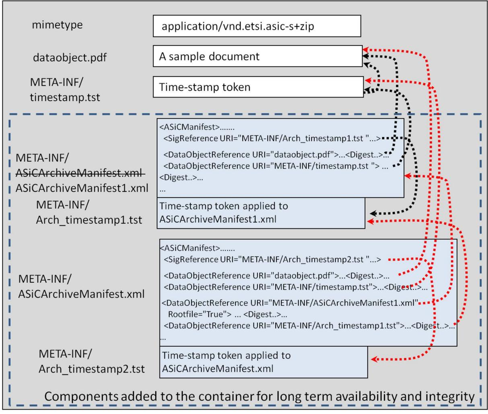
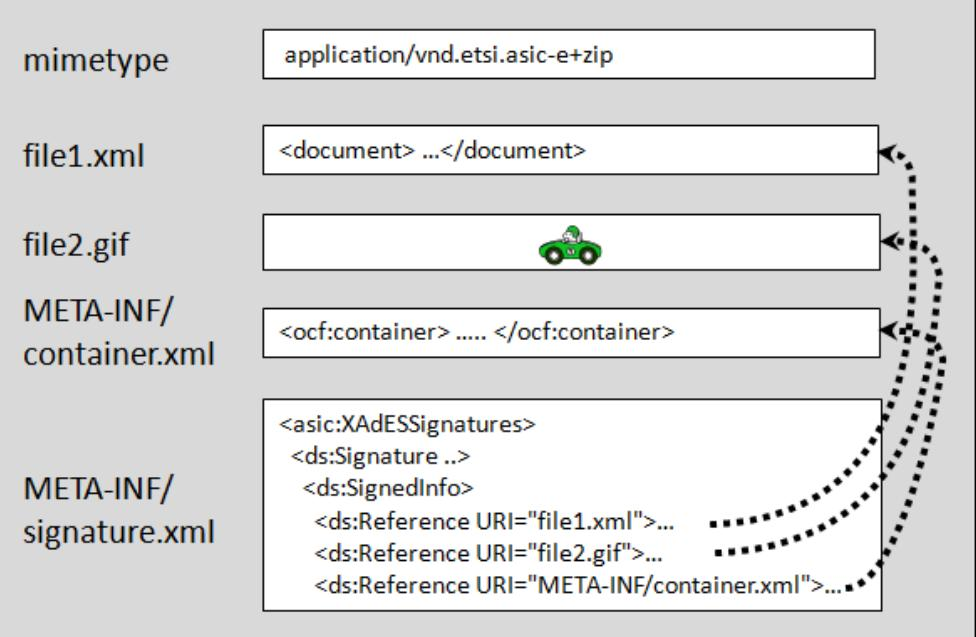
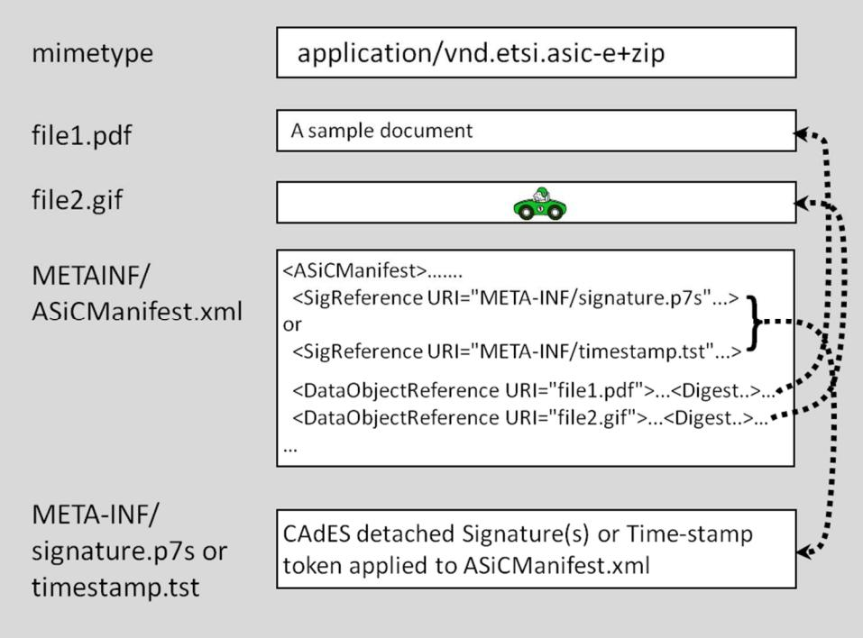
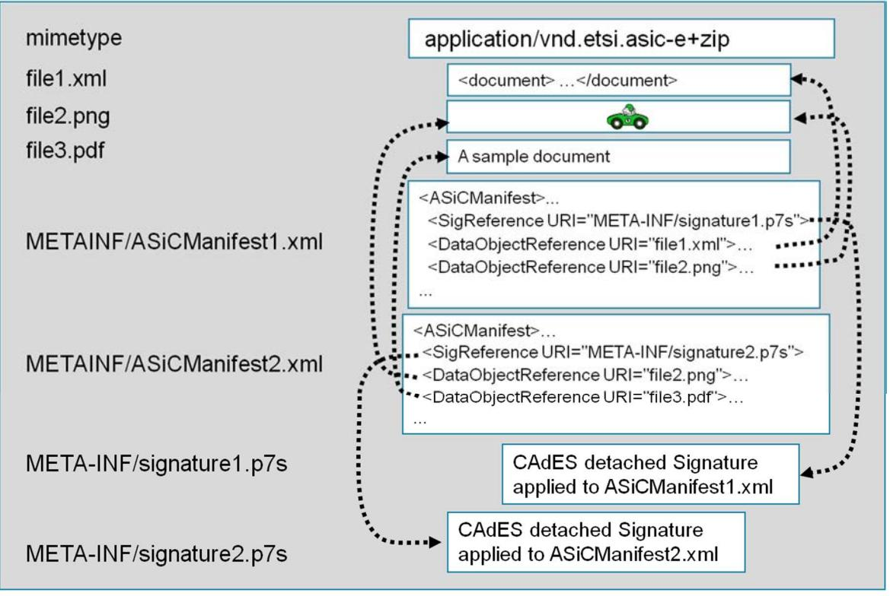
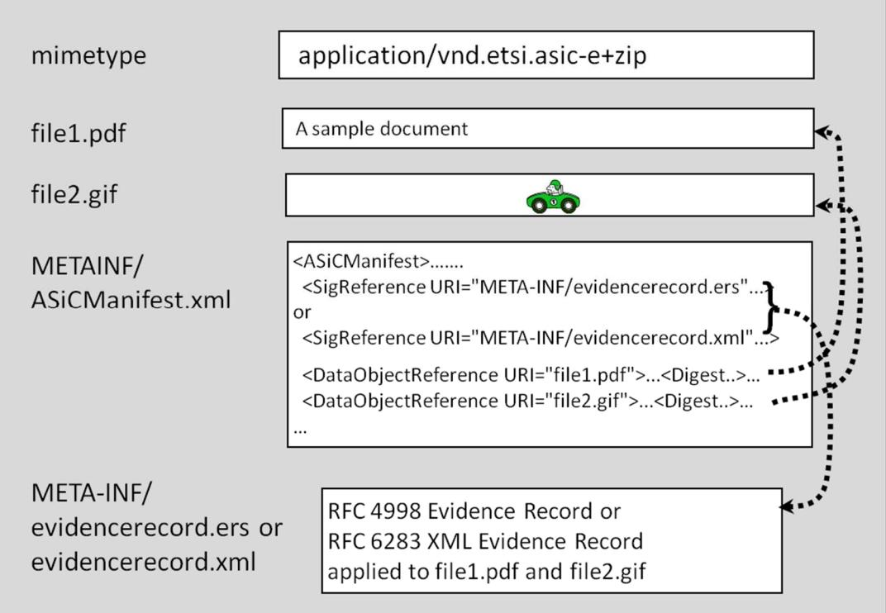

# ETSI EN 319 162-1 V1.1.1 (2016-04)


**Electronic Signatures and Infrastructures (ESI); Associated Signature Containers (ASiC); Part 1: Building blocks and ASiC baseline containers** 

Reference DEN/ESI-0019162-1

Keywords ASiC, e-commerce, electronic signature, security

#### *ETSI*

#### 650 Route des Lucioles F-06921 Sophia Antipolis Cedex - FRANCE

Tel.: +33 4 92 94 42 00 Fax: +33 4 93 65 47 16

Siret N° 348 623 562 00017 - NAF 742 C Association à but non lucratif enregistrée à la Sous-Préfecture de Grasse (06) N° 7803/88

#### *Important notice*

The present document can be downloaded from: <http://www.etsi.org/standards-search>

The present document may be made available in electronic versions and/or in print. The content of any electronic and/or print versions of the present document shall not be modified without the prior written authorization of ETSI. In case of any existing or perceived difference in contents between such versions and/or in print, the only prevailing document is the print of the Portable Document Format (PDF) version kept on a specific network drive within ETSI Secretariat.

Users of the present document should be aware that the document may be subject to revision or change of status. Information on the current status of this and other ETSI documents is available at <https://portal.etsi.org/TB/ETSIDeliverableStatus.aspx>

If you find errors in the present document, please send your comment to one of the following services: <https://portal.etsi.org/People/CommiteeSupportStaff.aspx>

#### *Copyright Notification*

No part may be reproduced or utilized in any form or by any means, electronic or mechanical, including photocopying and microfilm except as authorized by written permission of ETSI.

The content of the PDF version shall not be modified without the written authorization of ETSI. The copyright and the foregoing restriction extend to reproduction in all media.

> © European Telecommunications Standards Institute 2016. All rights reserved.

**DECT**TM, **PLUGTESTS**TM, **UMTS**TM and the ETSI logo are Trade Marks of ETSI registered for the benefit of its Members. **3GPP**TM and **LTE**™ are Trade Marks of ETSI registered for the benefit of its Members and of the 3GPP Organizational Partners.

**GSM**® and the GSM logo are Trade Marks registered and owned by the GSM Association.

|                            | Intellectual Property Rights  5                                                      |  |  |  |
|----------------------------|--------------------------------------------------------------------------------------|--|--|--|
| Foreword  5                |                                                                                      |  |  |  |
| Modal verbs terminology  5 |                                                                                      |  |  |  |
| Introduction  5            |                                                                                      |  |  |  |
| 1                          | Scope  7                                                                             |  |  |  |
| 2                          | References  7                                                                        |  |  |  |
| 2.1                        | Normative references  7                                                              |  |  |  |
| 2.2                        | Informative references  8                                                            |  |  |  |
| 3                          | Definitions and abbreviations  9                                                     |  |  |  |
| 3.1                        | Definitions  9                                                                       |  |  |  |
| 3.2                        | Abbreviations  9                                                                     |  |  |  |
| 4                          | General Syntax  10                                                                   |  |  |  |
| 4.1                        | Description of main features of Associated Signature Containers  10                  |  |  |  |
| 4.1.1                      | Basic container structure  10                                                        |  |  |  |
| 4.1.2                      | Container types  10                                                                  |  |  |  |
| 4.2                        | General requirements  11                                                             |  |  |  |
| 4.3                        | Associated Signature Container Simple (ASiC-S)  11                                   |  |  |  |
| 4.3.1                      | Introduction 11                                                                      |  |  |  |
| 4.3.2                      | General requirements for ASiC-S  11                                                  |  |  |  |
| 4.3.3                      | Detailed format for ASiC-S  12                                                       |  |  |  |
| 4.3.3.1                    | Media type identification  12                                                        |  |  |  |
| 4.3.3.2                    | Contents of the container  12                                                        |  |  |  |
| 4.3.4                      | Long term availability and integrity of ASiC-S  14                                   |  |  |  |
| 4.4                        | Associated Signature Container Extended (ASiC-E)  15                                 |  |  |  |
| 4.4.1                      | Introduction 15                                                                      |  |  |  |
| 4.4.2                      | General requirements of ASiC-E  16                                                   |  |  |  |
| 4.4.3                      | Detailed format for ASiC-E with XAdES  16                                            |  |  |  |
| 4.4.3.1                    | Media type identification  16                                                        |  |  |  |
| 4.4.3.2                    | Contents of Container  16                                                            |  |  |  |
| 4.4.3.3                    | ASiC-E with XAdES example (informative)  18                                          |  |  |  |
| 4.4.4                      | Detailed format for ASiC-E with CAdES - time assertions  18                          |  |  |  |
| 4.4.4.1                    | Media type identification  18                                                        |  |  |  |
| 4.4.4.2                    | Contents of Container  18                                                            |  |  |  |
| 4.4.5                      | Long term availability and integrity of ASiC-E  21                                   |  |  |  |
| 5                          | ASiC baseline containers 21                                                          |  |  |  |
| 5.1                        | ASiC levels  21                                                                      |  |  |  |
| 5.2                        | General requirements  22                                                             |  |  |  |
| 5.2.1                      | Algorithm requirements  22                                                           |  |  |  |
| 5.2.2                      | Notation for requirements  22                                                        |  |  |  |
| 5.3                        | Requirements for ASiC baseline containers  23                                        |  |  |  |
| 5.3.1                      | ASiC conformance  23                                                                 |  |  |  |
| 5.3.2                      | Requirements for ASiC-S  23                                                          |  |  |  |
| 5.3.2.1                    | General requirements for ASiC-S  23                                                  |  |  |  |
| 5.3.2.2                    | Requirements for ASiC-S with CAdES signature  23                                     |  |  |  |
| 5.3.2.3                    | Requirements for ASiC-S with XAdES signature  24                                     |  |  |  |
| 5.3.3                      | Requirements for ASiC-E with XAdES signature  24                                     |  |  |  |
|                            | ASiC metadata specification, data naming and referencing  25<br>Annex A (normative): |  |  |  |
| A.1                        | The mimetype file  25                                                                |  |  |  |
| A.2                        | Media type registrations  25                                                         |  |  |  |
| A.3                        | ASiC XML Schema  26                                                                  |  |  |  |
|                            |                                                                                      |  |  |  |

| A.4.2          | Syntax  26                                           |  |
|----------------|------------------------------------------------------|--|
| A.5            | XAdESSignatures element  27                          |  |
| A.5.1<br>A.5.2 | Semantics  27<br>Syntax  28                          |  |
| A.6            | Naming and referencing data within ASiC  28          |  |
| A.7            | ASiCArchiveManifest file content and rules  29       |  |
|                | ASiC examples 30<br>Annex B (informative):           |  |
| B.1            | Examples of ASiC-S  30                               |  |
| B.1.1          | PDF document associated with CAdES Signature  30     |  |
| B.1.2          | Simple document time stamp  30                       |  |
| B.1.3          | Signature of a ZIP file with an ASiC-S container  30 |  |
| B.2            | Example of ASiC-E with XAdES  31                     |  |
|                | History  32                                          |  |
|                |                                                      |  |

# <span id="page-4-0"></span>Intellectual Property Rights

IPRs essential or potentially essential to the present document may have been declared to ETSI. The information pertaining to these essential IPRs, if any, is publicly available for **ETSI members and non-members**, and can be found in ETSI SR 000 314: *"Intellectual Property Rights (IPRs); Essential, or potentially Essential, IPRs notified to ETSI in respect of ETSI standards"*, which is available from the ETSI Secretariat. Latest updates are available on the ETSI Web server ([https://ipr.etsi.org/\)](https://ipr.etsi.org/).

Pursuant to the ETSI IPR Policy, no investigation, including IPR searches, has been carried out by ETSI. No guarantee can be given as to the existence of other IPRs not referenced in ETSI SR 000 314 (or the updates on the ETSI Web server) which are, or may be, or may become, essential to the present document.

# Foreword

This European Standard (EN) has been produced by ETSI Technical Committee Electronic Signatures and Infrastructures (ESI).

The present document is part 1 of a multi-part deliverable specifying Associated Signature Containers (ASiC), as identified below:

#### **Part 1: "Building blocks and ASiC baseline containers";**

Part 2: "Additional ASiC containers".

| National transposition dates                                                              |                 |  |  |  |
|-------------------------------------------------------------------------------------------|-----------------|--|--|--|
| Date of adoption of this EN:                                                              | 25 April 2016   |  |  |  |
| Date of latest announcement of this EN (doa):                                             | 31 July 2016    |  |  |  |
| Date of latest publication of new National Standard<br>or endorsement of this EN (dop/e): | 31 January 2017 |  |  |  |
| Date of withdrawal of any conflicting National Standard (dow):                            | 31 January 2017 |  |  |  |

# Modal verbs terminology

In the present document "**shall**", "**shall not**", "**should**", "**should not**", "**may**", "**need not**", "**will**", "**will not**", "**can**" and "**cannot**" are to be interpreted as described in clause 3.2 of the [ETSI Drafting Rules](https://portal.etsi.org/Services/editHelp!/Howtostart/ETSIDraftingRules.aspx) (Verbal forms for the expression of provisions).

"**must**" and "**must not**" are **NOT** allowed in ETSI deliverables except when used in direct citation.

# Introduction

When signing data, the resultant signature needs to be associated with the data to which it applies. This can be achieved either by creating a data set which combines the signature and the data that was signed (e.g. by enveloping the data with the signature or including a signature element in the data set) or placing the (detached) signature in a separate resource and have some external means for associating the signature with the data to which it applies. While there are some advantages to the use of detached signatures, most significantly their non-modification of the original data objects, there remains a risk that the signature becomes separated from the data to which it applies and so losing the association. Therefore, many application systems have developed their own technique for combining a detached signature with the signed object in some form of container so that they can be more easily distributed and guarantee that the correct signature and any relevant metadata is used when validating. The same requirements apply to associate time assertions (i.e. time-stamp tokens or evidence records) to their associated data.

The present document defines a standardized use of container types to establish a common way for associating files containing data objects with files containing digital signatures and/or time assertions. Using a common container form and associated information will facilitate data interchange and interoperability among various signing and validation services.

Whilst ZIP [[5](#page-7-0)] provides a basic container structure that can associate files containing data objects (file objects) and the signature(s) that apply to them, there is a recognized need for additional structure and metadata about the association, for example to link a particular signature with the file object to which it is applied. Other formats have already been specified for the use of ZIP based structures to bind together a number of file objects with related metadata. This includes OCF [\[4\]](#page-7-0) which was originally designed for use by eBooks but has been adopted as the basis for other containers, for example ODF [[6](#page-7-0)]. The present document builds on this work specifically addressing the requirements of associating a digital signature with any type of data, independent of the needs of any particular document or data type.

The present document is intended to cover containers including digital signatures and time assertions supported by PKI and public key certificates, and aims to meet the general requirements of the international community to provide trust and confidence in electronic transactions, including, amongst other, applicable requirements from Regulation (EU) No 910/2014 [[i.3](#page-7-0)].

The present document is part of a rationalized framework of standards (see ETSI TR 119 000 [[i.9](#page-8-0)]). ETSI TR 119 100 [\[i.1](#page-7-0)] provides guidance on how to use the present document within the aforementioned framework.

# <span id="page-6-0"></span>1 Scope

The present document specifies Associated Signature Containers (ASiC) which bind together into one single digital container based on ZIP [[5\]](#page-7-0) either detached digital signatures or time assertions, with a number of file objects (e.g. documents, XML structured data, spreadsheet, multimedia content) to which they apply.

The present document specifies general purpose ASiC containers building blocks and a limited set of baseline containers.

ASiC supports the following signature and time assertion formats:

- CAdES object incorporating CAdES signatures (ETSI EN 319 122-1 [1] and ETSI EN 319 122-2 [\[11](#page-7-0)]);
- XAdES signatures (ETSI EN 319 132-1 [[2](#page-7-0)] and ETSI EN 319 132-2 [\[12\]](#page-7-0));
- IETF RFC 3161 [[3](#page-7-0)] and updated by IETF RFC 5816 [\[13\]](#page-7-0) time-stamp tokens; and
- IETF RFC 4998 [[8](#page-7-0)] or IETF RFC 6283 [[9\]](#page-7-0) evidence records.
- NOTE 1: No restriction is placed on time assertions eventually used within CAdES signatures or XAdES signatures.

The building blocks defined in the present document support additional features not supported by the aforementioned formats, such as time-stamping and CAdES signing of multiple content and XAdES parallel signatures, that can be used in other contexts.

The present document defines baseline containers which provide the basic features necessary for a wide range of business and governmental use cases for electronic procedures and communications to be applicable to a wide range of communities when there is a clear need for interoperability.

The present document aims at supporting associated signature containers in different regulatory frameworks.

NOTE 2: Specifically, but not exclusively, ASiC Associated Signature Containers specified in the present document aim at supporting electronic signature and electronic seal as per Regulation (EU) No 910/2014 [\[i.3](#page-7-0)].

The present document defines four levels of ASiC baseline containers addressing incremental requirements to maintain the availability and integrity of the containers over the long term, suitably profiled for reducing the optionality as much as possible, in a way that a certain level always addresses all the requirements already addressed at levels that are below it.

The present document does not address the identification of the validation policy to be used for verifying a container that contains time assertions.

# 2 References

### 2.1 Normative references

References are either specific (identified by date of publication and/or edition number or version number) or non-specific. For specific references, only the cited version applies. For non-specific references, the latest version of the referenced document (including any amendments) applies.

Referenced documents which are not found to be publicly available in the expected location might be found at [http://docbox.etsi.org/Reference.](http://docbox.etsi.org/Reference)

NOTE: While any hyperlinks included in this clause were valid at the time of publication, ETSI cannot guarantee their long term validity.

The following referenced documents are necessary for the application of the present document.

[1] ETSI EN 319 122-1: "Electronic Signatures and Infrastructures (ESI); CAdES digital signatures; Part 1: Building blocks and CAdES baseline signatures".

- <span id="page-7-0"></span>[2] ETSI EN 319 132-1: "Electronic Signatures and Infrastructures (ESI); XAdES digital signatures; Part 1: Building blocks and XAdES baseline signatures".
- [3] IETF RFC 3161: "Internet X.509 Public Key Infrastructure Time-Stamp Protocol (TSP)".
- [4] ISO/IEC TS 30135 (all parts): "Information technology -- Digital publishing -- EPUB3".
- NOTE: Available at [http://idpf.org/epub/30/spec/epub30-ocf.html.](http://idpf.org/epub/30/spec/epub30-ocf.html)
- [5] Application Note: "APPNOTE.TXT .ZIP File Format Specification", PKWARE® Inc., September 2012.
- NOTE: Available at [http://www.pkware.com/documents/APPNOTE/APPNOTE-6.3.3.TXT.](http://www.pkware.com/documents/APPNOTE/APPNOTE-6.3.3.TXT)
- [6] OASIS: "Open Document Format for Office Applications (OpenDocument) Version 1.2; Part 3: Packages" 29 September 2011.
- [7] IETF RFC 3986: "Uniform Resource Identifier (URI): Generic Syntax".
- [8] IETF RFC 4998: "Evidence Record Syntax (ERS)".
- [9] IETF RFC 6283: "Extensible Markup Language Evidence Record Syntax (XMLERS)".
- [10] ISO/IEC 21320-1: "Information technology -- Document Container File -- Part 1: Core".
- [11] ETSI EN 319 122-2: "Electronic Signatures and Infrastructures (ESI); CAdES digital signatures; Part 2: Extended CAdES signatures".
- [12] ETSI EN 319 132-2: "Electronic Signatures and Infrastructures (ESI); XAdES digital signatures; Part 2: Extended XAdES signatures".
- [13] IETF RFC 5816: "ESSCertIDv2 Update for RFC 3161".
- [14] W3C recommendation: "XML Signature Syntax and Processing".
- [15] ISO/IEC 10646: "Information technology Universal Coded Character Set (UCS)".

### 2.2 Informative references

References are either specific (identified by date of publication and/or edition number or version number) or non-specific. For specific references, only the cited version applies. For non-specific references, the latest version of the referenced document (including any amendments) applies.

NOTE: While any hyperlinks included in this clause were valid at the time of publication, ETSI cannot guarantee their long term validity.

The following referenced documents are not necessary for the application of the present document but they assist the user with regard to a particular subject area.

| [i.1] | ETSI TR 119 100: "Electronic Signatures and Infrastructures (ESI); Business Driven Guidance for<br>Signature Creation and Validation".                                                                                                 |
|-------|----------------------------------------------------------------------------------------------------------------------------------------------------------------------------------------------------------------------------------------|
| [i.2] | ISO 15489-1: "Information and documentation - Records management - Part 1: General".                                                                                                                                                   |
| [i.3] | Regulation (EU) No 910/2014 of the European Parliament and of the Council of 23 July 2014 on<br>electronic identification and trust services for electronic transactions in the internal market and<br>repealing Directive 1999/93/EC. |
| [i.4] | ETSI TS 119 312: "Electronic Signatures and Infrastructures (ESI); Cryptographic Suites".                                                                                                                                              |
| [i.5] | IETF RFC 6838: "Media Type Specifications and Registration Procedures".                                                                                                                                                                |
| [i.6] | IETF RFC 2045: "Multipurpose Internet Mail Extensions (MIME) Part One: Format of Internet<br>Message Bodies".                                                                                                                          |
| [i.7] | ETSI EN 319 422: "Electronic Signatures and Infrastructures (ESI); Time-stamping protocol and<br>time-stamp token profiles".                                                                                                           |

- <span id="page-8-0"></span>[i.8] ETSI TS 101 533-1: "Electronic Signatures and Infrastructures (ESI); Data Preservation Systems Security; Part 1: Requirements for Implementation and Management". [i.9] ETSI TR 119 000: "Electronic Signatures and Infrastructures (ESI); The framework for standardization of signatures: overview". [i.10] ETSI TR 119 001: "Electronic Signatures and Infrastructures (ESI); The framework for standardization of signatures; Definitions and abbreviations".
- [i.11] IETF RFC 1951: "DEFLATE Compressed Data Format Specification version 1.3".

# 3 Definitions and abbreviations

# 3.1 Definitions

For the purposes of the present document, the terms and definitions given in ETSI TR 119 001 [i.10] and the following apply:

**ASiCArchiveManifest file:** container file whose name matches "\*ASiCArchiveManifest\*.xml" containing one ASiCManifest element instance conforming to clause A.7 of the present document

**ASiCEvidenceRecordManifest file:** container file used in ASiC-E to reference a set of files to which an ER applies whose name matches "META-INF/ASiCEvidenceRecordManifest\*.xml" and containing one ASiCManifest element instance conformant to clause A.4 of the present document

**ASiCManifest file:** file whose name matches "\*ASiCManifest\*.xml" containing one ASiCManifest element instance conformant to clause A.4 of the present document

**CAdES signature:** digital signature that satisfies the requirements specified within ETSI EN 319 122-1 [[1\]](#page-6-0) or ETSI EN 319 122-2 [\[11](#page-7-0)]

**CAdES object:** instance of ContentInfo with Signed-data Content as specified in CAdES [[1\]](#page-6-0) clause 4 including one or more CAdES signatures covering the same content

**container:** file created according to ZIP holding as internal elements files with related manifest, metadata and associated signature(s), under a folder hierarchy

**media type:** method to label arbitrary content, carried by MIME [\[i.6\]](#page-7-0) or other protocols

NOTE: Refer to IETF RFC 6838 [\[i.5](#page-7-0)], clause 1.

**metadata:** data describing context, content and structure of data objects and their management over time

NOTE: Refer to ISO 15489-1:2001 [[i.2](#page-7-0)], definition 3.12 with modifications.

**time assertion:** time-stamp token or evidence record

NOTE: A time assertion can be used as a proof of existence and integrity in signature validation.

**XAdES signature:** digital signature that satisfies the requirements specified within ETSI EN 319 132-1 [[2\]](#page-7-0) or ETSI EN 319 132-2 [\[12](#page-7-0)]

### 3.2 Abbreviations

For the purposes of the present document, the abbreviations given in CAdES [\[1\]](#page-6-0), XAdES [[2\]](#page-7-0) and the following apply:

| ASiC<br>ER | Associated Signature Container<br>Evidence Record |
|------------|---------------------------------------------------|
| NOTE:      | Refer to IETF RFC 4998 [8] and IETF RFC 6283 [9]. |
| OCF        | Open Container Format                             |

NOTE: As specified in ISO/IEC TS 30135 [\[4\]](#page-7-0).

<span id="page-9-0"></span>ODF Open Document Format

NOTE: Refer to [[6](#page-7-0)].

# 4 General Syntax

### 4.1 Description of main features of Associated Signature Containers

#### 4.1.1 Basic container structure

The ASiC is a data container holding a set of file objects and associated digital signatures and/or time assertions using the ZIP [\[5](#page-7-0)] format.

Any ASiC container has an internal structure including:

- a root folder, for all the container content possibly including folders reflecting the content structure; and
- a "META-INF" folder, in the root folder, for files containing metadata about the content, including associated signature or time assertion files.
- NOTE: The detached signatures or time assertions are applied in such a way that the integrity of the data is not broken when the files are extracted from the ZIP container. Hence, the signatures and time assertions used in ASiC can be verified against the file objects to which they apply when outside the container structure (for example when placed in local storage).

#### 4.1.2 Container types

Signatures and time assertions within ASiC containers are present within signature or time assertion files.

A signature file can contain either:

- one CAdES object; or
- one or more XAdES signatures.

A time assertion file can contain either:

- one time-stamp token conformant to IETF RFC 3161 [\[3\]](#page-7-0) (which can be profiled as specified in ETSI EN 319 422 [\[i.7\]](#page-7-0)); or
- one Evidence Record conformant to IETF RFC 4998 [\[8](#page-7-0)] or IETF RFC 6283 [[9](#page-7-0)].

The present document defines two types of containers.

The first type is ASiC Simple (ASiC-S) that associates one single file object with either:

- one signature file; or
- one time assertion file.

This type of container can also include a file named "mimetype" specifying the media type.

This type of container allows to add at a later time additional signatures signing the aforementioned file object and additional ASiCArchiveManifest files to protect long term time-stamp tokens.

The second type is ASiC Extended (ASiC-E), a container that associates one or more file objects with either:

- one or more XAdES signatures present within one or more signature files and optionally one or more ERS within one or more time assertion files; or
- one or more CAdES signatures present within one or more CAdES object files and/or one or more time assertions within one or more time assertion files.

<span id="page-10-0"></span>Each signature and/or time assertion is associated with all or part of the file objects in the container.

It is possible to add signature files, time assertion files and data files to an ASiC-E container. The additional signature and time assertion files can apply to the same set of files or a different set, without invalidating previously applied signatures or time assertions. Later signatures can also sign signatures applied previously.

NOTE: in ASiC-E with CAdES, use of Archive Time-stamp attributes possibly present in CAdES signatures does not guarantee long term validation of signed file objects referenced using ASiCManifest.

### 4.2 General requirements

- 1) The container format shall comply with the ZIP [\[5](#page-7-0)] specification.
- 2) ZIP [\[5\]](#page-7-0) limitations:
	- a) ASiC containers shall not use the multiple volumes split feature.
	- b) File names and comments shall be encoded with ISO/IEC 10646 [[15](#page-7-0)] UNICODE UTF-8.
	- c) Only no compression or the deflated compression format specified in IETF RFC 1951 [[i.11\]](#page-8-0) should be used; therefore, according to the ZIP specification [\[5](#page-7-0)] only 0 ("stored") or 8 ("deflated") values should be used as ZIP compression method.
- NOTE: ISO/IEC 21320-1 [\[10\]](#page-7-0) specifies a format that is a profile of ZIP [[5\]](#page-7-0). Compliance with ISO/IEC 21320-1 [[10\]](#page-7-0) guarantees full compliance with items 1) and 2) of the present clause.
- 3) At least one container type specified in clauses 4.3 or 4.4 shall be supported.

### 4.3 Associated Signature Container Simple (ASiC-S)

#### 4.3.1 Introduction

This clause defines the Associated Signature Container Simple (ASiC-S) that associates one data file with either:

- one signature file containing one or more detached digital signature(s) that apply to it; or
- one time assertion file containing a time assertion that apply to it.

Three ASiC-S container types are defined:

- 1) ASiC-S with XAdES: the data file is associated with signature(s) in XAdES format.
- 2) ASiC-S with CAdES: the data file is associated with signature(s) in CAdES format.
- 3) ASiC-S with time assertions: the data file is associated with a time assertion.

#### 4.3.2 General requirements for ASiC-S

The ASiC-S container shall comply with clause 4.2 and with the file structure specified in clause 4.3.3.2 to bind the constitutive files into a single container file.

The signed file object may be itself a container, for example ZIP, OCF, ODF or another ASiC. In this case the inner container is associated with one or more signatures or a time assertion that applies to it.

In case of signing a ZIP container, the "file comment" field specified in ZIP [[5\]](#page-7-0) may be used to specify the media type of each file present in the ZIP container with the value "mimetype= " followed by its media type.

Examples of the use of ASiC-S are given in clause B.1.

#### <span id="page-11-0"></span>4.3.3.1 Media type identification

- 1) In case the "mimetype" file defined in clause 4.3.3.2 point 1) is present, the media type shall be either:
	- a) "application/vnd.etsi.asic-s+zip" if one of the following cases is verified:
		- i) the file extension is as specified in item 2) c) of the present clause; or
		- ii) no specific media type is associated to the signed file object; or
	- b) the media type associated to the signed file object in all the other cases.
- 2) The container file extension shall be:
	- a) ".asics" unless one of the options b) or c) below applies;
	- b) ".scs" in case of operating systems and/or file systems not allowing more than 3 characters for file extensions; or
	- c) ".zip" in the case the container content is to be handled manually; in this case item 1) a) of the present clause shall apply.
- 3) The ".ZIP file comment" field of the container (defined in ZIP [\[5](#page-7-0)]) may contain the value "mimetype=" followed by the original media type of the signed file object.
- NOTE: The media type can include parameters according to the media type definition, for example a "charset" parameter can be used with "text/plain" media type (see IETF RFC 6838 [[i.5](#page-7-0)], clause 4.2.1).

#### 4.3.3.2 Contents of the container

The ASiC-S container:

- 1) May contain a "mimetype" file. It shall be at the root level and shall be encoded as specified in clause A.1. Its content shall be the media type specified in clause 4.3.3.1, item 1.
- 2) Shall contain one data file at the root level. It shall be the only file object present at the container root level besides the optional "mimetype" specified in item 1) above.
- 3) Shall contain one META-INF folder at the root level.
- 4) The META-INF folder shall contain only one of the following files:
	- a) "timestamp.tst" containing a time-stamp token as defined in IETF RFC 3161 [[3\]](#page-7-0) and updated by IETF RFC 5816 [\[13\]](#page-7-0) applying to the data file;
	- b) "signature.p7s" containing CAdES object incorporating one or more detached CAdES signatures conformant to ETSI EN 319 122-1 [\[1](#page-6-0)] or ETSI EN 319 122-2 [[11\]](#page-7-0) applying to the data file;
	- c) "signatures.xml" containing the root element asic:XAdESSignatures as specified in clause A.5, containing one or more detached ds:Signature elements conformant to XAdES baseline signatures [\[2](#page-7-0)] or XAdES extended signatures [[12](#page-7-0)] each applying to the whole data file content. In case the URI attribute is present in the ds:Reference element [\[14](#page-7-0)] it shall be used to reference the data file and the rules specified in clause A.6 shall apply. In case the URI attribute is not present in ds:Reference element [[14\]](#page-7-0) then a reference to the data file is implied. Any canonicalization computed on descendant elements of a ds:Signature shall be performed keeping this ds:Signature element as a child of asic:XAdESSignatures (without detaching it);
- NOTE: In the case of use of implied reference the party verifying the signature is aware of the application context and the expected relation between the file object and the signature. Use of implied reference gives greater flexibility for the application's use of ASiC in positioning the signature relative to the data. Use of relative references requires the relative positioning to be maintained when data is extracted from the container if signatures are still to be verifiable.

 Exclusive canonicalization may be used. In this case the canonicalization result shall not include the ancestor's context (asic:XAdESSignatures element in this case).

- d) "evidencerecord.ers" containing an ER in ERS [[8](#page-7-0)] format that applies to the file object specified in item 2); or
- e) "evidencerecord.xml" containing an ER in XMLERS [[9](#page-7-0)] format that applies to the file object specified in item 2).
- 5) The META-INF folder may contain the following additional files:
	- a) One or more ASiCArchiveManifest file and the time-stamp tokens that apply to them.
	- b) Revocation status information or certificates referenced by CAdES extended signatures [\[11\]](#page-7-0) or XAdES extended signatures [\[12](#page-7-0)] allowing referencing of external information.
	- c) Other application specific information.

Figures 1 to 4 illustrate examples for the content of the ASiC-S container.

| mimetype                                                        | application/vnd.etsi.asic-s+zip |  |
|-----------------------------------------------------------------|---------------------------------|--|
| dataobject.pdf                                                  | A sample document               |  |
| META-INF/<br>signature.p7s or<br>signatures.xml or              |                                 |  |
| timestamp.tst or<br>evidencerecord.ers or<br>evidencerecord.xml | Signature or Time Assertion     |  |

**Figure 1: ASiC-S structure applied to a plain file object** 

| mimetype                                    | application/vnd.etsi.asic-s+zip |  |  |  |
|---------------------------------------------|---------------------------------|--|--|--|
| package.zip                                 | File1.pdf<br>A sample document  |  |  |  |
|                                             | File2.gif                       |  |  |  |
| META-INF/<br>signature.p7s or               |                                 |  |  |  |
| signatures.xml or<br>timestamp.tst or       | Signature or Time Assertion     |  |  |  |
| evidencerecord.ers or<br>evidencerecord.xml |                                 |  |  |  |

**Figure 2: ASiC-S structure applied to a nested container** 

### <span id="page-13-0"></span>4.3.4 Long term availability and integrity of ASiC-S

Long term availability and integrity of ASiC-S shall be achieved for the different container types as follows:

- 1) For ASiC-S containers with XAdES signatures and ASiC-S containers with CAdES signatures, the attributes specified in ETSI EN 319 122-1 [\[1\]](#page-6-0), ETSI EN 319 122-2 [[11\]](#page-7-0), ETSI EN 319 132-1 [\[2\]](#page-7-0) and ETSI EN 319 132-2 [[12\]](#page-7-0) shall be used for achieving long term availability and integrity. This shall apply to all the signatures present in the containers.
- 2) For ASiC-S containers with time-stamp token one or more ASiCArchiveManifest files and one time-stamp token for each ASiCArchiveManifest file applied to its content shall be added to the container following the rules specified in clause A.7.
- 3) For ASiC-S containers with ER, the internal mechanism of IETF RFC 4998 [\[8\]](#page-7-0) and IETF RFC 6283 [\[9](#page-7-0)] shall be used.

Figure 3 shows an example of ASiC-S container with a time-stamp token with long term components.



**Figure 3: ASiC-S with time-stamp token and long term components (example)** 

<span id="page-14-0"></span>Figure 4 shows the same ASiC-S container with a new ASiCArchiveManifest file added at a later time to further extend its availability and integrity; changes are marked in red.



**Figure 4: Further availability and integrity extension of a container with an additional ASiCArchiveManifest file** 

# 4.4 Associated Signature Container Extended (ASiC-E)

#### 4.4.1 Introduction

The ASiC-E container supports one or more signature and time assertion files each applicable to its own set of one or more file objects. Each file object can have associated additional information and metadata that can also be protected by any of the signature(s) present in the container. The container packages all the mentioned elements. The container can be designed to prevent any further modification or allowing that additional file objects, signatures and time assertions can be included at a later time to the container without breaking the previous signatures.

Two ASiC-E container types are defined:

- 1) ASiC-E with XAdES: the data files are associated with signatures files, each one containing one or more XAdES signatures. The container may also include one or more ERS files.
- 2) ASiC-E with CAdES time assertions: the data files are associated with signature files, each one containing a CAdES object, or with time assertion files, each one containing a time assertion.

All ASiC types allow container nesting (with inner containers being themselves ASiC or any type of container) allowing arbitrary complex hierarchies to be represented.

#### <span id="page-15-0"></span>4.4.2 General requirements of ASiC-E

- 1) ASiC-E containers shall comply with clause 4.2 items 1) and 2) with the file structure specified in clauses 4.4.3.2 or 4.4.4.2 to bind the contained file objects into a single container.
- 2) One or more data files digitally signed or time asserted in the following detailed format for ASiC-E clauses shall be present in the container in any folder structure outside the root META-INF folder.
- NOTE: This does not preclude that signed or time-asserted file objects can be present in the META-INF folder, provided that at least one signed or time-asserted file object is present outside the root META-INF folder as specified in the item above.

#### 4.4.3 Detailed format for ASiC-E with XAdES

#### 4.4.3.1 Media type identification

- 1) The file extension shall be either:
	- a) ".asice"; or
	- b) ".sce" in case of operating systems and/or file systems not allowing more than 3 characters for file extensions.
- 2) The "mimetype" file content shall be:
	- a) "application/vnd.etsi.asic-e+zip" to identify an ASiC-E container in case the container to be signed does not have a specific media type; or
	- b) the original media type of the container.

EXAMPLE: One of the ODF media types when signing an ODF container.

3) The ".ZIP file comment" field specified in [\[5](#page-7-0)] may be present and may have the value "mimetype=application/vnd.etsi.asic-e+zip".

#### 4.4.3.2 Contents of Container

Signatures associated to data files are XAdES signatures. Clause A.6 shall apply on referencing signed file objects.

The content and internal structure is defined as follows:

- 1) A "mimetype" file may be present. It shall be as defined in clause A.1 with the content specified in clause 4.4.3.1, item 2.
- 2) One or more "\*signatures\*.xml" files shall be present in a path beginning with "META-INF/" each containing one or more XAdES signatures as specified in the following item conforming to XAdES baseline signatures [[2\]](#page-7-0) or XAdES extended signatures [[12](#page-7-0)] where signed data files shall either be directly referenced by each signature with a set of ds:Reference elements [[14\]](#page-7-0) or be indirectly referenced using a signed ds:Manifest object [\[14\]](#page-7-0) that is pointed by a ds:Reference.
- 3) Each "\*signatures\*.xml" file shall contain as root element:
	- a) asic:XAdESSignatures element as specified in clause A.5;
	- b) document-signatures element as specified in ODF [[6\]](#page-7-0);
	- c) signatures element as specified in OCF [[4\]](#page-7-0);
	- d) any other element in any namespace only if its valid content is a sequence of one or more ds:Signature sibling elements; or
	- e) ds:Signature element [[14\]](#page-7-0).

NOTE 1: When item e) applies, only a single XAdES Signature instance can be present in the signature file.

Item a) should be used.

The root elements in all the signatures files present in the same container should be the same.

 When items from a) to d) apply, any canonicalization computed on descendant elements of one ds:Signature element shall be performed keeping this ds:Signature element as a child of the root element, without detaching it. Exclusive canonicalization may be used: in this case the canonicalization result shall not include the ancestor's context.

- NOTE 2: As specified in clause A.4 and in OCF [\[4](#page-7-0)] and ODF [[6\]](#page-7-0), in all the aforementioned cases except case e), the child elements of the root element are one or more ds:Signature sibling elements as specified in W3C recommendation: "XML Signature Syntax and Processing" [[i.5\]](#page-7-0).
- NOTE 3: Item 3), d) allows migrating existing, legacy, detached and/or enveloped signatures that contain explicit or implicit inclusive canonicalization into an ASiC-E container.
- 4) One or more ASiCEvidenceRecordManifest files may be present. They shall contain one ASiCManifest element instance conformant to clause A.4 that shall reference in the SigReference element a file containing an ER and the ds:DigestMethod element shall match the digest algorithm used to create the initial Archive Time-stamp protecting the first ReducedHashTree element as defined in IETF RFC 4998 [\[8\]](#page-7-0) or IETF RFC 6283 [[9\]](#page-7-0). The ER file shall:
	- a) be present in the "META-INF" folder;
	- b) apply to all the container files referenced by ASiCManifest with DataObjectReference elements; and
	- c) be named:
		- "evidencerecord.ers" if in ERS [[8\]](#page-7-0) format; or
		- "evidencerecord.xml" if in XMLERS [[9\]](#page-7-0) format.
- 5) Other application specific files may be present in the META-INF folder as follows:
	- a) "container.xml" if present shall be as specified in OCF [\[4](#page-7-0)]. It shall identify the media type and full path of all the root file objects in the container, as specified in OCF;
	- b) "manifest.xml" if present shall be as specified in ODF [\[6](#page-7-0)];
- NOTE 4: according to ODF [[6](#page-7-0)] specifications, inclusion of reference to other files within META-INF folder, such as "\*signatures\*.xml", in manifest.xml is optional. In this way it is possible to protect the container's content signing manifest.xml while allowing to add later signatures.
	- c) "META-INF/metadata.xml" if present shall be as specified in OCF [[4\]](#page-7-0) and has a user defined content;
	- d) any other file object provided that:
		- i) their name shall not contain the string "signature" or "timestamp" or "manifest" or "container.xml", case insensitive; and
		- ii) they shall not be required to validate the container.
- NOTE 5: The application specific files in items c) and d) need not be parsed and interpreted for the purpose of the ASiC container validation.

#### <span id="page-17-0"></span>4.4.3.3 ASiC-E with XAdES example (informative)

Figure 5 represents a typical structure for this container where the XMLDSig [[i.5](#page-7-0)] element ds:Reference is used directly to reference the signed objects.



**Figure 5: ASiC-E with XAdES and direct ds:reference usage** 

#### 4.4.4 Detailed format for ASiC-E with CAdES - time assertions

#### 4.4.4.1 Media type identification

- 1) The file extension shall be either:
	- a) ".asice"; or
	- b) ".sce" in case of operating systems and/or file systems not allowing more than 3 characters for file extensions.
- 2) The "mimetype" file content shall be "application/vnd.etsi.asic-e+zip".
- 3) The ".ZIP file comment" field in the ZIP header may be present and may have the value "mimetype= application/vnd.etsi.asic-e+zip".

#### 4.4.4.2 Contents of Container

The content and internal structure is defined as follows:

- 1) A "mimetype" file may be present. It shall be as defined in clause A.1 with the content specified in clause 4.4.4.1, item 2.
- 2) One or more ASiCManifest and/or ASiCEvidenceRecordManifest files shall be present.
- 3) For each ASiCManifest file one time-stamp token file or one signature file shall be present in the META-INF folder named as follows:
	- a) "\*signature\*.p7s" signature file containing one CAdES object including one or more detached CAdES signatures conformant to ETSI EN 319 122-1 [\[1](#page-6-0)] or ETSI EN 319 122-2 [\[11](#page-7-0)] applied to the ASiCManifest file; or
	- b) "\*timestamp\*.tst" time-stamp token file containing one time-stamp token as defined in IETF RFC 3161 [\[3](#page-7-0)] and updated by IETF RFC 5816 [[13](#page-7-0)] that applies to the ASiCManifest file.
- 4) For each ASiCEvidenceRecordManifest file one ER file shall be present in the META-INF folder named as follows:
	- a) "\*evidencerecord\*.ers" containing an ER as defined in IETF RFC 4998 [\[8\]](#page-7-0) that applies to the file object specified in the ASiCManifest file; or
	- b) "\*evidencerecord\*.xml" containing an ER as defined in IETF RFC 6283 [\[9](#page-7-0)] that applies to the file object specified in the ASiCManifest file.
- NOTE 1: An ASiC-E container conformant to the present clause can contain a mix of CAdES signatures, time-stamp tokens and evidence records each applied to a specific set of data files in the container.

Validation applications shall, for each ASiCManifest file present in the container whose name matches "META-INF/ASiCManifest\*.xml", verify that its content conforms to clause A.4 and identify the signature reference file pointed by the URI attribute of the SigReference element, then:

- a) In case the signature reference file name matches "\*signature\*.p7s" it references a CAdES signature that shall be validated against the ASiCManifest file content.
- b) In case the signature reference file name matches "\*timestamp\*.tst" it references a time-stamp token that shall be validated against the ASiCManifest file content.
- c) Validation applications shall, for each ASiCEvidenceRecordManifest file present in the container whose name matches "META-INF/ASiCEvidenceRecordManifest\*.xml", verify that its content conforms to clause A.4 and identify the signature reference file pointed by the URI attribute of the SigReference element that matches "\*evidencerecord\*.ers" or "\*evidencerecord\*.xml", then shall validate the referenced ER against all the ds:DigestValue in DataObjectReference present in the ASiCManifest file.
- d) Validation applications shall raise an error whenever a digest value mismatch is detected within any ds:DigestValue in DataObjectReference and the digest computed over the referenced file object.
- NOTE 2: In case the URI attribute of SigReference in the ASiCManifest file references an ER the ASiCManifest file itself is not covered by the ER.

Figure 6 shows an example for the content of the ASiC-E container where one or more CAdES signatures in a CAdES object or a time-stamp token are applied to a set of files in the container.



**Figure 6: ASiC-E with CAdES signature or time-stamp token** 



This container type allows the application of one or more CAdES signatures and/or time assertion each to different set of files in the container, as shown in figure 7.

**Figure 7: ASiC-E with CAdES containing different signatures** 

Figure 8 shows an example for the content of the ASiC-E container where an Evidence Record [\[8](#page-7-0)] or an XML Evidence Record [\[9](#page-7-0)] is applied to a set of files in the container.



**Figure 8: ASiC-E with Evidence Records** 

### <span id="page-20-0"></span>4.4.5 Long term availability and integrity of ASiC-E

Long term availability and integrity of ASiC-E is achieved for the different container types as follows:

- 1) For an ASiC-E containers with XAdES signatures, the mechanisms specified in XAdES signatures baseline and extended standards ETSI EN 319 132-1 [[2](#page-7-0)] and ETSI EN 319 132-2 [\[12](#page-7-0)] or the evidence record specifications IETF RFC 4998 [[8\]](#page-7-0) and IETF RFC 6283 [[9](#page-7-0)] shall be used for achieving long term availability and integrity. This shall apply to all the signatures present in the containers.
- 2) For ASiC-E containers with CAdES time assertions either:
	- a) one or more ASiCArchiveManifest files and related time-stamp token shall be added to the container following the rules specified in clause A.7; or
	- b) one or more ASiCEvidenceRecordManifest files shall apply to all the signed and/or time-asserted data and/or signature and/or time-stamp token files requiring long term validation support.
- 3) For ASiC-E containers with ER, the internal mechanism of IETF RFC 4998 [\[8](#page-7-0)] and IETF RFC 6283 [[9\]](#page-7-0) shall be used.

# 5 ASiC baseline containers

### 5.1 ASiC levels

This clause defines ASiC baseline containers with four levels intended to facilitate interoperability and to encompass the life cycle of ASiC containers namely:

- a) B-B level provides requirements for the creation of containers incorporating signatures generated in compliance with the B-B level CAdES baseline signatures [[1\]](#page-6-0) or B-B level XAdES baseline signatures [[2\]](#page-7-0).
- b) B-T level provides requirement for the creation of containers incorporating signatures including a proof of existence of the signature at a certain date and time in compliance with the B-T level CAdES baseline signatures [[1\]](#page-6-0) or B-T level XAdES baseline signatures [[2](#page-7-0)].
- c) B-LT level provides requirements for the creation of containers incorporating signatures in compliance with the B-LT level CAdES baseline signatures [[1\]](#page-6-0) or B-LT level XAdES baseline signatures [\[2](#page-7-0)] that include all the material required for signature validation.
- d) B-LTA level provides requirements for the creation of containers incorporating signatures in compliance with the B-LTA level CAdES baseline signatures [[1\]](#page-6-0) or B-LTA level XAdES baseline signatures [[2\]](#page-7-0) that include time-stamp tokens that allow validation of the signature long time after its generation.

All ASiC baseline container levels are defined for ASiC-S with CAdES, ASiC-S with XAdES and ASiC-E with XAdES.

ASiC baseline containers shall contain only CAdES baseline signatures as per clause 6 of ETSI EN 319 122-1 [\[1](#page-6-0)] or XAdES baseline signatures as per clause 6 of ETSI EN 319 132-1 [[2\]](#page-7-0).

The level of an ASiC baseline container shall be the lowest level of the incorporated baseline signature(s).

- NOTE 1: The levels b) to d) are appropriate where the technical availability and integrity of the container signatures need to be preserved for a period of time after the creation of the container where certificate expiration, revocation and/or algorithm obsolescence is of concern. The specific level applicable depends on the context and use case.
- NOTE 2: B-LTA level targets validation of digital signatures over long term. The B-LTA level can help to validate the signatures present in the containers beyond any event that limits their availability and integrity. The use of B-LTA level is considered an appropriate preservation and transmission technique for signed data.

<span id="page-21-0"></span>NOTE 3: Conformance to B-LT level, when combined with appropriate additional preservation techniques tackling the long term availability and integrity of the validation material is sufficient to allow validation of the signature long time after its generation. Preservation can be achieved according to specific legal instruments in force and/or other standards. Example of applicable standards are ETSI TS 101 533-1 [[i.8\]](#page-8-0), IETF RFC 4998 [\[8](#page-7-0)] and IETF RFC 6283 [[9\]](#page-7-0).

### 5.2 General requirements

#### 5.2.1 Algorithm requirements

The algorithms and key lengths used to generate and augment digital signatures should be as specified in ETSI TS 119 312 [\[i.4\]](#page-7-0).

NOTE: Cryptographic suites recommendations defined in ETSI TS 119 312 [\[i.4\]](#page-7-0) can be superseded by national recommendations.

In addition, MD5 algorithm shall not be used as digest algorithm.

#### 5.2.2 Notation for requirements

The present clause describes the notation used for defining the requirements applicable to all ASiC levels.

The tables 1 to 5 contain 5 columns:

- 1) Column "Container files or properties" where each specific ASiC property to be profiled is listed.
- 2) Column "Presence in all levels" specifies if the property listed in column 1 is present in all the ASiC levels listed in clause 5.1. Possible values:
	- "shall be present";
	- "shall not be present";
	- "may be present";
	- "shall be supported".
- 3) Column "Cardinality". This cell indicates the cardinality related to the property, if applicable. Below follows the values indicating the cardinality:
	- **0:** The container shall not incorporate any instance of the qualifying property or the signature's element.
	- **1:** The signature shall incorporate exactly one instance of the qualifying property or the signature's element.
	- **0 or 1:** The signature shall incorporate zero or one instance of the qualifying property or the signature's element.
	- ≥ **0:** The signature shall incorporate zero or more instances of the qualifying property or the signature's element.
	- ≥ **1:** The signature shall incorporate one or more instances of the qualifying property or the signature's element.
- 4) Column "References": This shall contain either the number of the clause specifying the property in the present document, or a reference to the document and clause that specifies the other signature's element.
- 5) Column "Additional notes and requirements". This cell contains letters referencing additional requirements on the property. Additional requirements are listed below table 1.

# <span id="page-22-0"></span>5.3 Requirements for ASiC baseline containers

### 5.3.1 ASiC conformance

Table 1 specifies the additional requirements that apply for any ASiC baseline container.

**Table 1** 

| Container files or properties | Presence in<br>all level | Cardinality | References            | Additional requirements<br>and notes |
|-------------------------------|--------------------------|-------------|-----------------------|--------------------------------------|
| Container format is ZIP       | shall be<br>supported    |             | Clause 4.2,<br>item 1 | a                                    |

- a) The container shall be compliant with ISO/IEC 21320-1 [[10\]](#page-7-0).
- NOTE: This additional requirement to ZIP aims to maximize interoperability by excluding encryption and by allowing either no compression or deflated [[i.11\]](#page-8-0) compression algorithm.

### 5.3.2 Requirements for ASiC-S

#### 5.3.2.1 General requirements for ASiC-S

Table 2 specifies the requirements in addition to the general requirements in clause 5.3.1 that apply to ASiC-S baseline containers.

#### **Table 2**

| Container files or properties   | Presence in<br>all level | Cardinality | References                              | Additional<br>requirements<br>and notes |
|---------------------------------|--------------------------|-------------|-----------------------------------------|-----------------------------------------|
| ASiC file extension is ".asics" | shall be present         | 1           | Clause 4.3.3.1, point 1) a)             |                                         |
| mimetype                        | may be present           | 0 or 1      | Clauses 4.3.3.1,<br>point 2) b) and A.1 |                                         |
| Data file                       | shall be present         | 1           |                                         |                                         |

#### 5.3.2.2 Requirements for ASiC-S with CAdES signature

Table 3 specifies the requirements in addition to the general requirements in clause 5.3.1 that apply to ASiC-S with CAdES baseline containers.

#### **Table 3**

| Container files or properties | Presence in<br>all level | Cardinality | References                  | Additional<br>requirements<br>and notes |
|-------------------------------|--------------------------|-------------|-----------------------------|-----------------------------------------|
| META-INF/signature.p7s        | shall be present         | 1           | Clause 4.3.3.2,<br>point 3b | a, b                                    |

Additional requirement:

- a) The CAdES signature(s) shall be as specified in CAdES [[1\]](#page-6-0) clause 6 according to the required ASiC level (see clause 5.1).
- b) No other element shall be present in the container in addition to this element, the "mimetype" file (clause 5.3.2.1) and the data file (clause 5.3.2.1).

#### <span id="page-23-0"></span>5.3.2.3 Requirements for ASiC-S with XAdES signature

Table 4 specifies the additional requirements that apply to ASiC-S with XAdES baseline containers.

| Container files or properties | Presence in<br>all level | Cardinality | References                 | Additional<br>requirements<br>and notes |
|-------------------------------|--------------------------|-------------|----------------------------|-----------------------------------------|
| META-INF/signatures.xml       | shall be present         | 1           | Clause 4.3.3.2,<br>item 3c | a, b, c                                 |
| asic:XAdESSignatures          | shall be present         | 1           | Clause 4.3.3.2,<br>item 3c |                                         |

#### **Table 4**

Additional requirements:

- a) Each XAdES signature child of asic:XAdESSignatures shall be as specified in XAdES [\[2\]](#page-7-0), clause 6, according to the required ASiC level (see clause 5.1).
- b) Each XAdES [[2\]](#page-7-0) signature child of the root element specified in a) shall reference explicitly the signed file object using a ds:Reference child of the ds:SignedInfo element.
- c) No other element shall be present in the container in addition to this element, the "mimetype" file and the signed data.

#### 5.3.3 Requirements for ASiC-E with XAdES signature

Table 5 specifies the requirements in addition to the general requirements in clause 5.3.1 that apply to ASiC-E with XAdES baseline containers.

| Container files or properties   | Presence in<br>all level | Cardinality | References                 | Additional<br>requirements<br>and notes |
|---------------------------------|--------------------------|-------------|----------------------------|-----------------------------------------|
| ASiC file extension is ".asice" | shall be present         | 1           | Clause 4.4.3.1, item 1) a) |                                         |
| mimetype                        | may be present           | 0 or 1      | Clause 4.4.3.1, item 2)    |                                         |
| Signed file object              | shall be present         | ≥ 1         | Clause 4.4.2, item 2       | a                                       |
| signature files                 | shall be present         | ≥ 1         | Clause 4.4.3.2, item 2     | b, c                                    |
| asic:XAdESSignatures            | shall be present         | 1           | Clause 4.4.3.2, item 3a    | d                                       |
| META-INF/manifest.xml           | shall be present         | 1           | Clause 4.4.3.2, item 5b    | e                                       |

#### **Table 5**

Additional requirements:

- a) At least one signed file object shall be in the container outside the META-INF folder.
- b) At least one signature shall be present in the META-INF folder.
- c) Each XAdES [[2\]](#page-7-0) signature child of the root element specified in a) shall reference explicitly the signed file objects using the ds:Reference children of the ds:SignedInfo element.
- d) The cardinality is referred to each signature file.
- NOTE: The presence of the file containing the asic:XAdESSignatures element implies that the other options listed in clause 4.4.3.2 cannot be used.
- e) Additional signed or unsigned file objects complying with 4.4.3.2 item 5) d) may be present in the META-INF folder.

# <span id="page-24-0"></span>Annex A (normative): ASiC metadata specification, data naming and referencing

# A.1 The mimetype file

The "mimetype" file, when stored in an ASiC container is used to support operating systems that rely on some content in specific positions in a file (the so called "magic number" as described in IETF RFC 6838 [[i.5](#page-7-0)]) in order to select the specific application that can load and elaborate the file content.

The following restrictions apply to the encoding of an ASiC container that include the "mimetype" file to support this feature:

- "mimetype" shall be the first file in the ASiC container;
- "mimetype" shall not contain "Extra fields" in its ZIP header (i.e. extra field length at offset 28 shall be set to zero);
- "mimetype" shall not be compressed (i.e. compression method in its ZIP header at offset 8 shall be set to zero);
- the first 4 octets of the ASiC container file shall have the hex values: "50 4B 03 04".
- NOTE: An application can ascertain if this feature is used by checking if the string "mimetype" is found starting at offset 30. In this case it can be assumed that a string representing the container media type is present starting at offset 38; the length of this string is contained in the 4 octets starting at offset 18.

All multi-octets values shall be little-endian.

The "mimetype" shall not be compressed or encrypted inside the ASiC container.

# A.2 Media type registrations

The following media-types and file-extensions are used in the present document:

NOTE 1: Each media-type is registered with IANA, additional information is available in the list of Directories of Content Types and Subtypes that can be found here:<http://www.iana.org/assignments/media-types/>.

| Media Type name:         | Application         |
|--------------------------|---------------------|
| Media Subtype name:      | vnd.etsi.asic-s+zip |
| Required parameters:     | none                |
| encoding considerations: | binary              |
| File extension:          | asics or scs        |
| Media Type name:         | Application         |
| Media Subtype name:      | vnd.etsi.asic-e+zip |
| Required parameters:     | none                |
| encoding considerations: | binary              |
| File extension:          | asice or sce        |

NOTE 2: The Media Type Application/vnd.etsi.timestamp-token is defined in ETSI EN 319 422 [[i.7](#page-7-0)].

| The data objects carried in ASiC container may contain malicious code and hence<br>unless the source is trusted the usual protection against malware and viruses should<br>be applied. |
|----------------------------------------------------------------------------------------------------------------------------------------------------------------------------------------|
| The integrity of the data is guaranteed by the electronic signature when present or<br>should be provided externally if only a time-stamp token is applied to the data.                |
| Privacy can be guaranteed through the use of ZIP encryption features or externally.<br>External integrity and privacy protection can be obtained e.g. through the use of               |
| SSL/TLS or S/MIME.<br>The ASiC container types as defined in the present document.                                                                                                     |
|                                                                                                                                                                                        |

# <span id="page-25-0"></span>A.3 ASiC XML Schema

The following namespace declarations apply for the XML Schema definitions throughout the present document:

```
<?xml version="1.0" encoding="UTF-8"?> 
<xsd:schema 
 targetNamespace="http://uri.etsi.org/02918/v1.2.1#" 
 xmlns:ds="http://www.w3.org/2000/09/xmldsig#" 
 xmlns="http://uri.etsi.org/02918/v1.2.1#" 
 xmlns:xsd="http://www.w3.org/2001/XMLSchema" 
 elementFormDefault="qualified" 
 attributeFormDefault="unqualified"> 
 <xsd:import 
 namespace="http://www.w3.org/2000/09/xmldsig#" 
 schemaLocation="http://www.w3.org/TR/2002/REC-xmldsig-core-20020212/xmldsig-core-schema.xsd"/>
```
This XML Schema described in the present annex is held in the file en\_31916201v010101p0.zip attached to the present document as a normative part. In any case of difference in contents between the present document and the attached file, the attached file takes precedence.

The digest value calculated on the schema file is:

SHA-256: a4:af:53:c1:a7:03:1a:5b:49:0d:d3:be:58:62:08:26:87:2f:e7:b0:f8:ac:60:42:2e:1f:6e:48:7a:49:74:cf

The following clauses describe the content of this XML Schema.

# A.4 ASiCManifest element

### A.4.1 Semantics

- 1) The ASiCManifest element shall reference one signature file or one time assertion file using the SigReference element defined in clause A.4.2.
- 2) The ASiCManifest element shall reference one or more data files using the DataObjectReference element defined in clause A.4.2.
- 3) For each referenced data file, the ASiCManifest element shall allow to indicate the mime type of the referenced file objects.
- 4) For each referenced data file, the ASiCManifest element shall contain the digest values of the referenced file objects.
- 5) For each referenced data file the ASiCManifest element shall allow the incorporation of additional information of any type that further qualify them.

### A.4.2 Syntax

The ASiCManifest element shall be defined as in the ASiC XML Schema file (which is attached to the present document as specified in clause A.3), and is copied below for information:

```
 <xsd:element name="ASiCManifest" type="ASiCManifestType"> 
 <xsd:annotation> 
 <xsd:documentation>Schema for ASiCManifest – See ETSI EN 319 162</xsd:documentation> 
 </xsd:annotation> 
 </xsd:element> 
 <xsd:complexType name="ASiCManifestType"> 
 <xsd:sequence> 
 <xsd:element ref="SigReference"/> 
 <xsd:element ref="DataObjectReference" maxOccurs="unbounded"/> 
 <xsd:element name="ASiCManifestExtensions" type="ExtensionsListType" minOccurs="0"/> 
 </xsd:sequence> 
 </xsd:complexType> 
 <xsd:element name="SigReference" type="SigReferenceType"/> 
 <xsd:complexType name="SigReferenceType"> 
 <xsd:attribute name="URI" type="xsd:anyURI" use="required"/> 
 <xsd:attribute name="MimeType" type="xsd:string" use="optional"/> 
 </xsd:complexType>
```

```
 <xsd:element name="DataObjectReference" type="DataObjectReferenceType"/> 
 <xsd:complexType name="DataObjectReferenceType"> 
 <xsd:sequence> 
 <xsd:element ref="ds:DigestMethod"/> 
 <xsd:element ref="ds:DigestValue"/> 
 <xsd:element name="DataObjectReferenceExtensions" type="ExtensionsListType" 
minOccurs="0"/> 
 </xsd:sequence> 
 <xsd:attribute name="URI" type="xsd:anyURI" use="required" /> 
 <xsd:attribute name="MimeType" type="xsd:string" use="optional" /> 
 <xsd:attribute name="Rootfile" type="xsd:boolean" use="optional" /> 
 </xsd:complexType> 
 <xsd:complexType name="AnyType" mixed="true"> 
 <xsd:sequence minOccurs="0" maxOccurs="unbounded"> 
 <xsd:any processContents="lax"/> 
 </xsd:sequence> 
 </xsd:complexType> 
 <xsd:element name="Extension" type="ExtensionType"/> 
 <xsd:complexType name="ExtensionType"> 
 <xsd:complexContent> 
 <xsd:extension base="AnyType"> 
 <xsd:attribute name="Critical" type="xsd:boolean" use="required"/> 
 </xsd:extension> 
 </xsd:complexContent> 
 </xsd:complexType> 
 <xsd:complexType name="ExtensionsListType"> 
 <xsd:sequence> 
 <xsd:element ref="Extension" maxOccurs="unbounded"/> 
 </xsd:sequence> 
 </xsd:complexType>
```
Here follows the description of all the xml tags defined in this schema:

- ASiCManifest: root element. It defines, with all the elements it includes, the content of ASiCManifest or ASiCArchiveManifest files. Additional Extension elements can be added inside in the optional ASiCManifestExtensions element to extend the semantic at the root schema level.
- SigReference: this element contains:
	- an URI attribute that shall point to the file containing the CAdES object or the file containing the time assertion. In case the pointed file contains a CAdES object or a time-stamp token the signature(s) or the time-stamp token shall apply to the file containing the ASiCManifest element, in case the pointed file contains an ER, such ER applies to all the files referenced by the DataObjectReference elements present in the ASiCManifest element;
	- a MimeType attribute containing the media type of the pointed signature or time assertion.
- DataObjectReference: URI attribute shall reference the signed file object. MimeType attribute value shall indicate the media type of the signed file object. Rootfile, when set to "true" shall indicate that the signed file object is a root file as per OCF [[4](#page-7-0)], clause 3.5.1. ds:DigestValue shall contain the digest value computed on the content of the file object using the algorithm indicated by the content of ds:DigestMethod. There shall be one DataObjectReference element for each file object referenced by ASiCManifest. Other Extension elements may be added in the optional DataObjectReferenceExtensions element to extend the semantic associated to each file object referenced by this schema.
- Extension: this element is optional. If present it shall contain any well formed XML, used to extend the semantic of this schema.

# A.5 XAdESSignatures element

### A.5.1 Semantics

The XAdESSignatures element shall have one or more ds:Signature children.

NOTE: This element can also be used outside the context of the present document for the same purpose.

### <span id="page-27-0"></span>A.5.2 Syntax

The XAdESSignatures element shall be defined as in the ASiC XML schema (which is attached to the present document as specified in clause A.3) and copied below for information:

```
 <xsd:element name="XAdESSignatures" type="XAdESSignaturesType"> 
 <xsd:annotation> 
 <xsd:documentation>Schema for parallel detached XAdES Signatures </xsd:documentation> 
 </xsd:annotation> 
 </xsd:element> 
 <xsd:complexType name="XAdESSignaturesType"> 
 <xsd:sequence> 
 <xsd:element ref="ds:Signature" maxOccurs="unbounded"/> 
 </xsd:sequence> 
 </xsd:complexType>
```
The root element XAdESSignatures contains one or more ds:Signature elements containing each a detached XAdES signature as specified in XAdES baseline signatures [\[2](#page-7-0)] or XAdES extended signatures [\[12\]](#page-7-0).

# A.6 Naming and referencing data within ASiC

ZIP format specification [\[5](#page-7-0)] defines a cross-platform file storage and transfer format. In the present document the terms "file object" or "metadata" indicate information stored in the container using the ZIP format without assuming any particular data storage technology.

File objects and metadata can be hierarchically structured in folders as allowed by the ZIP format.

Valid file object and metadata naming shall comply with ZIP [\[5](#page-7-0)] and any supported specific container. In the present document the character "\*" is used to indicate an arbitrary character string of any length, including zero, to compose a valid file name.

EXAMPLE 1: "xxxx/yyyy\*.ext" indicates a file object in the "xxxx" folder whose name begins with "yyyy" followed by zero or more allowed characters and terminating with ".ext". Example of possible values are "xxxx/yyyy.ext" or "xxxx/yyyy-1234.ext".

In ASiC-E with CAdES and ASiC-E with time assertion, signed/time-asserted file objects are referenced using ASiCManifest element (specified in clause A.4). In ASiC-S containers using XAdES the signed file objects is referenced as specified in clause 4.3.3.2, item 4) c). In ASiC-E containers using XAdES the signed file objects is referenced as specified in clause 4.4.3.2, item 2).

The following rules shall apply to these references, expressed as URIs (as defined in IETF RFC 3986 [[7\]](#page-7-0)):

- 1) reference to file objects within the container shall be relative URIs and the rules specified in ODF [\[6](#page-7-0)], clause 3.7 shall apply; and
- 2) relative URIs present in metadata stored in the "META-INF" folder subtree containing a relative path shall be resolved considering the root directory as the base URI, not taking into account the "META-INF" folder where signature metadata are stored.
- EXAMPLE 2: For referencing a file object named "document.xml" in the root directory, correct references are "document.xml" or "/document.xml".

References to data objects outside the container shall not be allowed.

NOTE: For referencing file objects for different purposes than electronically signing or time-asserting them, the rules defined in this clause (considering that rule in item 2 can be extended to any metadata contained in META-INF) can be used when applications do not have specific requirements to implement different rules. These rules, in fact, are compatible with the rules defined in ODF [\[6](#page-7-0)].

# <span id="page-28-0"></span>A.7 ASiCArchiveManifest file content and rules

The ASiCArchiveManifest file is used in containers where long term availability and integrity is required and cannot be achieved with direct use of signature or time assertion formats attributes/qualifying properties.

One or more ASiCArchiveManifest files may be present. New ASiCArchiveManifest files are added to the container to maintain its long term availability and integrity. Each ASiCArchiveManifest file shall contain one ASiCManifest element instance conformant to clause A.4. The ASiCManifest element shall reference a set of signed and/or timeasserted file objects, including previously added ASiCArchiveManifest files, according to the following rules:

- 1) When adding the first ASiCArchiveManifest file to the container the signatures and/or time-stamp tokens requiring long term availability and integrity guarantee already present in the container shall each include the full set of certificates, including the trust anchors when they are available in the form of certificates, and the related revocation information (i.e. OCSP response and CRL) as required for validation. The generator shall use the SignedData.certificates/ SignedData.crls or the certificatevalues/revocation-values unsigned attributes as specified in CAdES [\[1](#page-6-0)]. The ASiCArchiveManifest file shall:
	- a) be named "ASiCArchiveManifest.xml";
	- b) reference all the signed and/or time-asserted data and/or signature and/or time-stamp token files requiring long term validation support; and
	- c) reference in the SigReference element a time-stamp token that is applied to it that shall be named with any valid name "META-INF/\*timestamp\*.tst" avoiding any name collision with other elements already present in the container.
- 2) When adding a new ASiCArchiveManifest file, the time-stamp token applied to the last ASiCArchiveManifest file shall include the full information required for its validation as specified in the item 1 above, and:
	- a) the last ASiCArchiveManifest file already present in the container (named "ASiCArchiveManifest.xml") shall be renamed to any valid name "META-INF/\*ASiCArchiveManifest\*.xml" avoiding any name collision with other elements already present in the container; and
	- b) the new ASiCArchiveManifest file shall:
		- i) be named "ASiCArchiveManifest.xml";
		- ii) reference in the SigReference element a time-stamp token that is applied to it that shall be named with any valid name "META-INF/\*timestamp\*.tst" avoiding any name collision with other elements already present in the container;
		- iii) reference all the signed and/or time-stamped file objects requiring long term availability and integrity guarantee, including all the file objects referenced by the ASiCArchiveManifest files already present, the ASiCArchiveManifest files already present, and the time-stamp tokens that apply to them; all the referenced file objects above shall not have the Rootfile attribute or it shall be set to false; and
		- iv) reference the ASiCArchiveManifest renamed according to item 2) a) with Rootfile attribute set to true.
- NOTE: When applying the rules above the file named "ASiCArchiveManifest.xml" is always the last ASiCArchiveManifest file added to the container and when more than one ASiCArchiveManifest file is present, using the Rootfile attribute present in each ASiCArchiveManifest file added after the first one the whole sequence of ASiCArchiveManifest file can be obtained.

# <span id="page-29-0"></span>Annex B (informative): ASiC examples

# B.1 Examples of ASiC-S

# B.1.1 PDF document associated with CAdES Signature

This example shows how to associate a PDF document with a digital signature that applies to it.

The following file objects are put in the container:

- "mimetype", containing "application/vnd.etsi.asic-s+zip";
- "file1.pdf", containing the PDF document to be signed;
- "/META-INF/signatures.p7s" containing the CAdES detached signature of file1.pdf.

### B.1.2 Simple document time stamp

This example shows how to associate a PDF document with a time-stamp token that applies to it.

The following file objects are put in the container:

- "mimetype", containing "application/vnd.etsi.asic-s+zip";
- "file1.pdf", containing the PDF document time-stamped;
- "/META-INF/timestamp.tst" containing the IETF RFC 3161 [[3](#page-7-0)] time-stamp created on file1.pdf.

### B.1.3 Signature of a ZIP file with an ASiC-S container

As a possible variant of the examples given above, when a set of file objects has to be digitally signed or time-stamped, a ZIP file can be created containing all the file objects of the set and an ASiC-S container created associating a digital signature or time-stamp token that applies to the ZIP file.

Here follows an example using a file containing a CAdES object. A ZIP file named "inner-container.zip" is created as follows:

- "file1.pdf", a PDF file object;
- "file2.xml", an XML file object;
- "picture3.png", a graphical file object.

An ASiC-S container is then created as follows:

- "mimetype", containing "application/vnd.etsi.asic-s+zip";
- "inner-container.zip", the ZIP file created as described above;
- "/META-INF/signatures.p7s" containing the CAdES object incorporating the signature(s) that applies to the inner-container.zip file object.

# <span id="page-30-0"></span>B.2 Example of ASiC-E with XAdES

In this example two XML file objects are digitally signed with a XAdES digital signature.

The ASiC-E container includes:

- "mimetype", containing "application/vnd.etsi.asic-e+zip".
- "file1.xml", the first XML file object.
- "file2.xml", the second XML file object.
- "/META-INF/signatures.xml" containing two XAdES digital signatures, the first applied to file1.xml and file2.xml and the second applied to file1.xml only, as described below.

#### **META-INF/signatures.xml**

```
<?xml version="1.0" encoding="UTF-8"?> 
<asic: XAdESSignatures 
 xmlns:ds="http://www.w3.org/2000/09/xmldsig#" 
 xmlns:asic="http://uri.etsi.org/02918/v1.2.1#" 
 xmlns:xsi="http://www.w3.org/2001/XMLSchema-instance" 
 xmlns:xades="http://uri.etsi.org/01903/v1.3.2#"> 
 <ds:Signature> 
 <!-- ... --> 
 <ds:Reference URI="file1.xml"> 
 <!-- ... --> 
 </ds:Reference> 
 <!-- ... --> 
 <ds:Reference URI="file2.xml"> 
 <!-- ... --> 
 </ds:Reference> 
 <!-- ... --> 
 </ds:Signature> 
 <ds:Signature> 
 <!-- ... --> 
 <ds:Reference URI="file1.xml"> 
 <!-- ... --> 
 </ds:Reference> 
 <!-- ... --> 
 <!-- ... --> 
 </ds:Signature> 
</asic:XAdESSignatures>
```
# <span id="page-31-0"></span>History

| Document history |               |                                  |              |                          |
|------------------|---------------|----------------------------------|--------------|--------------------------|
| V1.0.0           | August 2015   | EN Approval Procedure            | AP 20151211: | 2015-08-13 to 2015-12-11 |
| V1.0.1           | August 2015   | Publication as ETSI TS 119 162-1 |              |                          |
| V1.1.0           | February 2016 | Vote                             | V 20160424:  | 2016-02-24 to 2016-04-25 |
| V1.1.1           | April 2016    | Publication                      |              |                          |
|                  |               |                                  |              |                          |