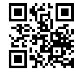

# **Leitfaden: E-Scannen für Bundesbehörden**

**Ersetzendes Scannen gemäß EGovG und TR-RESISCAN**

**Anlage (STR): Muster Strukturanalyse**

| 1   | Einleitung                           | 3 |
|-----|-----------------------------------------|---|
| 2   | Strukturanalyse                      | 3 |
| 2.1 | IT-Systeme und Anwendungen           | 3 |
| 2.2 | Netze und Kommunikationsbeziehungen  | 7 |
| 2.3 | Datenobjekte                            | 8 |

# 1 Einleitung

*Hinweis:* Die vorliegende Anlage 1 des Leitfadens "E-Scannen für Bundesbehörden" kann als Dokumentenvorlage für die Erstellung einer **Strukturanalyse** gemäß der TR-RESISCAN genutzt werden.

Wie in Abschnitt 4 des Leitfadens "E-Scannen für Bundesbehörden" näher erläutert, beginnt die Einführung des Ersetzenden Scannens mit der Strukturanalyse, in der die relevanten Bestandteile des existierenden oder geplanten Scansystems bzw. Scanprozesses identifiziert werden. Hierbei werden die folgenden Aspekte betrachtet:

- IT-Systeme und Anwendungen (siehe Abschnitt [2.1\)](#page-2-2),
- Netze und Kommunikationsbeziehungen (siehe Abschnitt [2.2\)](#page-6-0) und
- Datenobjekte (siehe Abschnit[t 2.3\)](#page-7-0).

Zielgruppe des Musters Strukturanalyse sind vorrangig

- IT-Sicherheitsbeauftragte und
- Mitarbeiterinnen und Mitarbeiter der IT-Abteilung.

Eine Unterstützung durch die für den Scanprozess fachliche verantwortliche Organisationseinheit ist empfehlenswert.

## 2 Strukturanalyse

### 2.1 IT-Systeme und Anwendungen

Im Zuge der Identifikation der relevanten IT-Systeme und Anwendungen des Scansystems wird ein bereinigter Netzplan (siehe [Abbildung 1\)](#page-3-0) erstellt, der auch Ausgangspunkt für die mögliche Auditierung und Zertifizierung des Scanprozesses ist. Das zu betrachtende Scansystem umfasst dabei die zum Scannen notwendigen Komponenten inklusive der Schnittstellen zu den angrenzenden Systemen (z.B. E-Akte-System, TR-ESOR-System).

Das Scansystem der Behörde ist im reduzierten Netzplan in [Abbildung 1](#page-3-0) im Überblick dargestellt. Der behördenspezifische Netzplan kann auf Basis des Powerpoint-Templates zur Muster-Strukturanalyse erstellt werden.

*Hinweis:* Dieser reduzierte Netzplan muss an das konkrete Scansystem der Behörde angepasst werden und bildet die Grundlage für die weiteren Betrachtungen.

Abbildung 1: Netzplan des Scansystems der [Organisation]

Wie in [Abbildung 1](#page-3-0) ersichtlich, umfasst das *exemplarische Scansystem* eine Reihe von Systemen (S*x*) (siehe

[Tabelle](#page-4-0) 1) und darauf laufenden Anwendungen (A*y*) (siehe [Tabelle 2\)](#page-6-1).

Die hierbei identifizierten Systeme und Anwendungen bilden die Grundlage für die Bestimmung der notwendigen Sicherheitsmaßnahmen bei der Umsetzung der Anforderung A.T.1 (siehe auch Abschnitt 6.2 des Leitfadens), welche letztlich die Implementierung der relevanten Maßnahmen aus dem Grundschutz-Kompendium des BSI [\[BSI-GSK\]](#page-10-0) fordert.

*Hinweis:* Die nachfolgende Tabelle muss an den konkreten Netzplan des Scansystems der Behörde angepasst werden.

| ID | IT-System        | Beschreibung                                                                                                                                                                                                                                                                                                                                                  | Ausprägung Anwenderbehörde |
|----|------------------|---------------------------------------------------------------------------------------------------------------------------------------------------------------------------------------------------------------------------------------------------------------------------------------------------------------------------------------------------------------|-------------------------------|
| S1 | Scanner          | Scanner für die Erzeugung eines Scanproduktes aus dem scanrelevanten Papierdokument. Hinweis: Dieser Scanner kann lokal (z. B. über USB) oder über ein Netzwerk an die Scan-Workstation (S2) angeschlossen sein.                                                                                                                            |                               |
| S2 | Scan-Workstation | Bildet die Ablaufumgebung für die Scan-Software (A1), die für die stationäre Digitalisierung der Papierdokumente genutzt wird. Hinweis: In der Praxis kann die hier betrachtete "Scan-Workstation" durch mehrere gleichartige Rechnersysteme realisiert sein, die im Rahmen der Strukturanalyse zusammen betrachtet werden können. |                               |

| ID | IT-System                               | Beschreibung                                                                                                                                                                                                                                                                                                                                   | Ausprägung      |
|----|-----------------------------------------|------------------------------------------------------------------------------------------------------------------------------------------------------------------------------------------------------------------------------------------------------------------------------------------------------------------------------------------------|-----------------|
| S3 | Qualitätssicherungs (QS)-Workstation | Bildet die Ablaufumgebung für die QS Software (A2), die zur Qualitätssicherung der Scanprodukte und zur Erzeugung des Transfervermerks eingesetzt wird. Hinweis: Sofern die IT-Plattform der Scan-Workstation und der QS Workstation identisch ist, können die beiden IT-Systeme zusammengefasst betrachtet werden. | Anwenderbehörde |
| S4 | Scan-Server                             | Bildet die Ablaufumgebung für den Scan-Service (A3), der für die Integration der Scan- und QS-Software mit den angrenzenden Zielsystemen und der mobilen Scan-App sorgt.                                                                                                                                                           |                 |
| S5 | Firewall                                | Dient der Netzwerkssegmentierung innerhalb der bestehenden IT Infrastruktur und trennt das scanspezifische interne Netz von den anderen internen bzw. externen Netzen.                                                                                                                                                          |                 |
| S6 | Router                                  | Sorgt für die IP-basierte Kommunikation mit den angrenzenden Systemen (E-Akte- und TR-ESOR System) bzw. dem Intranet.                                                                                                                                                                                                                 |                 |
| S7 | Proxyserver                             | Server auf dem ein als Application Level Gateway fungierender Apache (A4) läuft, der die TLS-gesicherte Übertragung von extern erzeugten Scanprodukten an den auf dem Scan Server (S4) laufenden Scan-Service (A3) ermöglicht.                                                                                               |                 |
| S8 | Smartphone                              | Stellt die Ablaufumgebung für die Scan App (A5) bereit, die die mobile Erfassung von beleghaften Dokumenten und die gesicherte Übertragung der entsprechenden Scanprodukte an den auf dem Scan-Server (S4) laufenden Scan-Service (A3) ermöglicht.                                                                           |                 |
| S9 | IS-Hardware1                            | Signatur-/Siegelkarte zur Integritätssicherung des Scanprodukts und Transfervermerks                                                                                                                                                                                                                                                     |                 |

**Tabelle 1: IT-Systeme im Scansystem der [Organisation]**

 1 Besteht nur wenn Signatur/Siegel auf Basis von Signatur- oder Siegelkarte erzeugt wird.

Für die IT-Systeme und Anwendungen sollen2 Verantwortliche definiert werden.

*Hinweis:* Die nachfolgende Tabelle muss an den konkreten Netzplan des Scansystems der Behörde angepasst werden.

| ID | Anwendung     | Beschreibung                                                                                                                                                                                                                                                        | Ausprägung Anwenderbehörde |
|----|---------------|---------------------------------------------------------------------------------------------------------------------------------------------------------------------------------------------------------------------------------------------------------------------|-------------------------------|
| A1 | Scan-Software | Client-Software, die auf der Scan Workstation (S2) läuft und für die digitale Erfassung von Papierdokumenten genutzt wird.                                                                                                                                 |                               |
| A2 | QS-Software   | Client-Software, die auf der QS Workstation (S3) läuft und für die Qualitätssicherung der Scanprodukte und zur Erzeugung des Transfervermerks genutzt wird.                                                                                             |                               |
| A3 | Scan-Service  | Dienst, der auf dem Scan-Server (S4) läuft und für die Integration der Scan Software (A1) und QS-Software (A2) mit den angrenzenden Systemen (E-Akte und TR-ESOR-System) und der mobilen Scan-App (A5) und zur Integritätssicherung genutzt wird. |                               |
| A4 | Apache        | Dienst, der auf dem Proxyserver (S7) als Application Level Gateway läuft und die TLS-gesicherte Übertragung von extern erzeugten Scanprodukten von der Scan App (A5) an den Scan-Service (A3) ermöglicht.                                            |                               |
| A5 | Scan-App      | Anwendung auf dem Smartphone (S8), die die mobile Erfassung von beleghaften Dokumenten und die gesicherte Übertragung der entsprechenden Scanprodukte an den Scan-Service (A3) ermöglicht.                                                           |                               |
| A6 | IS-Software   | Software zur Erzeugung (qualifizierter) elektronischer Signaturen/Siegel oder Zeitstempel ggf. in Kommunikation mit dem qualifizierten Vertrauendiensteanbieter zur Integritätssicherung des Scanprodukts sowie Transfervermerks.                 |                               |
| A7 | Indexsoftware | Softwarekomponente für die automatische (z. B. durch OCR) oder manuelle Bereitstellung von zum Scanprodukt (D2) gehörigen Index- und Metadaten (D3). Diese Index-Software kann wie hier dargestellt auf der Scan-                                    |                               |

2 Siehe [\[BSI-TR03138\]](#page-10-1) (A.O.1 f)). Hinweis: Sofern beispielsweise eine bestimmte Organisationseinheit für alle IT-Systeme und Anwendungen verantwortlich ist, kann hier auf eine differenzierte Betrachtung in den Tabellen hier verzichtet werden.

| ID | Anwendung | Beschreibung                                                                                                                        | Ausprägung Anwenderbehörde |
|----|-----------|-------------------------------------------------------------------------------------------------------------------------------------|-------------------------------|
|    |           | Workstation, einem eigenständigen Indexier-Arbeitsplatz oder innerhalb einer entsprechenden Fachanwendung betrieben werden |                               |

Tabelle 2: Anwendungen im Scansystem von [Organisation]

#### 2.2 Netze und Kommunikationsbeziehungen

Zusätzlich zur Identifikation der IT-Systeme und Anwendungen müssen3 im Rahmen der Strukturanalyse auch die Netze und Kommunikationsbeziehungen (siehe [Abbildung 2\)](#page-6-2) identifiziert werden, damit später adäquate Sicherheitsmaßnahmen4 ausgewählt und umgesetzt werden können. Die behördenspezifische Darstellung der Netze und Kommunikationsbeziehungen kann auf Basis des Powerpoint-Templates zur Muster-Strukturanalyse erstellt werden.

*Hinweis:* Die nachfolgende Abbildung muss an den konkreten Netzplan des Scansystems der Behörde angepasst werden.

Abbildung 2: Netze und Kommunikationsbeziehungen im Scansystem von [Organisation]

| ID | Netze und Kommunikationsbeziehungen | Beschreibung                                                                                                                          | Ausprägung Anwenderbehörde |
|----|----------------------------------------|---------------------------------------------------------------------------------------------------------------------------------------|-------------------------------|
| N1 | Scan-Netz                              | Im Scan-Netz befinden sich der Scanner (S1), die Scan Workstation (S2), die QS Workstation (S3) und der Scan Server (S4). |                               |

 3 Siehe [\[BSI-TR03138\]](#page-10-1) (A.G.1, e))

4 Siehe [\[BSI-TR03138\]](#page-10-1) (A.T.1)

| ID | Netze und                  | Beschreibung                     | Ausprägung      |
|----|----------------------------|----------------------------------|-----------------|
|    | Kommunikationsbeziehungen  |                                  | Anwenderbehörde |
| N2 | DMZ                        | In der De-Militarisierten-Zone   |                 |
|    |                            | (DMZ), die von den beiden        |                 |
|    |                            | Firewalls (S5) umschlossen wird, |                 |
|    |                            | befindet sich der Proxyserver    |                 |
|    |                            | (S7).                            |                 |
| N3 | Internet                   | Das Internet wird für die        |                 |
|    |                            | Übertragung der extern           |                 |
|    |                            | erzeugten Scanprodukte genutzt.  |                 |
| K1 | Scan-Server-TR-ESOR-System | Über diese                       |                 |
|    |                            | Kommunikationsbeziehung          |                 |
|    |                            | werden die am Scan-Server        |                 |
|    |                            | integritätsgesicherten           |                 |
|    |                            | Scanprodukte, Index- und         |                 |
|    |                            | Metadaten, Transfervermerke      |                 |
|    |                            | etc. an das TR-ESOR-System zur   |                 |
|    |                            | langfristigen Aufbewahrung       |                 |
|    |                            | übergeben.                       |                 |
| K2 | Smartphone-Scan-Server     | Über diese                       |                 |
|    |                            | Kommunikationsbeziehung          |                 |
|    |                            | werden die am Smartphone         |                 |
|    |                            | erzeugten Scanprodukte etc. an   |                 |
|    |                            | den Scan-Server geleitet.        |                 |

#### **Tabelle 3: Netze und Kommunikationsbeziehungen im Scansystem von [Organisation]**

#### 2.3 Datenobjekte

Wie in der TR-RESISCAN gefordert, müssen5 im Rahmen der Strukturanalyse die relevanten Dokumente und Datenobjekte identifiziert werden. Außerdem sollen6 Verantwortliche für die jeweiligen Datenobjekte festgelegt werden. Die nachfolgende Tabelle der Datenobjekte basiert auf [\[BSI-TR03138-](#page-10-2) [A\]](#page-10-2) (Tabelle 1):

| ID | Datenobjekt                | Beschreibung                                                                                                                                                                                                                                                                                            | Ausprägung Datenobjekt Anwenderbehörde | Verantwortlichkeit |
|----|----------------------------|---------------------------------------------------------------------------------------------------------------------------------------------------------------------------------------------------------------------------------------------------------------------------------------------------------|----------------------------------------------|--------------------|
| D0 | Schriftgut aus dem      | Schriftgut, das per Post o. ä. eingegangen ist.                                                                                                                                                                                                                                                      |                                              |                    |
|    | Posteingang                |                                                                                                                                                                                                                                                                                                         |                                              |                    |
| D1 | Scanrelevantes Original | Papierdokument, das durch geeignete Vorbereitungsschritte (z. B. durch Entfernung des Kuverts, Umkopieren, Entklammern etc.) aus dem eingegangenen Schriftgut (D0) gewonnen und dem Scanprozess zugeführt wird. Hinweis: Die in einem konkreten Scansystem verarbeiteten und |                                              |                    |

 5 Siehe [\[BSI-TR03138\]](#page-10-1) (A.O.1 b))

6 Siehe [\[BSI-TR03138\]](#page-10-1) (A.O.1 f)).

| ID | Datenobjekt     | Beschreibung                                      | Ausprägung Datenobjekt | Verantwortlichkeit |
|----|-----------------|---------------------------------------------------|---------------------------|--------------------|
|    |                 |                                                   | Anwenderbehörde           |                    |
|    |                 | nicht-verarbeitbaren                              |                           |                    |
|    |                 | Dokumenttypen7 müssen im                          |                           |                    |
|    |                 | Rahmen der                                        |                           |                    |
|    |                 | Verfahrensdokumentation                           |                           |                    |
|    |                 | explizit aufgelistet werden. Dies                 |                           |                    |
|    |                 | erfolgt sinnvoller Weise in der                   |                           |                    |
|    |                 | Verfahrensanweisung (siehe                        |                           |                    |
|    |                 | Anlage 3).                                        |                           |                    |
|    |                 | Die genau verarbeiteten Dokumente sind in         |                           |                    |
|    |                 | Abschnitt 2.3 der Verfahrensanweisung aufgeführt. |                           |                    |
| D2 | Scanprodukt     | Elektronisches Abbild des                         |                           |                    |
|    |                 | Papierdokumentes (D1). Dieses                     |                           |                    |
|    |                 | wird durch den Scanner erzeugt                    |                           |                    |
|    |                 | und ggf. von der Scansoftware                     |                           |                    |
|    |                 | nachbearbeitet.                                   |                           |                    |
| D3 | Index- und      | Daten, die das Auffinden und die                  |                           |                    |
|    | Metadaten       | Nutzung des später abgelegten                     |                           |                    |
|    |                 | Scanproduktes ermöglichen bzw.                    |                           |                    |
|    |                 | erleichtern.                                      |                           |                    |
|    |                 | Durch die hier manuell oder                       |                           |                    |
|    |                 | automatisch durch eine                            |                           |                    |
|    |                 | Formularerkennungs-Software                       |                           |                    |
|    |                 | vorgeschlagenen und im Rahmen                     |                           |                    |
|    |                 | der Qualitätssicherung                            |                           |                    |
|    |                 | überprüften bzw. ergänzten                        |                           |                    |
|    |                 | Index- und Metadaten wird die                     |                           |                    |
|    |                 | eindeutige Zuordnung der                          |                           |                    |
|    |                 | Dokumente zu einem                                |                           |                    |
|    |                 | Geschäftsvorfall sichergestellt,                  |                           |                    |
|    |                 | wodurch ein wesentliches                          |                           |                    |
|    |                 | Element der Ordnungsmäßigkeit                     |                           |                    |
|    |                 | gegeben ist.                                      |                           |                    |
| D4 | Transfervermerk | Mit dem Transfervermerk8 wird                     |                           |                    |
|    |                 | dokumentiert, wann und durch                      |                           |                    |
|    |                 | wen die Übertragung des                           |                           |                    |
|    |                 | Papierdokumentes in ein                           |                           |                    |
|    |                 | elektronisches Dokument                           |                           |                    |
|    |                 | stattgefunden hat.                                |                           |                    |
|    |                 | Hinweis: Im vorliegenden                          |                           |                    |
|    |                 | Beispiel des exemplarischen                       |                           |                    |
|    |                 | Scansystems (siehe Abbildung 1)                   |                           |                    |
|    |                 | wird der Transfervermerk vom                      |                           |                    |
|    |                 | Scan-Service (A3) erstellt.                       |                           |                    |
| D5 | Sicherungsdaten | Sicherungsdaten sind                              |                           |                    |
|    |                 | Datenobjekte, die dem Schutz                      |                           |                    |

 7 Siehe [\[BSI-TR03138\]](#page-10-1) (A.G.1 a)).

8 Siehe auch [\[BSI-TR03138\]](#page-10-1) (A.NB.4).

| ID | Datenobjekt    | Beschreibung                                                                                                                                                                                                                                                                               | Ausprägung Datenobjekt Anwenderbehörde | Verantwortlichkeit |
|----|----------------|--------------------------------------------------------------------------------------------------------------------------------------------------------------------------------------------------------------------------------------------------------------------------------------------|----------------------------------------------|--------------------|
|    |                | der Integrität und ggf. Authentizität anderer Datenobjekte dienen. Hinweis: Im vorliegenden Beispiel des exemplarischen Scansystems (siehe Abbildung 1) werden zur Sicherung der Integrität der Scanprodukte fortgeschrittene elektronische Siegel9 eingesetzt. |                                              |                    |
| D6 | Protokolldaten | Die Protokolldaten dokumentieren zusätzliche sicherheitsrelevante Abläufe und Ereignisse. Sie unterstützen somit die Nachvollziehbarkeit der Abläufe und den Nachweis der Ordnungsmäßigkeit des Scanprozesses.                                                        |                                              |                    |

**Tabelle 4: Relevante Datenobjekte und Dokumenttypen im Scansystem von [Organisation]**

### Verzeichnisse

### Tabellenverzeichnis

| Tabelle 1: IT-Systeme im Scansystem der [Organisation]                              | 5 |
|----------------------------------------------------------------------------------------|---|
| Tabelle 2: Anwendungen im Scansystem von [Organisation]                             | 7 |
| Tabelle 3: Netze und Kommunikationsbeziehungen im Scansystem von [Organisation]        | 8 |
| Tabelle 4: Relevante Datenobjekte und Dokumenttypen im Scansystem von [Organisation]10 |   |

### Abbildungsverzeichnis

| Abbildung 1: Netzplan des Scansystems der [Organisation]                              | 4 |
|---------------------------------------------------------------------------------------|---|
| Abbildung 2: Netze und Kommunikationsbeziehungen im Scansystem von [Organisation]  | 7 |

### Literaturverzeichnis

| [BSI-GSK]       | Bundesamt für Sicherheit in der Informationstechnik (BSI): IT-Grundschutz Kompendium,                                                                                                                |
|-----------------|---------------------------------------------------------------------------------------------------------------------------------------------------------------------------------------------------------|
|                 | https://www.bsi.bund.de/DE/Themen/ITGrundschutz/ITGrundschutzKompendi um/itgrundschutzKompendium_node.html                                                                                           |
| [BSI-TR03138]   | Bundesamt für Sicherheit in der Informationstechnik (BSI): Ersetzendes Scannen (RESISCAN), BSI TR-03138 https://www.bsi.bund.de/DE/Publikationen/TechnischeRichtlinien/tr03138/inde x_htm.html |
| [BSI-TR03138-A] | Bundesamt für Sicherheit in der Informationstechnik (BSI): Ersetzendes Scannen – Anwendungshinweis A: Ergebnis der Risikoanalyse, BSI TR 03138-A, Version 1.2, 2018                               |

#### **Impressum**

#### **Herausgeber**

Der Beauftragte der Bundesregierung für Informationstechnik, 10557 Berlin

#### **Ansprechpartner**

Programm Dienstekonsolidierung Postanschrift: Alt-Moabit 140, 10557 Berlin Hausanschrift: Englische Str. 30, 10587 Berlin Referatspostfach[: DGII1@bmi.bund.de](mailto:DGII1@bmi.bund.de) Internet[: www.cio.bund.de](http://www.cio.bund.de/)

#### **Stand**

27.04.2020

#### **Bildnachweis**

James Brey/GettyImages

Die Publikation wird kostenlos abgegeben und ist nicht zum Verkauf bestimmt. Sie darf weder von Parteien noch von Wahlwerbern oder Wahlhelfern während eines Wahlkampfes zum Zwecke der Wahlwerbung verwendet werden. Dies gilt für Bundestags-, Landtags- und Kommunalwahlen sowie für Wahlen zum Europäischen Parlament. Nachdruck, auch auszugsweise, ist genehmigungspflichtig.

1