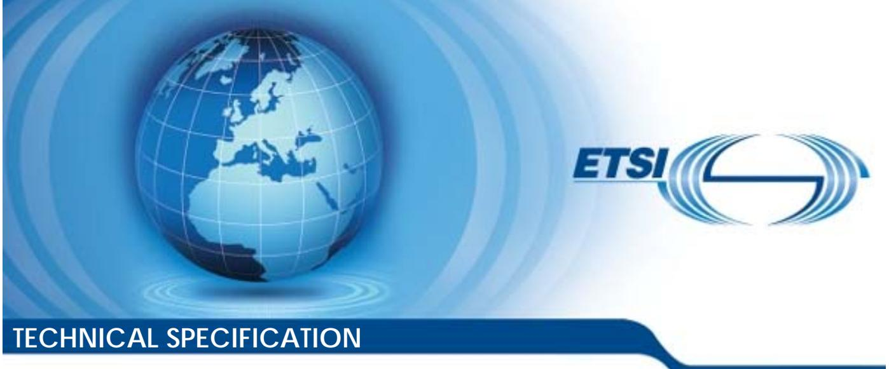
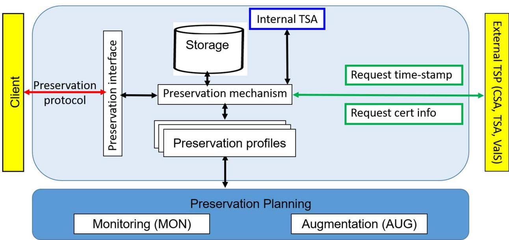
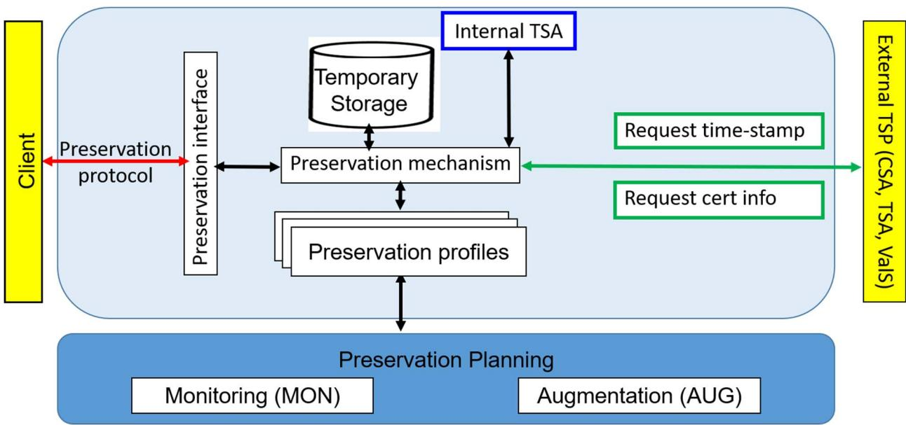
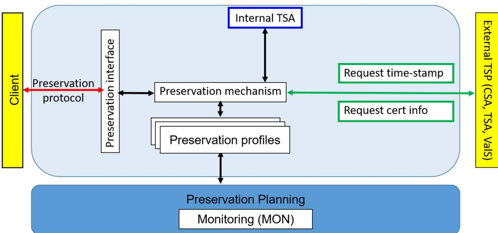

# ETSI TS 119 511 V1.1.1 (2019-06)



**Electronic Signatures and Infrastructures (ESI); Policy and security requirements for trust service providers providing long-term preservation of digital signatures or general data using digital signature techniques** 

Reference DTS/ESI-0019511

Keywords

electronic preservation, electronic signature, trust services

#### *ETSI*

#### 650 Route des Lucioles F-06921 Sophia Antipolis Cedex - FRANCE

Tel.: +33 4 92 94 42 00 Fax: +33 4 93 65 47 16

Siret N° 348 623 562 00017 - NAF 742 C Association à but non lucratif enregistrée à la Sous-Préfecture de Grasse (06) N° 7803/88

#### *Important notice*

The present document can be downloaded from: <http://www.etsi.org/standards-search>

The present document may be made available in electronic versions and/or in print. The content of any electronic and/or print versions of the present document shall not be modified without the prior written authorization of ETSI. In case of any existing or perceived difference in contents between such versions and/or in print, the prevailing version of an ETSI deliverable is the one made publicly available in PDF format at [www.etsi.org/deliver](http://www.etsi.org/deliver).

Users of the present document should be aware that the document may be subject to revision or change of status. Information on the current status of this and other ETSI documents is available at <https://portal.etsi.org/TB/ETSIDeliverableStatus.aspx>

If you find errors in the present document, please send your comment to one of the following services: <https://portal.etsi.org/People/CommiteeSupportStaff.aspx>

#### *Copyright Notification*

No part may be reproduced or utilized in any form or by any means, electronic or mechanical, including photocopying and microfilm except as authorized by written permission of ETSI. The content of the PDF version shall not be modified without the written authorization of ETSI. The copyright and the foregoing restriction extend to reproduction in all media.

> © ETSI 2019. All rights reserved.

**DECT**TM, **PLUGTESTS**TM, **UMTS**TM and the ETSI logo are trademarks of ETSI registered for the benefit of its Members. **3GPP**TM and **LTE**TM are trademarks of ETSI registered for the benefit of its Members and of the 3GPP Organizational Partners. **oneM2M™** logo is a trademark of ETSI registered for the benefit of its Members and of the oneM2M Partners. **GSM**® and the GSM logo are trademarks registered and owned by the GSM Association.

|              | Intellectual Property Rights  5                                                                         |  |  |  |
|--------------|---------------------------------------------------------------------------------------------------------|--|--|--|
|              | Foreword  5                                                                                             |  |  |  |
|              | Modal verbs terminology  5                                                                              |  |  |  |
|              | Introduction  5                                                                                         |  |  |  |
| 1            | Scope  7                                                                                                |  |  |  |
| 2            | References  8                                                                                           |  |  |  |
| 2.1          | Normative references  8                                                                                 |  |  |  |
| 2.2          | Informative references  8                                                                               |  |  |  |
| 3            | Definition of terms, symbols, abbreviations and notations  10                                           |  |  |  |
| 3.1          | Terms  10                                                                                               |  |  |  |
| 3.2          | Symbols  12                                                                                             |  |  |  |
| 3.3          | Abbreviations  13<br>Notations  13                                                                      |  |  |  |
| 3.4          |                                                                                                         |  |  |  |
| 4            | General Concepts  14                                                                                    |  |  |  |
| 4.1          | Preservation storage models  14                                                                         |  |  |  |
| 4.1.1        | Overview  14                                                                                            |  |  |  |
| 4.1.2        | Preservation service with storage [WST]  15                                                             |  |  |  |
| 4.1.3        | Preservation service with temporary storage [WTS]  16<br>Preservation service without storage [WOS]  17 |  |  |  |
| 4.1.4<br>4.2 | Functional goals  17                                                                                    |  |  |  |
| 4.3          | Preservation service applicable documentation  19                                                       |  |  |  |
| 4.3.1        | Preservation service practice statement  19                                                             |  |  |  |
| 4.3.2        | Preservation service policy  19                                                                         |  |  |  |
| 4.3.3        | Preservation schemes and preservation profiles  19                                                      |  |  |  |
| 4.3.4        | Preservation evidence policy  20                                                                        |  |  |  |
| 4.3.5        | Signature validation policy  20                                                                         |  |  |  |
| 4.4          | Expected evidence duration  20                                                                          |  |  |  |
| 4.5          | Preservation period  21                                                                                 |  |  |  |
| 5            | Risk assessment  21                                                                                     |  |  |  |
| 6            | Policies and practices  21                                                                              |  |  |  |
| 6.1          | Preservation service practice statement  21                                                             |  |  |  |
| 6.2          | Terms and Conditions  22                                                                                |  |  |  |
| 6.3          | Information security policy  22<br>Preservation profiles  23                                            |  |  |  |
| 6.4          | Preservation evidence policy  24                                                                        |  |  |  |
| 6.5<br>6.6   | Signature validation policy  25                                                                         |  |  |  |
| 6.7          | Subscriber agreement  25                                                                                |  |  |  |
| 7            | PSP management and operation  25                                                                        |  |  |  |
| 7.1          | Internal organization 25                                                                                |  |  |  |
| 7.2          | Human resources  25                                                                                     |  |  |  |
| 7.3          | Asset management  25                                                                                    |  |  |  |
| 7.4          | Access control  25                                                                                      |  |  |  |
| 7.5          | Cryptographic controls  25                                                                              |  |  |  |
| 7.6          | Physical and environmental security  26                                                                 |  |  |  |
| 7.7          | Operation security  26<br>Network security  26                                                          |  |  |  |
| 7.8<br>7.9   | Incident management  26                                                                                 |  |  |  |
| 7.10         | Collection of evidence  26                                                                              |  |  |  |
| 7.11         | Business continuity management  27                                                                      |  |  |  |
| 7.12         | TSP termination and termination plans  27                                                               |  |  |  |
| 7.13         | Compliance 27                                                                                           |  |  |  |
| 7.14         | Cryptographic monitoring  27                                                                            |  |  |  |

| 7.15<br>7.16           | Augmentation of preservation evidences  27<br>Export-import package  28                              |                                                                                                                                                 |  |
|------------------------|------------------------------------------------------------------------------------------------------|-------------------------------------------------------------------------------------------------------------------------------------------------|--|
| 8<br>8.1<br>8.2        | Operational and notification protocols  28<br>Preservation protocol  28<br>Notification protocol  29 |                                                                                                                                                 |  |
| 9<br>9.1<br>9.2<br>9.3 |                                                                                                      | Preservation process  30<br>Storage of preserved data and evidences  30<br>Preservation evidences  30<br>Preservation of digital signatures  30 |  |
|                        | Annex A (normative):                                                                                 | Qualified preservation service for QES as defined by article 34 the<br>Regulation (EU) No 910/2014  32                                          |  |
|                        | Annex B (informative):                                                                               | Mapping of requirements to Regulation (EU) No 910/2014  33                                                                                      |  |
|                        | Annex C (informative):                                                                               | Differences and relationships between an archival service and a<br>preservation service  35                                                     |  |
| C.1                    |                                                                                                      | Archival services  35                                                                                                                           |  |
| C.2                    | Preservation services  35                                                                            |                                                                                                                                                 |  |
| C.3                    | Comparison of archival services with preservation services  36                                       |                                                                                                                                                 |  |
| C.4                    | Relationships between archival services and preservation services  36                                |                                                                                                                                                 |  |
|                        | Annex D (informative):                                                                               | Cryptographic threats and countermeasures  37                                                                                                   |  |
| D.1                    | Risks based on collision attacks of one-way hash functions used within a digital signature  37       |                                                                                                                                                 |  |
| D.2                    | Risks based on the digital signature algorithm and key length  37                                    |                                                                                                                                                 |  |
| D.3                    | Risks based on the revocation of a signing key  38                                                   |                                                                                                                                                 |  |
|                        |                                                                                                      | History  39                                                                                                                                     |  |

## <span id="page-4-0"></span>Intellectual Property Rights

#### Essential patents

IPRs essential or potentially essential to normative deliverables may have been declared to ETSI. The information pertaining to these essential IPRs, if any, is publicly available for **ETSI members and non-members**, and can be found in ETSI SR 000 314: *"Intellectual Property Rights (IPRs); Essential, or potentially Essential, IPRs notified to ETSI in respect of ETSI standards"*, which is available from the ETSI Secretariat. Latest updates are available on the ETSI Web server (<https://ipr.etsi.org/>).

Pursuant to the ETSI IPR Policy, no investigation, including IPR searches, has been carried out by ETSI. No guarantee can be given as to the existence of other IPRs not referenced in ETSI SR 000 314 (or the updates on the ETSI Web server) which are, or may be, or may become, essential to the present document.

#### Trademarks

The present document may include trademarks and/or tradenames which are asserted and/or registered by their owners. ETSI claims no ownership of these except for any which are indicated as being the property of ETSI, and conveys no right to use or reproduce any trademark and/or tradename. Mention of those trademarks in the present document does not constitute an endorsement by ETSI of products, services or organizations associated with those trademarks.

### Foreword

This Technical Specification (TS) has been produced by ETSI Technical Committee Electronic Signatures and Infrastructures (ESI).

## Modal verbs terminology

In the present document "**shall**", "**shall not**", "**should**", "**should not**", "**may**", "**need not**", "**will**", "**will not**", "**can**" and "**cannot**" are to be interpreted as described in clause 3.2 of the [ETSI Drafting Rules](https://portal.etsi.org/Services/editHelp!/Howtostart/ETSIDraftingRules.aspx) (Verbal forms for the expression of provisions).

"**must**" and "**must not**" are **NOT** allowed in ETSI deliverables except when used in direct citation.

### Introduction

On the one hand, digital signatures as well as time-stamps based on cryptographic mechanisms are increasingly used in our everyday life and are a major cornerstone for electronic commerce.

On the other hand, it is well known, that the strength and suitability of cryptographic mechanisms is a function of time and one needs to apply suitable preservation mechanisms, which are able to maintain the validity status of a signed object over long periods of time, which may involve the application of different storage technologies and cryptographic algorithms.

The need for long-term preservation is acknowledged amongst others in the Regulation (EU) No 910/2014 of the European Parliament and of the Council of 23 July 2014 on electronic identification and trust services for electronic transactions in the internal market [[i.2\]](#page-7-0), as can be seen in recital (61):

"*This Regulation should ensure the long-term preservation of information, in order to ensure the legal validity of electronic signatures and electronic seals over extended periods of time and guarantee that they can be validated irrespective of future technological changes.*"

Furthermore Article 34 of the Regulation (EU) No 910/2014 [\[i.2\]](#page-7-0) states that "*a qualified preservation service for qualified electronic signatures may only be provided by a qualified trust service provider that uses procedures and technologies capable of extending the trustworthiness of the qualified electronic signature beyond the technological validity period*" and that "*the Commission may, by means of implementing acts, establish reference numbers of standards for the qualified preservation service for qualified electronic signatures.*".

The present document is aiming to meet the general requirements of the international community to provide trust and confidence in preservation services which can be used to preserve the validity status of digital signatures or to provide a proof of existence of digital objects using digital signature techniques, including, amongst others, applicable requirements from Articles 34 and 40 of Regulation (EU) N 910/2014 [\[i.2\]](#page-7-0) that establishes a legal framework for qualified preservation service for qualified electronic signatures and mutatis mutandis for qualified preservation service for qualified electronic seals.

### <span id="page-6-0"></span>1 Scope

The present document builds on the general policy requirements specified in ETSI EN 319 401 [[1\]](#page-7-0), specifies policy and security requirements for trust service providers providing long-term preservation of digital signatures and of general data, i.e. signed data or unsigned data, using digital signature techniques.

The present document aims at supporting preservation services in different regulatory frameworks.

Specifically, but not exclusively, the preservation service addressed in the present document aims at supporting qualified preservation service for qualified electronic signatures or seals as per Regulation (EU) No 910/2014 [\[i.2\]](#page-7-0).

Specifically, but not exclusively, digital signatures in the present document cover electronic signatures, advanced electronic signatures, qualified electronic signatures, electronic seals, advanced electronic seals, and qualified electronic seals as per Regulation (EU) No 910/2014 [[i.2](#page-7-0)].

The present document addresses two main cases:

- 1) The preservation **over long periods of time, using digital signature techniques**, of the **ability to validate a digital signature,** of the ability **to maintain its validity status** and of the ability **to get a proof of existence** of the associated signed data as they were at the time of the submission to the preservation service even if later the signing key becomes compromised, the certificate expires, or cryptographic attacks become feasible on the signature algorithm or the hash algorithm used in the submitted signature.
- NOTE 1: A qualified preservation service for qualified electronic signatures or seals as per Regulation (EU) No 910/2014 [[i.2\]](#page-7-0) for which the status of the technical validity needs to be preserved, is covered in this case.
- NOTE 2: The validity status of a signature means the status of the signature that will not change over time. Such a status may be valid (TOTAL\_PASSED according to ETSI EN 319 102-1 [[i.6](#page-7-0)]) or invalid (TOTAL\_FAILED and certain cases for INDETERMINATE according to ETSI EN 319 102-1 [\[i.6](#page-7-0)]).
- NOTE 3: "Digital signature techniques" designates techniques based on digital signatures, time-stamps or evidence records.
- 2) The provision of a proof of existence of digital objects, whether they are signed or not, **using digital signature techniques** (digital signatures, time-stamp tokens, evidence records, etc.).
- NOTE 4: In this case, even if the main object to be preserved is a signature, it is treated in the same way as any other file.
- NOTE 5: A proof of existence of digital object not using digital signature techniques is not in the scope of the present document.

The present document covers different strategies for the preservation service. The applicable requirements depend on the strategy chosen by the preservation service.

- EXAMPLE 1: The preservation service can provide storage, no storage, or temporary storage.
- EXAMPLE 2: The preservation service can receive the digital signature, the signed data, the revocation information or only hash values and evidences.

The present document identifies specific controls needed to address specific risks associated with preservation services.

The transformation of the original data into another data object with equivalent object content and semantic to avoid the risk that the original data object/viewer system is becoming obsolete is out of the scope of the present document.

## <span id="page-7-0"></span>2 References

### 2.1 Normative references

References are either specific (identified by date of publication and/or edition number or version number) or non-specific. For specific references, only the cited version applies. For non-specific references, the latest version of the referenced document (including any amendments) applies.

Referenced documents which are not found to be publicly available in the expected location might be found at <https://docbox.etsi.org/Reference>.

NOTE: While any hyperlinks included in this clause were valid at the time of publication, ETSI cannot guarantee their long term validity.

The following referenced documents are necessary for the application of the present document.

- [1] ETSI EN 319 401: "Electronic Signatures and Infrastructures (ESI); General Policy Requirements for Trust Service Providers".
- [2] ETSI TS 119 612: "Electronic Signatures and Infrastructures (ESI); Trusted Lists".
- [3] ISO/IEC 15408 (parts 1 to 3): "Information technology -- Security techniques -- Evaluation criteria for IT security".
- [4] ISO/IEC 19790: "Information technology -- Security techniques -- Security requirements for cryptographic modules".
- [5] FIPS PUB 140-2: "Security Requirements for Cryptographic Modules".

### 2.2 Informative references

References are either specific (identified by date of publication and/or edition number or version number) or non-specific. For specific references, only the cited version applies. For non-specific references, the latest version of the referenced document (including any amendments) applies.

NOTE: While any hyperlinks included in this clause were valid at the time of publication, ETSI cannot guarantee their long term validity.

The following referenced documents are not necessary for the application of the present document but they assist the user with regard to a particular subject area.

- [i.1] Directive 95/46/EC of the European Parliament and of the Council of 24 October 1995 on the protection of individuals with regard to the processing of personal data and on the free movement of such data. [i.2] Regulation (EU) No 910/2014 of the European Parliament and of the Council of 23 July 2014 on electronic identification and trust services for electronic transactions in the internal market and repealing Directive 1999/93/EC. OJ L 257, 28.8.2014, p. 73-114. [i.3] Commission Implementing Decision (EU) 2015/1505 of 8 September 2015 laying down technical specifications and formats relating to trusted lists pursuant to Article 22(5) of Regulation (EU) No 910/2014 of the European Parliament and of the Council on electronic identification and trust services for electronic transactions in the internal market. [i.4] ETSI TR 119 001: "Electronic Signatures and Infrastructures (ESI); The framework for standardization of signatures; Definitions and abbreviations".
- [i.5] ETSI TS 119 312: "Electronic Signatures and Infrastructures (ESI); Cryptographic Suites".
- [i.6] ETSI EN 319 102-1: "Electronic Signatures and Infrastructures (ESI); Procedures for Creation and Validation of AdES Digital Signatures; Part 1: Creation and Validation".

<span id="page-8-0"></span>[i.7] ETSI TS 119 122-3: "Electronic Signatures and Infrastructures (ESI); CAdES digital signatures; Part 3: Incorporation of Evidence Record Syntax (ERS) mechanisms in CAdES".

[i.8] ETSI EN 319 162-1: "Electronic Signatures and Infrastructures (ESI); Associated Signature Containers (ASiC); Part 1: Building blocks and ASiC Baseline containers".

- [i.9] ETSI EN 319 411-1: "Electronic Signatures and Infrastructures (ESI); Policy and security requirements for Trust Service Providers issuing certificates; Part 1: General requirements". [i.10] ETSI EN 319 411-2: "Electronic Signatures and Infrastructures (ESI); Policy and security requirements for Trust Service Providers issuing certificates; Part 2: Requirements for trust service providers issuing EU qualified certificates". [i.11] ETSI EN 319 421: "Electronic Signatures and Infrastructures (ESI); Policy and Security Requirements for Trust Service Providers issuing Time-Stamps". [i.12] ETSI EN 319 422: "Electronic Signatures and Infrastructures (ESI); Time-stamping protocol and time-stamp token profiles". [i.13] ETSI TS 119 512: "Electronic Signatures and Infrastructures (ESI); Protocols for trust service providers providing long-term data preservation services". [i.14] ISO/IEC 21320-1 (2015): "Information technology -- Document Container File -- Part 1: Core". [i.15] ISO 14641-1:2018: "Electronic archiving -- Part 1: Specifications concerning the design and the operation of an information system for electronic information preservation".
- [i.16] ISO 14721:2012: "Space data and information transfer systems -- Open archival information system (OAIS) -- Reference model".
- [i.17] ISO 16363:2011: "Space data and information transfer systems -- Audit and certification of trustworthy digital repositories".
- [i.18] IETF RFC 3161: "Internet X.509 Public Key Infrastructure Time-Stamp Protocol (TSP)".
- [i.19] IETF RFC 3986: "Uniform Resource Identifier (URI): Generic Syntax".
- [i.20] IETF RFC 4998: "Evidence Record Syntax (ERS)".
- [i.21] IETF RFC 5280 (2008): Public Key Infrastructure Certificate and Certificate Revocation List (CRL) Profile".
- [i.22] IETF RFC 5816 (2010): "ESSCertIDv2 Update for RFC 3161".
- [i.23] IETF RFC 6283 (2011): "Extensible Markup Language Evidence Record Syntax (XMLERS)".
- [i.24] IETF RFC 6960 (2013): "Online Certificate Status Protocol OCSP".
- [i.25] W3C Recommendation 26 November 2008: "Extensible Markup Language (XML) 1.0 (Fifth Edition)".
- NOTE: Available at [https://www.w3.org/TR/REC-xml/.](https://www.w3.org/TR/REC-xml/)
- [i.26] BSI TR-03125-F: "Preservation of Evidence of Cryptographically signed Documents", Formats (TR-ESOR-F).
- NOTE: Available at [https://www.bsi.bund.de/EN/tr-esor\\_XAIP.](https://www.bsi.bund.de/EN/tr-esor_XAIP)
- [i.27] BSI TR-03125-M.3: "Preservation of Evidence of Cryptographically signed Documents", Formats (TR-ESOR-M.3).
- NOTE: Available at [https://www.bsi.bund.de/EN/tr-esor.](https://www.bsi.bund.de/EN/tr-esor)

## <span id="page-9-0"></span>3 Definition of terms, symbols, abbreviations and notations

### 3.1 Terms

For the purposes of the present document, the terms given in ETSI TR 119 001 [[i.4](#page-7-0)] and the following apply:

**certificate status authority:** authority providing certificate status information

EXAMPLE: The certificate status information can be provided using the Online Certificate Status Protocol (OCSP) [\[i.24](#page-8-0)] or in form of Certificate Revocation Lists (CRL) [[i.21](#page-8-0)].

**container:** data object, which contains a set of data objects and optional additional information, which describes the contained data objects and optionally its content and its interrelationships

- EXAMPLE: The format of a container can be based on, ZIP as defined in ISO/IEC 21320-1 [[i.14](#page-8-0)] or XML [[i.25\]](#page-8-0). ASiC [\[i.8\]](#page-8-0) is an example of a container based on ZIP.
- NOTE: Additional information may comprise associated digital signatures, time-stamps, evidence records, validation data (CRLs, OCSP responses) and validation reports.

**data object:** actual binary/octet data being operated on (e.g. transformed, digested, or signed) by an application and which may be associated with additional information like an identifier, the encoding, size or type

**delta preservation object container:** special preservation object container describing the difference to an already existing preservation object container

**digital signature techniques:** techniques based on digital signatures, time-stamps or evidence records

**EU qualified time-stamping authority:** qualified trust-service provider issuing qualified electronic time-stamps as laid down in Regulation (EU) 910/2014 [\[i.2](#page-7-0)]

**evidence record:** unit of data, which can be used to prove the existence of an archived data object or an archived data object group at a certain time

NOTE: See IETF RFC 4998 [\[i.20](#page-8-0)], IETF RFC 6283 [[i.23\]](#page-8-0) and ETSI TS 119 122-3 [\[i.7](#page-8-0)].

**expected evidence duration:** for a preservation service with temporary storage or without storage, duration during which the preservation service expects that the preservation evidence can be used to achieve the preservation goal

**export-import package:** information extracted from the preservation service including the submission data object (SubDO), the preservation evidence and preservation-related metadata, allowing another preservation service to import it in order to continue to achieve the preservation goal based on this information

**long-term:** time period during which technological changes may be a concern

EXAMPLE: Possible technological changes are obsolescence of cryptographic technology such as crypto algorithms, key sizes or hash functions, key compromises.

**long-term preservation:** extension of the validity status of a digital signature over long periods of time and/or extension of provision of proofs of existence of data over long periods of time, in spite of obsolescence of cryptographic technology such as crypto algorithms, key sizes or hash functions, key compromises or of the loss of the ability to check the validity status of public key certificates

**metadata:** data about other data

NOTE: See ISO 14721:2012 [\[i.16](#page-8-0)].

**notification protocol:** protocol used by a preservation service to notify the preservation client

**preservation client:** component or a piece of software which interacts with a preservation service via the preservation protocol

**preservation evidence:** evidence produced by the preservation service which can be used to demonstrate that one or more preservation goals are met for a given preservation object

**preservation evidence augmentation:** addition of data to an existing preservation evidence to extend the validity period of that evidence

EXAMPLE: Adding a new time-stamp protecting additional validation data which can be used to validate a previous signature and/or time-stamp, and/or the hash of the protected data using a stronger hash algorithm.

**preservation evidence policy:** set of rules that specify the requirements and the internal process to generate or how to validate a preservation evidence

**preservation evidence retention period:** for a preservation service With Temporary Storage (WTS) the time period during which the evidences that are produced asynchronously can be retrieved from the preservation service

**preservation goal:** one of the following objectives achieved during the preservation time frame: extending over long periods of time the validity status of digital signatures, providing proofs of existence of data over long periods of time, or augmenting externally provided preservation evidences

NOTE: A preservation service can achieve one or more preservation goals.

**preservation mechanism:** mechanism used to preserve preservation objects and to maintain the validity of preservation evidences

NOTE: The present document only addresses preservation mechanisms based on digital signature techniques.

**preservation interface:** component implementing the preservation protocol on the side of the preservation service

**preservation manifest:** data object in a preservation object container referring to the preservation data objects or additional information and metadata in the preservation object container

EXAMPLE 1: Additional file in an ASiC-container according to ETSI EN 319 162-1 [\[i.8\]](#page-8-0), clause A.7.

EXAMPLE 2: versionManifest in TR-ESOR-F [[i.26](#page-8-0)].

EXAMPLE 3: An XML based manifest data element in an XML-based Preservation Object Container (POC).

**preservation object:** typed data object which is submitted to, processed by or retrieved from a preservation service

NOTE: This covers submission data objects, preservation object containers and preservation evidences.

**preservation object container:** container which contains a set of data objects and optionally related metadata providing information about the data objects and optionally preservation manifest(s) specifying its content and relationships

EXAMPLE 1: An ASiC-S or ASiC-E container is a Preservation Object Container that supports one or more signature and time assertion files each applicable to its own set of one or more files.

EXAMPLE 2: An OAIS Submission Information Packages is a Preservation Object Container.

**preservation object identifier:** unique identifier of a (set of) preservation object(s) submitted to a preservation service

**preservation period:** for a preservation service with storage, duration during which the preservation service preserves the submitted preservation objects and the associated evidences

NOTE: The submitted preservation objects can be updated during the preservation period.

**preservation profile:** uniquely identified set of implementation details pertinent to a preservation storage model and one or more preservation goals which specifies how preservation evidences are generated and validated

NOTE: See clause 4.3 of the present document and the description of a machine-readable version in ETSI TS 119 512 [\[i.13](#page-8-0)].

**preservation protocol:** protocol to communicate between the preservation service and a preservation client

<span id="page-11-0"></span>**preservation scheme:** generic set of procedures and rules pertinent to a preservation storage model and one or more preservation goals which outlines how preservation evidences are created and validated

NOTE 1: Different preservation profiles can implement the same preservation scheme.

NOTE 2: A preservation scheme can be implemented by one or more preservation profiles.

**preservation service:** service capable of extending the validity status of a digital signature over long periods of time and/or of providing proofs of existence of data over long periods of time

**preservation service provider:** trust service provider providing a preservation service

**preservation service policy:** trust service policy for a preservation service

**preservation service practice statement:** trust service practice statement for a preservation service

**preservation storage model:** one of the following ways of implementing a preservation service: with storage, with temporary storage, without storage

**preservation submitter:** legal or natural person using the preservation client to submit the submission data object

**preservation subscriber:** legal or natural person bound by agreement with a preservation trust service provider to any subscriber obligations

**proof of existence:** evidence that proves that an object existed at a specific date/time

**proof of integrity:** evidence that data has not been altered since it was protected

NOTE: A proof of existence requires and implies a proof of integrity.

**EU qualified preservation service:** preservation service that meets the requirements for qualified preservation service for qualified electronic signatures and/or for qualified electronic seals as laid down in Regulation (EU) 910/2014 [[i.2](#page-7-0)]

**signer:** entity being the creator of a digital signature

**submission data object:** original data object provided by the client

NOTE: If provided by the client, the Preservation Object Container (POC) is a submission data object.

**time assertion:** time-stamp token or an evidence record

**time-stamp:** data in electronic form which binds other electronic data to a particular time establishing evidence that these data existed at that time

**time-stamping authority:** trust service provider which issues time-stamps using one or more time-stamping units

**time-stamping service:** trust service for issuing time-stamps

**time-stamping unit:** set of hardware and software which is managed as a unit and has a single time-stamp signing key active at a time

**trusted list:** list that provides information about the status and the status history of the trust services from trust service providers regarding compliance with the applicable requirements and the relevant provisions of the applicable legislation

NOTE: In the context of European Union Member States, as specified in Regulation (EU) No 910/2014 [\[i.2](#page-7-0)], it refers to an EU Member State list including information related to the qualified trust service providers for which it is responsible, together with information related to the qualified trust services provided by them.

**validation data:** data that is used to validate a digital signature

#### 3.2 Symbols

Void.

### <span id="page-12-0"></span>3.3 Abbreviations

For the purposes of the present document, the abbreviations given in ETSI TR 119 001 [\[i.4\]](#page-7-0) and the following apply:

| AUG   | Augmentation goal                                           |
|-------|-------------------------------------------------------------|
| CSA   | Certificate Status Authority                                |
| EUMS  | European Union Member State                                 |
| OVR   | Overall                                                     |
| PDS   | Preservation of Digital Signatures                          |
| PGD   | Preservation of General Data                                |
| PO    | Preservation Object                                         |
| POC   | Preservation Object Container                               |
| PRP   | Preservation service Protocol                               |
| PSP   | Preservation Service Provider                               |
| QES   | Qualified Electronic Signature or Qualified Electronic Seal |
| SigS  | digital Signature creation Service                          |
| SubDO | Submission Data Object                                      |
| TS    | Trust Service                                               |
| TSA   | Time-Stamping Authority                                     |
| TSP   | Trust Service Provider                                      |
| ValS  | Validation Service                                          |
| WOS   | Without Storage                                             |
| WST   | With Storage                                                |
| WTS   | With Temporary Storage                                      |
|       |                                                             |

### 3.4 Notations

The requirements, recommendations or permissions identified in the present document include:

- a) requirements, recommendations or permissions applicable to any TSP conforming to the present document. Such requirements are indicated by clauses without any additional marking;
- b) requirements, recommendations or permissions applicable under certain conditions. Such requirements are indicated by clauses marked by "[CONDITIONAL]";
- c) requirements, recommendations or permissions applicable to specific sub-group of preservation are marked as follows:
	- [WOS] preservation service without storage;
	- [WTS] preservation service with temporary storage;
	- [WST] preservation service with storage;
	- [PDS] preservation of digital signatures;
	- [PGD] preservation of general data;
	- [PDS+PGD] combined preservation of digital signatures and general data;
	- [AUG] augmentation of submitted preservation evidence.

The requirements, recommendations or permissions in the present document are identified as follows:

<the 3 letters identifying the elements of services > **-** < the clause number> **-** <2-digit number - incremental>

The elements of services are:

- **OVR:** General requirements, recommendations or permissions (requirement applicable to more than 1 component).
- **PRP:** Preservation service protocol.

<span id="page-13-0"></span>The management of the requirement identifiers for subsequent editions of the present document is as follows:

- When a requirement is inserted at the end of a clause, the 2-digit number above is incremented to the next available digit.
- When a requirement is inserted between two existing requirements, capital letters appended to the previous requirement identifier are used to distinguish new requirements.
- The requirement identifier for deleted requirements are left and completed with "VOID".

The requirement identifier for modified requirements is left void and the modified requirement is identified by capital letter(s) appended to the initial requirement number.

### 4 General Concepts

#### 4.1 Preservation storage models

#### 4.1.1 Overview

Three preservation storage models for the preservation service are distinguished:

- 1) **Preservation services with storage [WST].** In this case, the data to be preserved is stored by the preservation service while the evidences and the preserved data are delivered upon request by the preservation service to the preservation client. The preservation service stores the submitted data object(s) (SubDO(s)) and the preservation object(s) (PO(s)) and the associated preservation evidences. The PO(s) are derived from the SubDo(s) by augmentation or by building a Preservation Object Container (POC). Specific requirements, recommendations or permissions for this case are marked by [WST], see clause [3.4.](#page-12-0)
- 2) **Preservation services with temporary storage [WTS].** In this case, the data to be preserved is stored on the client side. The preservation service keeps the data or a hash of the data to be preserved only temporarily at latest until the evidence is produced. Evidences are produced asynchronously. Once they are produced, the evidences are stored during some time period to allow the client to retrieve them. Specific requirements, recommendations or permissions for this case are marked by [WTS], see clause [3.4.](#page-12-0)
- EXAMPLE: Evidences records can be produced daily using the hash values of the data to be preserved that has been presented during 24 hours.
- 3) **Preservation services without storage [WOS].** In this case, the data to be preserved is stored on the client side. The preservation service neither stores the SubDO nor the preservation evidences. Evidences are produced synchronously and are included in the response. The preservation service only keeps traces of its actions to be able to provide records of its activities. Specific requirements, recommendations or permissions for this case are marked by [WOS], see clause [3.4](#page-12-0).

Depending on the preservation storage model, the service will implement different processes. The three models are shown in figures [1](#page-14-0), [2](#page-15-0) and [3](#page-16-0).



### <span id="page-14-0"></span>4.1.2 Preservation service with storage [WST]

#### **Figure 1: Functional model of a preservation service with storage [WST]**

The preservation protocol allows the preservation client to interact with the preservation interface.

A preservation service with storage stores the SubDO and the preservation object(s) (PO(s)) derived from the SubDO(s) by augmentation or building a Preservation Object Container (POC) and produces preservation evidences upon request according to a preservation profile that has been previously selected. The preservation client of the submitter submits one or more SubDO(s) to the preservation service and receives back a preservation object identifier. Afterwards, during the preservation period, the preservation client is able to retrieve upon request one or more preservation evidence(s) and/or Preservation Objects (POs). The preservation service provides the possibility to delete the stored PO(s). In case of the deletion of preservation evidences the corresponding SubDOs and derived POs are to be deleted as well. According to the preservation profile that has been previously selected, the preservation service can keep the preservation evidences when deleting the SubDOs, but not the other way around, until the end of the preservation period.

A preservation service with storage can allow to provide a new version of an already submitted PO. The link between different versions is covered in the POC. Such a functionality allows to specify the difference to the previous version.

The preservation service can contact external TSPs to retrieve information needed to create the preservation evidences. Such services can be Certificate Status Authorities (CSA), Time-Stamping Authorities (TSA), digital Signature creation Service (SigS) or Validation Services (ValS) or archival service.

The preservation service uses an internal or external TSA in producing the preservation evidences.

The preservation service monitors the cryptographic algorithms used within the stored preservation evidences (see clause 7.14) and augments the preservation evidences, if needed (see clause 7.15).



### <span id="page-15-0"></span>4.1.3 Preservation service with temporary storage [WTS]

#### **Figure 2: Functional model of a preservation service with temporary storage [WTS]**

The preservation protocol allows the preservation client to interact with the preservation interface.

A preservation service with temporary storage temporarily stores one or more SubDO(s) or one or more submitted hash value(s) received by the preservation client until the preservation evidence(s) are made available for retrieval by the client and then deletes them.

The preservation service makes evidences asynchronously available after a time period according to the preservation profile. Once a preservation service has produced the evidences, they can be obtained upon request during the preservation evidence retention period.

The preservation service can contact external TSPs to retrieve information needed to create the preservation evidences. Such services can be Certificate Status Authorities (CSA), Time-Stamping Authorities (TSA), Signature or Seal creation Service (SigS) or Validation Services (ValS).

The preservation service uses an internal or external TSA in producing the preservation evidences.

The preservation service monitors the cryptographic algorithms used within its active profiles (see clause 7.14) and changes the set of applicable algorithms if needed. The preservation evidences are created according to the active profiles and augmented, if needed (see clause 7.15).



#### <span id="page-16-0"></span>4.1.4 Preservation service without storage [WOS]

#### **Figure 3: Functional model of a preservation service without storage [WOS]**

The preservation protocol allows the preservation client to interact with the preservation interface.

A preservation service without storage neither stores the data to be preserved nor a hash of the data nor evidences. It produces evidences synchronously according to the preservation profile.

The submitter submits one or more a SubDO(s) and immediately retrieves a response with one or more preservation evidence(s) for it (synchronous mode).

The preservation service monitors the cryptographic algorithms used within its active profiles (see clause 7.14) and changes the set of applicable algorithms if needed. The preservation evidences are created according to the active profiles.

The preservation service can contact external TSPs to retrieve information needed to create the preservation evidences. Such services can be Certificate Status Authorities (CSA), Time-Stamping Authorities (TSA), Signature or Seal creation Service (SigS) or validation services (ValS).

The preservation service uses an internal or external TSA in producing the preservation evidences.

### 4.2 Functional goals

Different scenarios for preservation services can be distinguished, each having specific security and policy requirements. A preservation service can provide:

- 1) the provision of proofs of existence over long periods of time of general data whether this data is signed or not;
- 2) the preservation over long periods of time of the ability to validate a digital signature, to maintain its validity status and to get a proof of existence of the associated signed data; and/or
- 3) the augmentation of preservation evidence submitted to the preservation service.

In the first case, the goal of a preservation service is to produce evidence that data or a collection of data indeed have not been altered and existed at a certain time.

Specific requirements, recommendations or permissions for this care are marked by [PGD], see clause [3.4](#page-12-0).

In the second case, the ability to validate a digital signature and to maintain its validity status is obtained by making sure that all needed validation data is collected, verified and protected using digital signature techniques.

- NOTE 1: ETSI EN 319 102-1 [\[i.6\]](#page-7-0) defines different validation statuses (TOTAL\_VALID, TOTAL\_FAILED, INDETERMINATE).
- NOTE 2: The main difference between the first and the second case is that in the second date the validation data corresponding to the signature is preserved as well, see **OVR-9.3-03** in clause 9.3.

These evidences provide a proof of existence of the digital signature and the validation data (time-stamps, certification paths, revocation information), and also a proof of existence of the signed data in case the signed data is provided together with the signature. The validation data can be included either in the information submitted to the preservation service, or can be obtained by the preservation service. The present document does not give any restrictions on how the validation data is collected and protected in the preservation evidence.

NOTE 3: The validation data can be included directly into the evidence or into a validation report.

NOTE 4: The preservation service is not a signature validation service. It can use a signature validation service to create a validation report, or to make sure that all needed validation data is collected and verified, but this is not needed, as long as it collects, verifies and protects all the validation data needed to preserve the ability to validate the digital signature and to maintain its validity status over long periods of time.

In case all the needed validation data cannot be collected and verified by the preservation service, the preservation profile indicates how the preservation service will react. Possible strategies for the preservation service are:

- to indicate a failure; or
- to preserve all the information it can collect; or
- if possible, try to collect missing validation data at a later point in time.

Specific requirements, recommendations or permissions for this case are marked by [PDS], see clause [3.4.](#page-12-0)

A preservation service can also provide both, extending the validity status of submitted digital signatures and at the same time providing a proof of existence for the other submitted data [PDS+PGD].

In addition to the first two cases, the preservation service can support an augmentation goal of submitted preservation evidences. In this case, the preservation service allows the client to submit one or more preservation evidence(s) which will then be augmented by the preservation service, if needed.

- EXAMPLE 1: The preservation service allows to receive an evidence record created by a different preservation service, and the protected data, and will continue the preservation of the data by augmenting the originally submitted preservation evidence.
- NOTE 5: For a preservation service with storage, the augmentation of preservation evidence during the preservation period is independent of the "augmentation goal", since it augments internally stored preservation evidence(s) and not submitted preservation evidence(s).

A preservation service can support the augmentation goal alone or in combination with other goals.

The mapping between the signed documents(s) and their hashes used within the signature(s) is essential when preserving a signature.

EXAMPLE 2: In Regulation (EU) No 910/2014 [\[i.2\]](#page-7-0) the link between the signed document and the signature is part of the conditions for an advanced electronic signature/seal.

However due to confidentiality, privacy or performance reasons there are use cases where it is preferable to submit only the hashes of the signed documents to the preservation service. In this case, the preservation of the signed document falls out of the control and responsibility of the preservation service. The preservation service is only responsible for the preservation of the submitted hashes. The proof of existence of the hash value gives a proof of the existence of the hashed object as long as the hash algorithm is considered strong enough. A preservation service might provide the possibility to send new hash values of the signed document before the originally used hash algorithm becomes week. These values can for example be used to do a hash-tree renewal or update an evidence. However, again in this case the preservation service is only responsible for the preservation of the submitted hashes, it has no way of checking if the new hash values are related to the originally provided ones.

### <span id="page-18-0"></span>4.3 Preservation service applicable documentation

#### 4.3.1 Preservation service practice statement

The PSP develops, implements, enforces, and updates a preservation practice statements which is a trust service practice statement such as defined in ETSI EN 319 401 [\[1](#page-7-0)], instantiated for a preservation service. See clause 6.1.

The preservation service practice statements describe *how* the PSP operates its service and is owned by the PSP. The recipients of the practice statements can be the auditors, the subscribers and the relying parties.

NOTE: The presence of some elements is mandatory in the preservation service practice statement as requested in the present document, however the present document places no restriction on the form of the preservation service practice statement; it can be included in a general TSP practice statement document that covers other services delivered by that TSP or a standalone document.

The present document provides requirements identified as necessary to support a high-level preservation service policy, to be endorsed by a PSP and reflected in its practice statements.

#### 4.3.2 Preservation service policy

A preservation service policy describes *what* is offered and can contain diverse information beyond the scope of the present document to indicate the applicability of the service.

The recipients of the service policy can be auditors, the subscribers and the relying parties. It contains the rules to follow in providing the service. However, it is not limited to the technical description as provided in the preservation profile, but covers also more general requirements on the service management and the operation.

The present document can be referred by such preservation service policy to provide information about the level of the service.

PSPs conforming to the present document's normative requirements except those from annex A may use in its documentation the following specific OID:

• itu-t(0) identified-organization(4) etsi(0) pres-service-policies(19511) policy-identifiers(1) main (1).

PSPs conforming to the present document's normative requirements including those defined in annex A may use in its documentation the following specific OID:

• itu-t(0) identified-organization(4) etsi(0) pres-service-policies(19511) policy-identifiers(1) qualified (2).

According to ETSI EN 319 401 [\[1](#page-7-0)] it is mandatory for a TSP to identify the service policies it supports. For preservation services, such identifier is communicated through the documentation provided to the subscribers and relying parties.

A preservation service policy is not necessarily part of the SP's documentation (as per ETSI EN 319 401 [[1\]](#page-7-0) a practice statement and general terms and conditions are sufficient); e.g. a preservation service policy can be shared by a community and not owned by the PSP. Also, the present document does not put constraints on the form of the preservation service policy; a preservation service policy can be a stand-alone document or be provided as part of or referenced by the practice statements and/or the general terms and conditions.

#### 4.3.3 Preservation schemes and preservation profiles

A preservation scheme is a generic set of procedures and rules pertinent to a preservation storage model and one or more preservation goals which outlines how preservation evidences are created and validated. It can be supported by one or more preservation profiles.

A preservation profile identifies a set of implementation details specifying how preservation evidences are generated and validated and which are pertinent to a preservation storage model and one or more preservation goals. A preservation profile can reference a preservation scheme for specification of general rules.

EXAMPLE 1: ETSI TS 119 512 [\[i.13](#page-8-0)] annex G contains examples of preservation schemes.

<span id="page-19-0"></span>A given preservation service can implement different preservation profiles. Each preservation profile is uniquely identifiable.

- EXAMPLE 2: The unique identification can be done using an URI (absolute or using relative), see IETF RFC 3986 [\[i.19](#page-8-0)].
- EXAMPLE 3: The unique identification can be done using an OID or URI and a version and a date from which the specific version is applicable.

The content of the preservation profile is described in clause [6.4](#page-22-0).

#### 4.3.4 Preservation evidence policy

The preservation evidence policy is referenced by the preservation profile. It contains all the information about how preservation evidences are created and how they can be validated.

```
NOTE: See OVR-6.4-04 c)-a.
```
#### 4.3.5 Signature validation policy

In case of preservation of digital signatures where the preservation service collects the validation data needed to determine the status of the digital signature, the signature validation policy is referenced in the preservation profile. In this case, the validation policy describes the rules followed to obtain the validation data.

NOTE: See **OVR-6.4-04** c)-b.

### 4.4 Expected evidence duration

The expected evidence duration applies for a preservation service with temporary storage or without storage.

It is a duration during which or a date until which, the preservation service expects that a preservation evidence can be used to achieve the preservation goal. This means that the preservation evidence can still be verified and provides cryptographical protection. For several preservation evidence formats, e.g. evidence records or archival AdES signatures, it is sufficient to be able to successfully validate the latest time-stamp of the whole preservation evidence.

For preservation evidences generated using digital signature techniques, several durations need to be considered:

- 1) the private key validity period, i.e. the pre-determined time period during which the private key can be used to generate evidences, unless the associated certificate has been revoked for any reason;
- 2) the certificate validity period;
- 3) the duration during which the certificate revocation requests are managed, i.e. a certificate can be revoked;
- 4) the duration during which the revocation information remains available;
- 5) the duration during which the hash functions are resistant to collision attacks; and
- 6) the duration during which the public key is resistant to cryptographic attacks.

For public key certificates conformant to IETF RFC 5280 [\[i.21\]](#page-8-0), the certificate can only be revoked during the certificate validity period.

For public key certificates conformant to IETF RFC 5280 [\[i.21](#page-8-0)], the revocation information is available at least until the end of the validity period of the certificate. However, a CA can provide revocation information also after the expiration of a certificate.

EXAMPLE: For qualified certificates, as defined by the Regulation (EU) No 910/2014 [[i.2\]](#page-7-0), the revocation information is provided beyond the validity period of the certificate, see article 24 point 4 of Regulation (EU) No 910/2014 [[i.2](#page-7-0)].

An evidence generated using time assertions (time-stamps or evidence records) needs to be validated by building a certification path up to a trust anchor.

<span id="page-20-0"></span>NOTE: A trust anchor can be at the top of a CA hierarchy or any CA certificate in a CA hierarchy.

A preservation evidence can be validated as long as:

- 1) none of the certificates from the certification path has been revoked for the reason 'key compromise';
- 2) no public key present in the validation data is subject to cryptographic attacks; and
- 3) none of the hash functions used in the validation data is subject to collision attacks.

Point 1) can be verified as long as revocation information is available.

If the private key and all backup copies of it are effectively destroyed at the end of the private key validity period, then the only way to compromise the private key will be to perform a successful cryptographic attack on the corresponding public key or on one of the hash functions being used.

The expected evidence duration reflects an estimation of a date for the resistance of both the digital signature algorithms and the hash functions used in the validation data for the last preservation evidence.

The technological validity period corresponds to a time period during which a signature or evidence can be successful validated and trusted. It depends on until when the certification path can be verified and until when the cryptographic algorithms hashing and signature can be trusted. The technological validity period of signature is similar to the expected evidence duration of preservation evidence based on digital signature techniques.

### 4.5 Preservation period

In the case of a preservation service with storage [WST], the preservation period is the duration during which the preservation service preserves the preservation objects (POs). The POs may consist of the submitted data objects (SubDO) and POs derived from the submitted data objects by augmentation or by building a POC including the associated evidences.

This preservation period can be defined using a duration period (e.g. in years) from the time of the submission, from legally required retention periods, by a criterion, or by a date. During that period, the preservation service creates and augments preservation evidences as needed to achieve the preservation goal. The way evidences are created may change during this period because for example certificates expire or because a cryptographic algorithm is not trustworthy anymore. The preservation service can use external sources of information to appreciate which cryptographic algorithms, key sizes or hash functions are not likely to be trustworthy anymore, e.g. ETSI TS 119 312 [\[i.5](#page-7-0)], and when necessary issue a new (version of a) preservation profile.

### 5 Risk assessment

**OVR-5-01:** The requirements specified in ETSI EN 319 401 [[1\]](#page-7-0), clause 5 shall apply.

6 Policies and practices

### 6.1 Preservation service practice statement

**OVR-6.1-01:** The requirements specified in ETSI EN 319 401 [\[1](#page-7-0)], clause 6.1 shall apply.

In addition, the following particular requirements apply:

**OVR-6.1-02:** The preservation service provider (PSP) should list or make reference to (e.g. through OIDs), and briefly describe the supported preservation service policies in its preservation service practice statement.

**OVR-6.1-03:** The PSP shall list in its preservation service practice statement the supported preservation profiles.

**OVR-6.1-04:** The PSP shall state in its preservation service practice statement how the preservation goals are achieved.

<span id="page-21-0"></span>**OVR-6.1-05:** The PSP shall define in its preservation service practice statement how the availability of the submitted data objects (SubDO) and the associated preservation evidences is achieved.

**OVR-6.1-06:** The PSP shall identify in its preservation service practice statement the obligations of all external organizations supporting the preservation service services including the applicable policies and practices.

**OVR-6.1-07 [WST]:** The PSP shall state in its preservation service practice statement the details on the process of requesting export-import package(s).

**OVR-6.1-08 [WST]:** The PSP shall specify in its preservation service practice statement the production methods of the export-import package(s), see clause [7.16](#page-27-0).

EXAMPLE 1: Whether the package is encrypted or not.

**OVR-6.1-09 [WST]:** The PSP shall specify in its preservation service practice statement what happens to the data at the end of the preservation period.

EXAMPLE 2: Whether the data is deleted or transferred to another place.

#### 6.2 Terms and Conditions

**OVR-6.2-01:** The requirements specified in ETSI EN 319 401 [\[1](#page-7-0)], clause 6.2 shall apply.

In addition, the following particular requirements apply for the PSP:

**OVR-6.2-02:** The PSP shall list in the terms and conditions all the preservation service policies it supports.

**OVR-6.2-03:** The PSP shall state where to find information on the supported preservation profiles.

**OVR-6.2-04 [CONDITIONAL]:** When the preservation submitter is allowed to take a role in the preservation process (e.g. providing needed validation data), the PSP shall describe in its terms and conditions under which conditions this can be done, and specify in particular which are the responsibilities taken by the preservation service and the ones that shall be taken by the submitter.

**OVR-6.2-05 [WST]:** The PSP shall state in its terms and conditions how the request for an export-import package can be done.

EXAMPLE 1: The request can be done via email or a registered mail.

**OVR-6.2-06 [PDS]:** The PSP shall state in its terms and conditions the strategy that it will follow when it is unable to collect and verify all the validation data.

- EXAMPLE 2: Whether to send a failure indication or not.
- EXAMPLE 3: Whether to abort the preservation request or to continue with the incomplete validation information.

**OVR-6.2-07 [CONDITIONAL]:** When the preservation submitter is allowed to provide hash values which might be used in a hash-tree-renewal, the PSP shall state in its terms and conditions that the PSP is not liable for guaranteeing that the new hash values correspond to the original hash values of the hash tree.

NOTE: The PSP has no way of knowing to which document the hash values correspond and even if it really corresponds to a hash value of a concrete hash computation.

**OVR-6.2-08 [CONDITIONAL]:** When the preservation submitter is allowed to provide hash values of objects to preserve, and not the object itself, the PSP shall state in its terms and conditions that the preservation is only on the submitted objects and that this allows a proof of the existence of the hashed object only as long as the hash algorithm is strong enough.

### 6.3 Information security policy

**OVR-6.3-01:** The requirements specified in ETSI EN 319 401 [\[1](#page-7-0)], clause 6.3 shall apply.

### <span id="page-22-0"></span>6.4 Preservation profiles

**OVR-6.4-01:** A preservation service shall support at least one preservation profile.

**OVR-6.4-02:** A preservation service may support more than one preservation profile.

**OVR-6.4-03:** A preservation profile shall be uniquely identified.

**OVR-6.4-04:** A preservation profile:

- a) Shall contain the identifier which uniquely identifies the preservation profile.
- b) Shall contain the supported operations of the preservation protocol. For each operation it:
	- Shall contain the supported input formats.
- EXAMPLE 1: In case the hash of data can be provided, the list of accepted hash functions.

EXAMPLE 2: In case of [PDS], the supported digital signature formats.

- [CONDITIONAL] Shall contain additional output formats, in case other output is supported that is different from the supported input format and preservation evidence format.
- c) Shall contain a set of applicable technical policies. The set of policies:
- NOTE 1: The preservation service policy is not covered here.
	- Shall contain the reference to the preservation evidence policy as defined in clause [6.5.](#page-23-0)
- NOTE 2: While the current version of the present document assumes that a human-readable policy document is present, future versions of the present document may refer to machine-readable policy specifications, if available.
	- [PDS][PDS +PGD] [CONDITIONAL] Shall contain the reference to the signature validation policy as defined in clause 6.6, in case the client does not provide the validation data.
- d) Shall contain the validity period of the profile. The validity period:
	- Shall contain the point in time from which on the preservation profile has become or will become active.
	- May contain a point in time until which the preservation profile is active.
- e) Shall contain the preservation storage model (WST, WTS or WOS).
- f) Shall contain the preservation goals (PDS, PGD, AUG or a combination of them).
- g) Shall contain all supported evidence formats.
- h) May contain a specification which can be used to refer to a publicly available specification in which the preservation profile is described.
- i) Shall contain or refer to a description of the preservation profile in a human understandable language. The description may be in more than one language.

EXAMPLE 3: Some countries could mandate the use of more than one language.

j) May contain an identifier which can be used to refer to a publicly available specification in which the preservation scheme related to the profile is described.

**OVR-6.4-05 [WTS]:** For a preservation service with temporary storage, the preservation profile shall contain the preservation evidence retention period, i.e. the time period during which the asynchronously produced can be retrieved from the preservation service by the preservation client.

**OVR-6.4-06 [WTS][WOS]:** For a preservation service with temporary storage or without storage, the preservation profile should contain the expected evidence duration.

<span id="page-23-0"></span>**OVR-6.4-07 [WTS][WOS]:** The expected evidence duration shall be based on the estimation of the suitability of cryptographic algorithms.

**OVR-6.4-08 [WTS][WOS]:** The expected evidence duration should be based on ETSI TS 119 312 [\[i.5](#page-7-0)].

NOTE: 3 Cryptographic suites recommendations defined in ETSI TS 119 312 [\[i.5](#page-7-0)] can be superseded by national recommendations.

**OVR-6.4-09:** The supported preservation profiles shall be available online.

**OVR-6.4-10:** A preservation service shall make publicly available all the preservation profiles it supports or that it has supported.

**OVR-6.4-11 [WST]:** The same preservation profile shall apply during the whole preservation period.

**OVR-6.4-12 [WTS]:** The same preservation profile shall apply during the whole preservation evidence retention period.

**OVR-6.4-13:** The preservation profile should not change over time, thus all dynamic aspects should be specified outside the preservation profile (e.g. the preservation evidence policy or signature validation policy).

**OVR-6.4-14:** The preservation evidence policies or signature validation policies referenced by the preservation profile may change over time. However, all versions related to a specific preservation profile shall be publicly available, and it shall be clear which version applied at which time.

EXAMPLE 4: The preservation evidence policy can change if the used TSA changes or when the applied cryptographic algorithms change.

#### 6.5 Preservation evidence policy

**OVR-6.5-01:** The preservation evidence policy which is referenced by the preservation profile (see **OVR-6.4-04**) may be in human readable form.

**OVR-6.5-02 [CONDITIONAL]:** If there are different formats or languages of the preservation evidence policy, the PSP shall state which version takes precedence.

**OVR-6.5-03:** The preservation evidence policy shall contain the description of how the preservation evidence is created including which cryptographic algorithms are used.

**OVR-6.5-04:** The cryptographic algorithms used should be chosen according to ETSI TS 119 312 [\[i.5](#page-7-0)].

NOTE 1: Cryptographic suites recommendations defined in ETSI TS 119 312 [\[i.5](#page-7-0)] can be superseded by national recommendations.

**OVR-6.5-05:** The preservation evidence policy shall contain the description of which trust service providers (e.g. digital signature creation service or time stamping authorities, certificate status authorities) may be used by the preservation service.

**OVR-6.5-06:** The preservation evidence policy shall contain how the preservation evidence can be validated, including:

- 1) Which trust anchors can be used to validate digital signatures within the preservation evidence.
- 2) Which trust anchors can be used to validate time-stamps within the preservation evidence.

**OVR-6.5-07 [WST][WTS]:** The preservation service evidence policy shall state how evidence is augmented.

NOTE 2: See clause 7.15 on requirements on preservation evidence augmentation.

**OVR-6.5-08:** The preservation evidence policy shall describe the format of the preservation evidence.

**OVR-6.5-09:** The preservation evidence policy shall state if and, in this case, how, the evidence contains explicit information of the applicable:

- a) Preservation service;
- b) Preservation evidence policy; or

<span id="page-24-0"></span>c) Preservation profile.

### 6.6 Signature validation policy

**OVR-6.6-01:** The signature validation policy contained in the preservation profile (see **OVR-6.4-04**) may be in human readable form.

**OVR-6.6-02 [CONDITIONAL]:** If there are different formats or languages of the signature validation policy, the PSP shall state which version takes precedence.

**OVR-6.6-03 [CONDITIONAL]:** If present in the preservation profile, the signature validation policy shall state the strategy to how the validation material is selected, e.g. trust anchors, validation model (chain/shell), etc.

### 6.7 Subscriber agreement

**OVR-6.7-01:** The PSP shall provide a subscriber agreement which shall include an acceptance of the terms and conditions.

**OVR-6.7-02 [CONDITIONAL]:** If the preservation service provides a notification protocol, the PSP shall state in the subscriber agreement whether and how the subscriber would like to be notified.

**OVR-6.7-03 [CONDITIONAL]:** If the preservation service provides a notification protocol, the PSP shall update the subscriber agreement each time a way to notify the subscriber is removed or added.

**OVR-6.7-04 [WTS][WST]:** The PSP shall state in the subscriber agreement who has the right to access to POs including the SubDOs and preservation evidences.

**OVR-6.7-05 [WTS][WST]:** The PSP shall state in the subscriber agreement who has the right to request traces on the actions related to the POs.

## 7 PSP management and operation

### 7.1 Internal organization

**OVR-7.1-01:** The requirements specified in ETSI EN 319 401 [\[1](#page-7-0)], clause 7.1 shall apply.

#### 7.2 Human resources

**OVR-7.2-01:** The requirements specified in ETSI EN 319 401 [\[1](#page-7-0)], clause 7.2 shall apply.

### 7.3 Asset management

**OVR-7.3-01:** The requirements specified in ETSI EN 319 401 [\[1](#page-7-0)], clause 7.3 shall apply.

### 7.4 Access control

**OVR-7.4-01:** The requirements specified in ETSI EN 319 401 [\[1](#page-7-0)], clause 7.4 shall apply.

### 7.5 Cryptographic controls

**OVR-7.5-01:** The requirements specified in ETSI EN 319 401 [\[1](#page-7-0)], clause 7.5 shall apply.

<span id="page-25-0"></span>In addition, the following particular requirements apply for the management of the keys used to generate and to validate the evidences:

**OVR-7.5-02:** The PSP shall insure that the time-stamps used in preservation process come from a TSA that follows state-of-the-art practices for policy and security requirements for trust service providers issuing time-stamps. In particular the TSA should conform to ETSI EN 319 421 [\[i.11\]](#page-8-0).

NOTE: In the EU context, one or more preservation profiles may use Qualified TSAs.

**OVR-7.5-03:** The PSP should only use in preservation process time-stamps that are verifiable using CRLs or OCSP responses which include a 'reason code' in case of the revocation of a public key certificate.

**OVR-7.5-04 [CONDITIONAL]:** When PSP signs (part of) a preservation evidence, the PSP should select a signing certificate issued by a trustworthy CA that implements ETSI EN 319 411-1 [[i.9](#page-8-0)] or ETSI EN 319 411-2 [[i.10](#page-8-0)].

**OVR-7.5-05 [CONDITIONAL]:** When PSP signs (part of) a preservation evidence, the PSP private signing key shall be held and used within a cryptographic module which:

- a) is a trustworthy system which is assured to EAL 4 or higher in accordance with ISO/IEC 15408 [[3\]](#page-7-0), or equivalent national or internationally recognized evaluation criteria for IT security. This shall be to a security target or protection profile which meets the requirements of the present document, based on a risk analysis and taking into account physical and other non-technical security measures; or
- b) meets the requirements identified in ISO/IEC 19790 [\[4](#page-7-0)] or FIPS PUB 140-2 [\[5](#page-7-0)], level 3.

**OVR-7.5-06 [CONDITIONAL]:** When PSP signs (part of) a preservation evidence, the secure cryptographic device required by **OVR-7.5-05** should be as per **OVR-7.5-05 a)**.

**OVR-7.5-07 [CONDITIONAL]:** When PSP signs (part of) a preservation evidence, any backup copies of the PSP private signing keys shall be protected to ensure its integrity and confidentiality by the cryptographic module before being stored outside that device.

### 7.6 Physical and environmental security

**OVR-7.6-01:** The requirements specified in ETSI EN 319 401 [\[1](#page-7-0)], clause 7.6 shall apply.

### 7.7 Operation security

**OVR-7.7-01:** The requirements specified in ETSI EN 319 401 [\[1](#page-7-0)], clause 7.7 shall apply.

### 7.8 Network security

**OVR-7.8-01:** The requirements specified in ETSI EN 319 401 [\[1](#page-7-0)], clause 7.8 shall apply.

**OVR-7.8-02 [WST]:** The preservation service shall be integrated in the IT environment implemented in such a way that all storage access by the preservation client changing the content of the storage shall only be done by the preservation service.

### 7.9 Incident management

**OVR-7.9-01:** The requirements specified in ETSI EN 319 401 [\[1](#page-7-0)], clause 7.9 shall apply.

### 7.10 Collection of evidence

**OVR-7.10-01:** The requirements specified in ETSI EN 319 401 [\[1](#page-7-0)], clause 7.10 shall apply.

**OVR-7.10-02:** The preservation service shall implement event logs to establish information needed for later proofs.

### <span id="page-26-0"></span>7.11 Business continuity management

**OVR-7.11-01:** The requirements specified in ETSI EN 319 401 [\[1](#page-7-0)], clause 7.11 shall apply.

### 7.12 TSP termination and termination plans

**OVR-7.12-01:** The requirements specified in ETSI EN 319 401 [\[1](#page-7-0)], clause 7.12 shall apply.

In addition, the following particular requirements apply:

**OVR-7.12-02 [WST]:** The termination plan shall include what happens with the stored POs at the termination of the preservation service.

## 7.13 Compliance

**OVR-7.13-01:** The requirements specified in ETSI EN 319 401 [\[1](#page-7-0)], clause 7.13 shall apply.

### 7.14 Cryptographic monitoring

**OVR-7.14-01:** For every supported active preservation profile, the TSP shall monitor the strength of every cryptographic algorithm that was used in connection with this profile. In case, one of the used algorithms or parameters is thought to become less secure or the validity of a relevant certificate is going to expire, it shall either update the related preservation evidence policy or create a new preservation profile to handle newly submitted POs.

**OVR-7.14-02 [WST] [CONDITIONAL]:** If one of the algorithms or parameters which were used in a preservation evidence, is thought to become less secure or the validity of a relevant certificate is going to expire, the preservation evidence shall be augmented by the preservation service according to a new version of the preservation evidence policy during the preservation period.

**OVR-7.14-03:** For the evaluation of the cryptographic algorithms in **OVR-7.14.01** and **OVR-7.14.02**, ETSI TS 119 312 [\[i.5](#page-7-0)] should be considered.

NOTE: Cryptographic suites recommendations defined in ETSI TS 119 312 [\[i.5](#page-7-0)] can be superseded by national recommendations.

### 7.15 Augmentation of preservation evidences

**OVR-7.15-01 [WST]:** During the preservation period, the preservation service shall make sure that the preservation evidence can be used to achieve the corresponding preservation goal.

**OVR-7.15-02 [WTS]:** During the preservation evidence retention period, the preservation service shall make sure that the preservation evidence can be used to achieve the corresponding preservation goal.

NOTE 1: This can be jeopardized in case a cryptographic algorithm cannot be trusted anymore or revocation information cannot be received anymore.

**OVR-7.15-03 [WST] [WTS]:** The preservation service shall augment the preservation evidences before they cannot be used anymore to achieve the corresponding preservation goal, to make sure that **OVR-7.15-01** or **OVR-7.15-02** is fulfilled.

- NOTE 2: In case of a digital signature, augmentation can be done by incorporating to a digital signature information to maintain the validity of that signature as there are e.g. time stamps, validation data, etc.
- NOTE 3: In case of an evidence record, augmentation can be done by time stamp renewal or hash tree renewal according to IETF RFC 4998 [\[i.20\]](#page-8-0) or IETF RFC 6283 [\[i.23\]](#page-8-0).

### <span id="page-27-0"></span>7.16 Export-import package

**OVR-7.16-01 [WST]:** The PSP shall allow the preservation client or another authorized preservation service to request the export-import package(s), containing the preserved data, the evidences and all information needed to validate the evidences.

- NOTE 1: The export-import package(s) can be used to move the preserved data from one preservation service to another preservation service.
- NOTE 2: The present document does not give any information on the exact format of the export-import package. See ETSI TS 119 512 [\[i.13\]](#page-8-0) for a possible structure.

**OVR-7.16-02 [WST]:** The PSP should use standardized format for the export-import package(s).

EXAMPLE 1: The export-import package(s) as described in ETSI TS 119 512 [\[i.13](#page-8-0)].

EXAMPLE 2: The export-import package(s) according to TR-ESOR-M.3 [[i.27](#page-8-0)], clause 2.5.

**OVR-7.16-03 [WST]:** The export-import package(s) shall only be delivered to an authorized legal or natural person.

**OVR-7.16-04 [WST]:** The PSP shall keep records of all released export-import packages including:

- 1) The date of the event.
- 2) The criteria that has been used to select the set of preservation objects to be included in the export-import package.

### 8 Operational and notification protocols

#### 8.1 Preservation protocol

**PRP-8.1-01:** The communication channel between the preservation client and the PSP shall be secured; i.e. the PSP shall offer a way to be authenticated by the client and the confidentiality of the data shall be ensured.

**PRP-8.1-02:** The preservation protocol as defined in ETSI TS 119 512 [\[i.13](#page-8-0)] should be used.

**PRP-8.1-03:** The protocols shall be protected against unauthorized usage.

#### **General case**

**PRP-8.1-04:** A preservation service shall allow to retrieve information about the currently and previously supported preservation profiles.

EXAMPLE 1: RetrieveInfo as defined in ETSI TS 119 512 [[i.13](#page-8-0)] to retrieve information on preservation profiles.

**PRP-8.1-05:** A preservation service shall allow one or more submission data objects (SubDO) to be preserved under a specific preservation profile, and to receive back either a preservation object identifier or to receive back immediately a preservation evidence (synchronous mode).

- EXAMPLE 2: The preservation object identifier can later be used to retrieve preservation object(s) (PO(s)) and/or traces or to delete PO(s) or to update preservation object containers (asynchronous mode).
- EXAMPLE 3: PreservePO as defined in ETSI TS 119 512 [[i.13](#page-8-0)].

**PRP-8.1-06:** A preservation service may allow to get the traces of all operations related to a specific preservation object identifier.

EXAMPLE 4: RetrieveTrace as defined in ETSI TS 119 512 [[i.13](#page-8-0)].

<span id="page-28-0"></span>**PRP-8.1-07:** A preservation service may allow to search for specific preservation objects and retrieve a set of preservation object identifiers, which can be used in other operations, like for example **PRP-8.1-05.**

EXAMPLE 5: Search as defined in ETSI TS 119 512 [[i.13](#page-8-0)].

**PRP-8.1-08:** A preservation service may allow to submit to the preservation service a preservation evidence and a sequence of POs to which the evidence corresponds, in order to validate the evidence and to receive back a preservation evidence validation report.

EXAMPLE 6: ValidateEvidence as defined in ETSI TS 119 512 [\[i.13](#page-8-0)].

**PRP-8.1-09 [CONDITIONAL]:** If the preservation service allows to search for specific preservation objects, it may include a filter functionality to which the preservation object (identifiers) shall correspond.

#### **Preservation service with storage**

**PRP-8.1-10 [WST]:** A preservation service with storage shall allow to retrieve evidences and/or preservation objects (POs).

NOTE 1: POs can also contain evidences.

EXAMPLE 7: RetrievePO as defined in ETSI TS 119 512 [[i.13](#page-8-0)].

**PRP-8.1-11 [WST]:** A preservation service with storage shall allow to delete stored POs. In case the deletion of the preservation evidence the corresponding SubDO shall be deleted as well.

**PRP-8.1-12 [WST]:** The preservation service shall assure that stored POs can only be deleted before the end of the preservation period when the delete request will be submitted together with a justification. Any submitted justification shall be logged together with the information of the deletion request.

EXAMPLE 8: DeletePO as defined in ETSI TS 119 512 [[i.13](#page-8-0)].

**PRP-8.1-13 [WST]:** A preservation service with storage should allow to request a set of preservation object identifiers, which can be used to retrieve or delete POs as in **PRP-8.1-05** and **PRP-8.1-06.**

EXAMPLE 9: Search as defined in ETSI TS 119 512 [[i.13](#page-8-0)].

**PRP-8.1-14 [WST]:** A preservation service with storage may allow to provide a new version of an already submitted POC. The newly provided version may be specified only by the difference to the previous version.

EXAMPLE 10: UpdatePOC as defined in ETSI TS 119 512 [[i.13](#page-8-0)].

NOTE 2: An update functionality allows to provide a new version of a SubDO. It can completely or partly replace the original version. All versions are kept, but one is marked as the latest one.

#### **Preservation service with temporary storage**

**PRP-8.1-15 [WTS]:** A preservation service with a temporary storage shall allow to retrieve preservation evidences that have been asynchronously produced by the preservation service.

NOTE 3: Since the evidences are produced asynchronously and can be used for a number of SubDOs, they are available during a time period as specified in the preservation profile.

EXAMPLE 11: RetrievePO as defined in ETSI TS 119 512 [[i.13](#page-8-0)].

#### 8.2 Notification protocol

**OVR-8.2-01:** The preservation service may define a notification protocol in order to be able to send messages or information to its subscribers.

NOTE: The way how this notification is done is out of the scope of this policy.

<span id="page-29-0"></span>**OVR-8.2-02 [CONDITONAL]:** When the preservation service provides a notification protocol, in case a preservation evidence policy referenced in an active preservation profile is considered to become insecure, the preservation service shall notify its subscribers possibly using the corresponding profile about the security concerns that are specific for that preservation evidence policy.

**OVR-8.2-03 [CONDITONAL]:** When the preservation service provides a notification protocol, in case there are changes in references elements that have an influence on the specific profile, the PSP shall notify its subscribers possibly using this profile.

9 Preservation process

### 9.1 Storage of preserved data and evidences

**OVR-9.1-01 [WOS] [WTS]:** A preservation service without storage or with temporary storage should not store the data to be preserved after the evidence has been created.

**OVR-9.1-02 [WOS] [WTS][CONDITIONAL]:** A preservation service without storage or with temporary storage which stores the data to be preserved after the evidence has be created should state the reasons for doing so in its terms and conditions.

**OVR-9.1-03 [WTS]:** A preservation service with temporary storage shall not store the evidence for a time period longer than the time indicated in the preservation practice statement.

### 9.2 Preservation evidences

**OVR-9.2-01 [CONDITIONAL]:** If the preservation service uses a time-stamp token it shall conform to IETF RFC 3161 [\[i.18](#page-8-0)] and updated by IETF RFC 5816 [\[i.22](#page-8-0)].

**OVR-9.2-02 [CONDITIONAL]:** If the preservation service uses a time-stamp token it should conform to the timestamping protocol and time-stamp token profiles as defined ETSI EN 319 422 [[i.12](#page-8-0)].

**OVR-9.2-03 [CONDITIONAL]:** If the preservation service uses an evidence record it shall conform to IETF RFC 4998 [\[i.20](#page-8-0)] or IETF RFC 6283 [[i.23\]](#page-8-0).

**OVR-9.2-04 [CONDITIONAL]:** If the preservation evidence policy cannot be identified from the context, the preservation evidence policy should be included directly in the preservation evidence.

NOTE: The preservation evidence policy is referenced by the preservation profile. If the preservation profile is known from the context, the evidence policy is known as well.

**OVR-9.2-05 [CONDITIONAL]:** If the preservation evidence policy is included in the preservation evidence, it should be cryptographically protected.

### 9.3 Preservation of digital signatures

**OVR-9.3-01 [PDS][PDS+PGD] [CONDITIONAL]:** If the validation data is not submitted by the preservation client, the preservation service shall make its best efforts to collect and verify the validation data according to the signature validation policy supported by the preservation profile (see clause 6.6).

**OVR-9.3-02 [PDS][PDS+PGD] [CONDITIONAL]:** If the validation data is submitted by the preservation client, the preservation service should verify the submitted validation data according to the signature validation policy supported by the preservation profile (see clause 6.6), and verify that the submitted validation data is appropriate, otherwise it should collect and verify the appropriate validation data.

**OVR-9.3-03 [PDS]:** To extend the ability to validate a digital signature and to maintain its validity status, the preservation service shall, at the minimum, provide a proof of existence of the signature and of the validation data needed to validate the signature using digital signature techniques (digital signatures, time-stamps, evidence records). NOTE 1: A proof of existence of a detached signature provides also a proof of existence of the signed data at as long algorithms, e.g. the hash function used in the original signature is resistant against collision attacks.

**OVR-9.3-04 [PDS+PGD]:** To extend the ability to validate a digital signature and to maintain its validity status, the preservation service shall, on one side, provide a proof of existence of the signature and of the validation data needed to validate the signature and on the other side a proof of existence of the signed data.

- NOTE 2: The present document gives no restrictions on the way the preservation service obtains the validation data needed to validate the signature.
- EXAMPLE: The preservation service can use an internal or external validation service to obtain the needed validation data, or just apply an appropriate time-stamp and perform an X.509 validation of the signer's certification path.

**OVR-9.3-05 [PDS][PDS+PGD] [CONDITIONAL]:** In the case of a detached signature, the preservation service may allow the preservation subscriber to provide only a hash value of the signed data instead of the signed data itself.

**OVR-9.3-06 [PDS][PDS+PGD] [CONDITIONAL]:** In case of a detached signature and if the preservation service allows the preservation subscriber to provide only a hash value of the signed data, the PSP shall indicate in the preservation profile the identifiers of the hash functions that can be used.

**OVR-9.3-07 [PDS][PDS+PGD] [CONDITIONAL]:** In case of a detached signature and if the preservation service allows the preservation subscriber to provide only a hash value of the signed data, the preservation service shall treat the hash value (associated with a hash function identifier) as a general data linked somehow to the signature, since it has no way of knowing if the hash value really corresponds to the signed data.

NOTE 3: In this case, the preservation service is only responsible for the preservation of the submitted hash value (associated with a hash function identifier).

**OVR-9.3-08 [PDS][PDS+PGD] [CONDITIONAL]:** In case of a detached signature and if the preservation service allows the preservation subscriber to provide only a hash value of the signed data, the preservation service shall verify that the submitted preservation object contains hash function identifiers that are in accordance with the identifiers of the hash functions listed in the preservation profile and that each hash value has a length in accordance with the associated hash function identifier.

## <span id="page-31-0"></span>Annex A (normative): Qualified preservation service for QES as defined by article 34 the Regulation (EU) No 910/2014

- NOTE 1: This clause aims at providing requirements for a preservation service allowing it to fulfil the requirement of Regulation (EU) No 910/2014 [\[i.2\]](#page-7-0) for qualified preservation service for qualified electronic signature and or seals (QES).
- NOTE 2: A qualified preservation service is only mentioned for the preservation of QES, not for the preservation of general data. However, nothing forbids such a service to preserve also other data.

**OVR-A-01 [PDS] [PDS+PGD]:** All requirements from clause 5 to 9 shall apply.

In addition:

**OVR-A-02 [PDS][PDS+PGD]:** The preservation service shall preserve all information needed to check the qualification status of the electronic signature or seal that would not be publicly available until the end of the preservation period.

- NOTE 3: As long as the corresponding EU Member State (EUMS) trusted list is provided, the information of historical services is included and publicly available.
- NOTE 4: CID (EU) 2015/1505 [\[i.3](#page-7-0)] defines the technical specifications and formats relating to EUMS trusted lists pursuant to Article 22(5) of Regulation (EU) No 910/2014 [\[i.2](#page-7-0)].

**OVR-A-03 [PDS][PDS+PGD]:** Time-stamps used within the preservation evidence should be provided by a qualified TSA.

**OVR-A-04:** The preservation service shall have one service digital identifier as defined in clause 5.5.3 of ETSI TS 119 612 [\[2](#page-7-0)] which allows to uniquely and unambiguously identify the service within an EUMS trusted list.

- EXAMPLE 1: The PKI certificate corresponding to an electronic seal that is applied to a receipt returned to the client after submitting data to the preservation service.
- EXAMPLE 2: The PKI certificate corresponding to an SSL certificate used when connecting to the preservation service.
- EXAMPLE 3: The certificate of a TSA service uniquely used by the preservation service.
- EXAMPLE 4: In case no PKI public key technology is used to identify the preservation service, an indicator expressed by a URI which uniquely and unambiguously identifies the preservation service.

## <span id="page-32-0"></span>Annex B (informative): Mapping of requirements to Regulation (EU) No 910/2014

The qualified preservation of QES is specified by Article 34.1 of the Regulation (EU) No 910/2014 [\[i.2](#page-7-0)] as follows:

*"A qualified preservation service for qualified electronic signatures may only be provided by a qualified trust service provider that uses procedures and technologies capable of extending the trustworthiness of the qualified electronic signature beyond the technological validity period."* 

For the qualified preservation of qualified electronic seals, the Regulation (EU) No 910/2014 Article 40 [\[i.2\]](#page-7-0) is applicable. Article 40 states that Article 4 "*shall apply mutatis mutandis to the* … *preservation of qualified electronic seals"*. Unless stated specifically, in the rest of the present annex QES will mean indifferently qualified electronic seal or qualified electronic signature.

#### **Qualified trust service provider**

The requirements for qualified trust service providers are provided in Article 24.2 (a) to (j) of Regulation (EU) No 910/2014 [[i.2](#page-7-0)]. They are covered by the present document as follows.

| Article 24.2 of Regulation (EU) No 910/2014 [i.2]                    | Requirements from the present document         |
|----------------------------------------------------------------------|------------------------------------------------|
| (a) inform the supervisory body of any change in the                 | (this is not specified by technical standards) |
| provision of its qualified trust services and an intention to        |                                                |
| cease those activities;                                              |                                                |
| (b) employ staff and, if applicable, subcontractors who              | Clause 7.2                                     |
| possess the necessary expertise, reliability, experience,            | OVR-9.1-01                                     |
| and qualifications and who have received appropriate                 | OVR-9.1-02                                     |
| training regarding security and personal data protection             |                                                |
| rules and shall apply administrative and management                  |                                                |
| procedures which correspond to European or                           |                                                |
| international standards;                                             |                                                |
| (c) with regard to the risk of liability for damages in              | Clause 7.1                                     |
| accordance with Article 13, maintain sufficient financial            |                                                |
| resources and/or obtain appropriate liability insurance, in          |                                                |
| accordance with national law;                                        |                                                |
| (d) before entering into a contractual relationship, inform, in a    | Clause 6.2                                     |
| clear and comprehensive manner, any person seeking to                |                                                |
| use a qualified trust service of the precise terms and               |                                                |
| conditions regarding the use of that service, including any          |                                                |
| limitations on its use;                                              |                                                |
| (e) use trustworthy systems and products that are protected          | Clause 7.7                                     |
| against modification and ensure the technical security               | PRP-8.1-01 and PRP-8.1-03                      |
| and reliability of the processes supported by them;                  |                                                |
| (f) use trustworthy systems to store data provided to it, in a       |                                                |
| verifiable form so that:                                             |                                                |
| (i)<br>they are publicly available for retrieval only where the      | Clause 7.13                                    |
| consent of the person to whom the data relates has<br>been obtained; |                                                |
| (ii)<br>only authorized persons can make entries and                 | Clause 7.2                                     |
| changes to the stored data;                                          | Clause 7.5                                     |
| (iii)<br>the data can be checked for authenticity;                   |                                                |
| (g) take appropriate measures against forgery and theft of           | Clauses 7.6 and 7.7                            |
| data;                                                                |                                                |
| (h) record and keep accessible for an appropriate period of          | Clauses 7.10 and 7.11                          |
| time, including after the activities of the qualified trust          |                                                |
| service provider have ceased, all relevant information               |                                                |
| concerning data issued and received by the qualified trust           |                                                |
| service provider, in particular, for the purpose of providing        |                                                |
| evidence in legal proceedings and for the purpose of                 |                                                |
| ensuring continuity of the service. Such recording may be            |                                                |
| done electronically;                                                 |                                                |
| (i) have an up-to-date termination plan to ensure continuity         | Clause 7.12                                    |
| of service in accordance with provisions verified by the             |                                                |
| supervisory body under point (i) of Article 17(4);                   |                                                |
| (j) ensure lawful processing of personal data in accordance          | Clause 7.13                                    |
| with Directive 95/46/EC [i.1].                                       |                                                |

A qualified trust service is referenced in the trusted list:

| Article 22.1 of Regulation (EU) No 910/2014 [i.2]                                                                                                                                                                                                                          | Requirements from the present document |
|----------------------------------------------------------------------------------------------------------------------------------------------------------------------------------------------------------------------------------------------------------------------------|----------------------------------------|
| Each Member State shall establish, maintain and publish<br>trusted lists, including information related to the qualified trust<br>service providers for which it is responsible, together with<br>information related to the qualified trust services provided by<br>them. | OVR-A-04                               |

#### **Providing preservation in compliance with Article 34(1) (respectively 40)**

The additional requirements for qualified preservation of QES are covered by the present document as follows.

| Article 34.1 of Regulation (EU) No 910/2014 [i.2]            | Requirements from the present document |
|--------------------------------------------------------------|----------------------------------------|
| Uses procedures and technologies capable of extending the    | Clause 7.14                            |
| trustworthiness of the qualified electronic signature beyond | Clause 7.15                            |
| the technological validity period.                           | Clause 9.2                             |
|                                                              | Clause 9.3                             |
|                                                              | OVR-A-02                               |

## <span id="page-34-0"></span>Annex C (informative): Differences and relationships between an archival service and a preservation service

## C.1 Archival services

When managing records within an archival service there are three different stages for the life cycle:

- 1) **Current records:** In this phase the records are created updated and/or linked together. During this phase, a workflow application is often used to manage the records.
- 2) **Semi-current or intermediary records:** Once records become stable, i.e. they are not changed anymore, they can be transferred to an archival system. Metadata is included into the records for two main reasons:
	- a) to be able to identify the records that correspond to some search criteria so that they can be retrieved; and
	- b) to be able to identify the records that have reached their **disposal phase** where the records can either be deleted, transferred to an historical archiving system and kept longer.
- 3) **Historical records:** Such records are selected for a permanent archival usually based on grounds of their cultural, historical, or evidentiary value. In this case, the time period of archival is "forever". The metadata included into the records is used to find out one or more records which correspond to some search criteria for the purpose of accessing to these records.

When a record is presented to an intermediary archival service, the archival service adds metadata to the record so that the date of the archival can be known, as well as an identifier of the entity which made the deposit.

EXAMPLE: In France, an archival system may use cryptographic techniques to provide proofs of existence of the data, but it is not mandatory to do so. In such a case, it may use the services of a preservation service as described in the present document.

## C.2 Preservation services

There are three main categories of Preservation Services:

- 1) with storage;
- 2) without storage; or
- 3) with temporary storage.

A Preservation Service with storage may look similar to an Archival Service because both services support a storage functionality.

A Preservation Service with storage keeps the submitted preservation objects and the associated evidences into storage during a preservation period. The preservation service provides the functionality to delete the preservation objects before the end of the preservation period.

EXAMPLE: In Germany, before deleting a PO, all federal and state public bodies are legally required to offer documents that are no longer needed for carrying out tasks to the Federal or State Archive to be taken over as federal/state archive material. This duty to offer also applies to electronic documents. Because archiving is not the subject of this technical specification, however, the corresponding legal requirements will not be described in more detail.

Preservation services as described in the present document use digital signature techniques.

<span id="page-35-0"></span>There are two possible preservation goals:

- 1) extending over long periods of time the ability to validate a digital signature and to maintain its validity status; and
- 2) providing proofs of existence of data over long periods of time.

To be able to extend over long periods of time the validity status of a digital signature the preservation service needs to provide a proof of existence of:

- 1) the signature;
- 2) the signed data; and
- 3) the validation data (certificate paths, revocation information).
- NOTE: The proof of existence of the signed data can be indirectly done by a proof of existence of the signature, as long as the signature can still be trusted to provide proof of integrity of the signed data, i.e. the hash algorithm and the cryptographic algorithm used to create the signature can still be trusted.

## C.3 Comparison of archival services with preservation services

For a digital archival service, the demonstration of a proof of existence can be based on an audit of the archival service against some criteria, e.g. ISO 14721:2012 [[i.16\]](#page-8-0), ISO 16363 [\[i.17\]](#page-8-0), ISO 14641-1:2018 [[i.15\]](#page-8-0) or other similar norms.

For a preservation service as defined in the present document, the demonstration of a proof of existence will be based on two factors:

- 1) an audit of the Preservation service against some criteria, e.g. the present document; and
- 2) the use of digital signature techniques to demonstrate that some data has not been modified since a given date.

A digital archival service may use digital signature techniques to provide proofs of existence for some data but is not required to use them.

A preservation service can be part of an archival service.

A difference between a preservation service and an archival service is that an archival service without a preservation service does not capture nor verify any validation data associated with a digital signature.

## C.4 Relationships between archival services and preservation services

A digital archival service can use a preservation service to provide proofs of existence of data based on digital signature techniques. It needs to manage all the metadata required by an archival service.

A preservation service with storage (WST) can use an archival service for the goal of storing data.

## <span id="page-36-0"></span>Annex D (informative): Cryptographic threats and countermeasures

## D.1 Risks based on collision attacks of one-way hash functions used within a digital signature

A digital signature, used in connection with a time assertion, uses a one-way collision resistant hash function used to compute a hash value which is signed by the signer's private key. In such a way, the digital signature protects the integrity of the hash value. Such one-way collision resistant hash functions can become weak on the long term. In this case, it might then be possible to find another signed data that would lead to the same hash value, and the integrity of the signed data cannot be guaranteed anymore. This principle applies to digital signatures submitted by the user, but also for any digital signature/time-stamp created by external trust service providers or the preservation service itself which are included by the preservation service within a preservation evidence.

There are various strategies to address the case where the one-way collision resistant hash function becomes weak which was originally used to compute the hash value signed under the signer's private key.

In case the preservation service has access to the signed data it can compute a new digital signature or time assertion based on a new hash value of the signed data, calculated with a suitable hash algorithm and suitable parameters, to guarantee the integrity and proof of existence of the signed data before the original hash algorithm becomes weak.

In case the preservation submitter only submitted the hash of the digitally signed data to the preservation service, e.g. because it is very large or due to privacy reasons, the preservation service cannot recompute on its own a new hash of the signed data. The client may submit two hash values computed by two different hash algorithms, based on different mathematical principles, to reduce the risk of possible collision attacks. In any case, the preservation service cannot know if the hash value(s) corresponds to the signed data, and can treat them only as arbitrary data related to the signature.

In the general case it is much more difficult, but not impossible, to find a collision for two such algorithms.

- NOTE 1: ETSI TS 119 312 [\[i.5\]](#page-7-0) gives recommendations on suitable hash algorithms.
- NOTE 2: In case the preservation submitter only submitted the hash of the signed data, proof of existence of the signed data falls out of the control and responsibility of the Preservation Service. The preservation client is responsible for the creation of the submitted digests and the preservation of the signed data.

## D.2 Risks based on the digital signature algorithm and key length

A digital signature uses an asymmetric signature algorithm based on a key pair of a specific key length. Due to development in cryptography it might be possible that at some moment in time it cannot be guaranteed anymore that the private key by which a specific signature was created, is still private and secret. This problem can be avoided if the digital signature including the certificate is covered by a time assertion that proves that it already existed before a specific time from which such an attack became possible.

However, some time assertions rely upon mechanisms that will be subject to the same problems. To counter this problem, time assertions are protected by obtaining a new time-stamp that covers the original data, its time-stamps and the corresponding validation data prior to the compromise of mechanisms used to generate the time assertions.

This principle applies to digital signatures submitted by the preservation submitter, but also for any digital signature/time assertions which are included within a preservation evidence.

### <span id="page-37-0"></span>D.3 Risks based on the revocation of a signing key

The revocation of a certificate states that the usage of the private key cannot be trusted anymore, e.g. because the (access to) the private key was stolen.

To be able to trust that a digital signature was created by the signer, the certificate needs to be checked that it was not revoked at the moment of signing or before. This can be done by using revocation information, like CRLs or OCSP responses, of the certificate. The preservation service captures and protects revocation information in the preservation evidence, using a proof of existence over it, to avoid problems because revocation information is not available anymore.

NOTE 1: To prove that a certificate was not revoked at a certain time, a proof of existence of the signature is needed in addition to the revocation information.

This principle applies to digital signatures submitted by the preservation submitter as well as to any digital signature/time-stamp created by external trust service providers or the preservation service itself and which are included by the preservation service within a preservation evidence.

In the general case, revocation information is available as long as a certificate is not expired. However, a CA can also provide it after the expiration date of the certificate.

NOTE 2: In case of qualified certificates in the context of Regulation (EU) No 910/2014 [\[i.2](#page-7-0)] revocation information is provided beyond the validity period of the certificates.

### <span id="page-38-0"></span>History

| Document history |           |             |
|------------------|-----------|-------------|
| V1.1.1           | June 2019 | Publication |
|                  |           |             |
|                  |           |             |
|                  |           |             |
|                  |           |             |