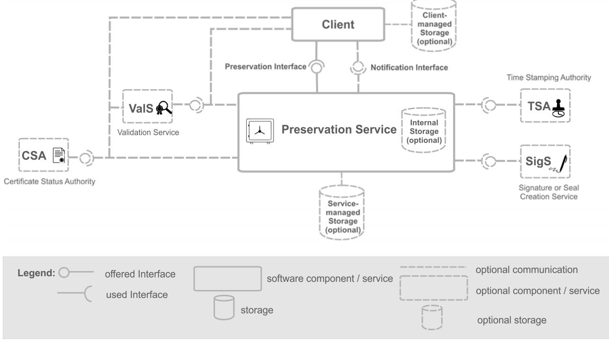
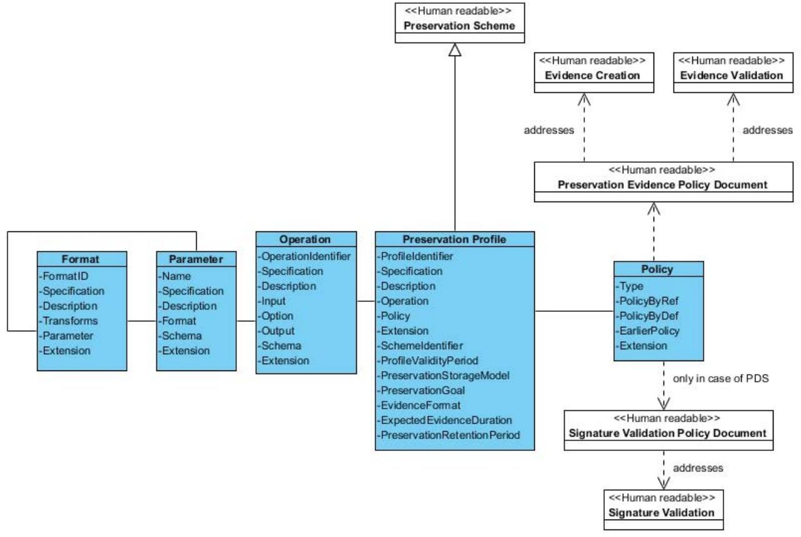
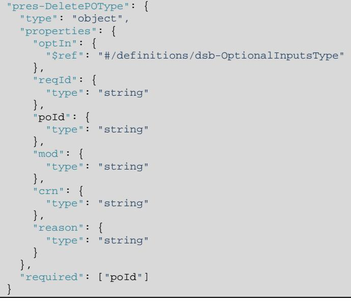
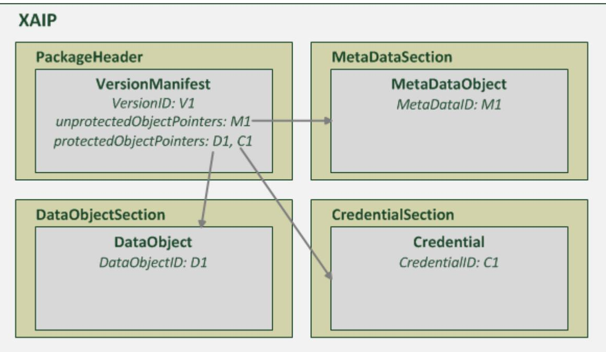
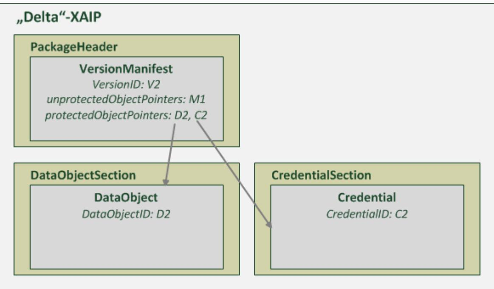
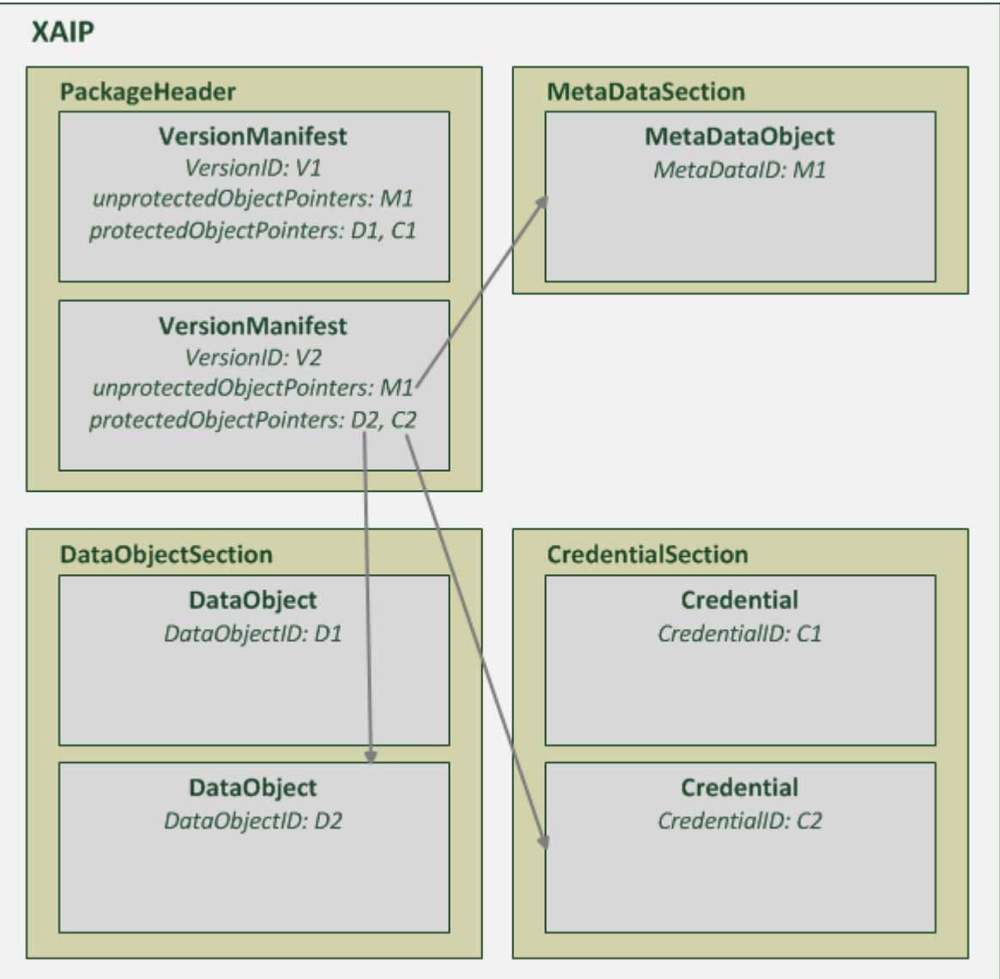

# ETSI TS 119 512 V1.1.1 (2020-01)


**Electronic Signatures and Infrastructures (ESI); Protocols for trust service providers providing long-term data preservation services** 

Reference DTS/ESI-0019512

Keywords

 electronic preservation, electronic signature, protocol

#### *ETSI*

#### 650 Route des Lucioles F-06921 Sophia Antipolis Cedex - FRANCE

Tel.: +33 4 92 94 42 00 Fax: +33 4 93 65 47 16

Siret N° 348 623 562 00017 - NAF 742 C Association à but non lucratif enregistrée à la Sous-Préfecture de Grasse (06) N° 7803/88

#### *Important notice*

The present document can be downloaded from: <http://www.etsi.org/standards-search>

The present document may be made available in electronic versions and/or in print. The content of any electronic and/or print versions of the present document shall not be modified without the prior written authorization of ETSI. In case of any existing or perceived difference in contents between such versions and/or in print, the prevailing version of an ETSI deliverable is the one made publicly available in PDF format at [www.etsi.org/deliver](http://www.etsi.org/deliver).

Users of the present document should be aware that the document may be subject to revision or change of status. Information on the current status of this and other ETSI documents is available at <https://portal.etsi.org/TB/ETSIDeliverableStatus.aspx>

If you find errors in the present document, please send your comment to one of the following services: <https://portal.etsi.org/People/CommiteeSupportStaff.aspx>

#### *Copyright Notification*

No part may be reproduced or utilized in any form or by any means, electronic or mechanical, including photocopying and microfilm except as authorized by written permission of ETSI. The content of the PDF version shall not be modified without the written authorization of ETSI. The copyright and the foregoing restriction extend to reproduction in all media.

> © ETSI 2020. All rights reserved.

**DECT™**, **PLUGTESTS™**, **UMTS™** and the ETSI logo are trademarks of ETSI registered for the benefit of its Members. **3GPP™** and **LTE™** are trademarks of ETSI registered for the benefit of its Members and of the 3GPP Organizational Partners. **oneM2M™** logo is a trademark of ETSI registered for the benefit of its Members and of the oneM2M Partners. **GSM®** and the GSM logo are trademarks registered and owned by the GSM Association.

| Intellectual Property Rights  9 |                                                    |  |
|---------------------------------|----------------------------------------------------|--|
|                                 | Foreword  9                                        |  |
|                                 | Modal verbs terminology  9                         |  |
|                                 | Executive summary  9                               |  |
|                                 | Introduction  10                                   |  |
| 1                               | Scope  11                                          |  |
| 2                               | References  11                                     |  |
| 2.1                             | Normative references  11                           |  |
| 2.2                             | Informative references  12                         |  |
| 3                               | Definition of terms, symbols and abbreviations  13 |  |
| 3.1                             | Terms  13                                          |  |
| 3.2                             | Symbols  16                                        |  |
| 3.3                             | Abbreviations  16                                  |  |
| 4                               | General aspects  17                                |  |
| 4.1                             | System architecture  17                            |  |
| 4.2                             | Preservation goals 18                              |  |
| 4.3                             | Storage models  18                                 |  |
| 4.3.1                           | Preservation with storage  18                      |  |
| 4.3.2                           | Preservation with temporary storage 18             |  |
| 4.3.3                           | Preservation without storage  19                   |  |
| 4.4                             | Preservation schemes, profile and policies  19     |  |
| 5                               | Technical Specification of Protocol  20            |  |
| 5.1                             | Introduction and Overview  20                      |  |
| 5.2                             | Discovery of supported preservation profiles  21   |  |
| 5.3                             | Operation requests and responses  21               |  |
| 5.3.1                           | Basic types for requests and responses  21         |  |
| 5.3.1.1                         | Component Request  21                              |  |
| 5.3.1.1.1                       | Semantics 21                                       |  |
| 5.3.1.1.2                       | XML Syntax  21                                     |  |
| 5.3.1.1.3                       | JSON Syntax  21                                    |  |
| 5.3.1.2                         | Component Response  21                             |  |
| 5.3.1.2.1                       | Semantics 21<br>XML Syntax  22                     |  |
| 5.3.1.2.2                       | JSON Syntax  22                                    |  |
| 5.3.1.2.3                       | RetrieveInfo  22                                   |  |
| 5.3.2<br>5.3.2.1                | RetrieveInfo request  22                           |  |
| 5.3.2.1.1                       | Semantics 22                                       |  |
| 5.3.2.1.2                       | XML Syntax  23                                     |  |
| 5.3.2.1.3                       | JSON Syntax  23                                    |  |
| 5.3.2.2                         | RetrieveInfoResponse  23                           |  |
| 5.3.2.2.1                       | Semantics 23                                       |  |
| 5.3.2.2.2                       | XML Syntax  24                                     |  |
| 5.3.2.2.3                       | JSON Syntax  24                                    |  |
| 5.3.3                           | PreservePO  25                                     |  |
| 5.3.3.1                         | PreservePO request  25                             |  |
| 5.3.3.1.1                       | Semantics 25                                       |  |
| 5.3.3.1.2                       | XML Syntax  25                                     |  |
| 5.3.3.1.3                       | JSON Syntax  25                                    |  |
| 5.3.3.2                         | PreservePOResponse  26                             |  |
| 5.3.3.2.1                       | Semantics 26                                       |  |
| 5.3.3.2.2                       | XML Syntax  27                                     |  |
| 5.3.3.2.3                       | JSON Syntax  27                                    |  |

| 5.3.4     | RetrievePO (Conditional)  27    |  |
|-----------|---------------------------------|--|
| 5.3.4.1   | RetrievePO Request  27          |  |
| 5.3.4.1.1 | Semantics 27                    |  |
| 5.3.4.1.2 | XML Syntax  28                  |  |
| 5.3.4.1.3 | JSON Syntax  29                 |  |
| 5.3.4.2   | RetrievePOResponse  29          |  |
| 5.3.4.2.1 | Semantics 29                    |  |
| 5.3.4.2.2 | XML Syntax  30                  |  |
| 5.3.4.2.3 | JSON Syntax  30                 |  |
| 5.3.5     | DeletePO (Conditional)  31      |  |
| 5.3.5.1   | DeletePO Request  31            |  |
|           | Semantics 31                    |  |
| 5.3.5.1.1 | XML Syntax  31                  |  |
| 5.3.5.1.2 | JSON Syntax  32                 |  |
| 5.3.5.1.3 |                                 |  |
| 5.3.5.2   | DeletePOResponse  32            |  |
| 5.3.6     | UpdatePOC (Optional)  33        |  |
| 5.3.6.1   | UpdatePOC Request  33           |  |
| 5.3.6.1.1 | Semantics 33                    |  |
| 5.3.6.1.2 | XML Syntax  33                  |  |
| 5.3.6.1.3 | JSON Syntax  34                 |  |
| 5.3.6.2   | UpdatePOCResponse  34           |  |
| 5.3.6.2.1 | Semantics 34                    |  |
| 5.3.6.2.2 | XML Syntax  35                  |  |
| 5.3.6.2.3 | JSON Syntax  35                 |  |
| 5.3.7     | RetrieveTrace (Optional)  36    |  |
| 5.3.7.1   | RetrieveTrace request  36       |  |
| 5.3.7.1.1 | Semantics 36                    |  |
| 5.3.7.1.2 | XML Syntax  36                  |  |
| 5.3.7.1.3 | JSON Syntax  36                 |  |
| 5.3.7.2   | RetrieveTraceResponse  37       |  |
|           | Semantics 37                    |  |
| 5.3.7.2.1 | XML Syntax  37                  |  |
| 5.3.7.2.2 | JSON Syntax  38                 |  |
| 5.3.7.2.3 | ValidateEvidence (Optional)  38 |  |
| 5.3.8     | ValidateEvidence Request  38    |  |
| 5.3.8.1   |                                 |  |
| 5.3.8.1.1 | Semantics 38                    |  |
| 5.3.8.1.2 | XML Syntax  39                  |  |
| 5.3.8.1.3 | JSON Syntax  39                 |  |
| 5.3.8.2   | ValidateEvidenceResponse  39    |  |
| 5.3.8.2.1 | Semantics 39                    |  |
| 5.3.8.2.2 | XML Syntax  40                  |  |
| 5.3.8.2.3 | JSON Syntax  40                 |  |
| 5.3.9     | Search (Optional)  41           |  |
| 5.3.9.1   | Search request  41              |  |
| 5.3.9.1.1 | Semantics 41                    |  |
| 5.3.8.1.2 | XML Syntax  41                  |  |
| 5.3.9.1.3 | JSON Syntax  42                 |  |
| 5.3.9.2   | SearchResponse  42              |  |
| 5.3.9.2.1 | Semantics 42                    |  |
| 5.3.9.2.2 | XML Syntax  43                  |  |
| 5.3.9.2.3 | JSON Syntax  43                 |  |
| 5.4       | Components for operations 44    |  |
| 5.4.1     | Overview  44                    |  |
| 5.4.2     | Component DeletionMode  44      |  |
|           | Semantics  44                   |  |
| 5.4.2.1   | XML Syntax  44                  |  |
| 5.4.2.2   | JSON Syntax  44                 |  |
| 5.4.2.3   |                                 |  |
| 5.4.3     | Component Event  45             |  |
| 5.4.3.1   | Semantics  45                   |  |
| 5.4.3.2   | XML Syntax  45                  |  |
| 5.4.3.3   | JSON Syntax  46                 |  |

| 5.4.4     | Component Evidence  46                 |  |
|-----------|----------------------------------------|--|
| 5.4.4.1   | Semantics  46                          |  |
| 5.4.4.2   | XML Syntax  47                         |  |
| 5.4.4.3   | JSON Syntax  47                        |  |
| 5.4.5     | Component PO  48                       |  |
| 5.4.5.1   | Semantics  48                          |  |
| 5.4.5.2   | XML Syntax  48                         |  |
| 5.4.5.3   | JSON Syntax  49                        |  |
| 5.4.6     | Component PreservationStorageModel  50 |  |
| 5.4.6.1   | Semantics  50                          |  |
| 5.4.6.2   | XML Syntax  50                         |  |
|           | JSON Syntax  50                        |  |
| 5.4.6.3   | Component Profile  50                  |  |
| 5.4.7     | Semantics  50                          |  |
| 5.4.7.1   |                                        |  |
| 5.4.7.2   | XML Syntax  52                         |  |
| 5.4.7.3   | JSON Syntax  53                        |  |
| 5.4.8     | Component Status  54                   |  |
| 5.4.8.1   | Semantics  54                          |  |
| 5.4.8.2   | XML Syntax  54                         |  |
| 5.4.8.3   | JSON Syntax  54                        |  |
| 5.4.9     | Component SubjectOfRetrieval  55       |  |
| 5.4.9.1   | Semantics  55                          |  |
| 5.4.9.2   | XML Syntax  55                         |  |
| 5.4.9.3   | JSON Syntax  55                        |  |
| 5.4.10    | Component Trace  56                    |  |
| 5.4.10.1  | Semantics  56                          |  |
| 5.4.10.2  | XML Syntax  56                         |  |
| 5.4.10.3  | JSON Syntax  56                        |  |
| 5.5       | Components for ASiC extensions  57     |  |
| 5.5.1     | Overview and motivation  57            |  |
| 5.5.2     | Extensions for ASiCManifest 57         |  |
| 5.5.2.1   | ContainerID Extension  57              |  |
|           | Semantics 57                           |  |
| 5.5.2.1.1 | Syntax  57                             |  |
| 5.5.2.1.2 | Criticality  57                        |  |
| 5.5.2.1.3 | PreservationPeriod Extension  57       |  |
| 5.5.2.2   |                                        |  |
| 5.5.2.2.1 | Semantics 57                           |  |
| 5.5.2.2.2 | Syntax  58                             |  |
| 5.5.2.2.3 | Criticality  58                        |  |
| 5.5.2.3   | PreservationSubmitter Extension  58    |  |
| 5.5.2.3.1 | Semantics 58                           |  |
| 5.5.2.3.2 | Syntax  58                             |  |
| 5.5.2.3.3 | Criticality  58                        |  |
| 5.5.2.4   | IsUpdatedVersionOf Extension  58       |  |
| 5.5.2.4.1 | Semantics 58                           |  |
| 5.5.2.4.2 | Syntax  58                             |  |
| 5.5.2.4.3 | Criticality  58                        |  |
| 5.5.2.5   | CanonicalizationMethod Extension  58   |  |
| 5.5.2.5.1 | Semantics 58                           |  |
| 5.5.2.5.2 | Syntax  59                             |  |
| 5.5.2.5.3 | Criticality  59                        |  |
| 5.5.2.6   | ValidationReport Extension 59          |  |
| 5.5.2.6.1 | Semantics 59                           |  |
| 5.5.2.6.2 | Syntax  59                             |  |
| 5.5.2.6.3 | Criticality  59                        |  |
| 5.5.3     | Extensions for DataObjectReference  59 |  |
|           | IsMetaDataOf Extension  59             |  |
| 5.5.3.1   |                                        |  |
| 5.5.3.1.1 | Semantics 59                           |  |
| 5.5.3.1.2 | Syntax  59                             |  |
| 5.5.3.1.3 | Criticality  59                        |  |

| 5.6.1               | Component DigestList  60                                       |  |
|---------------------|----------------------------------------------------------------|--|
| 5.6.1.1             | Semantics  60                                                  |  |
| 5.6.1.2             | XML Syntax  60                                                 |  |
| 5.6.1.3             | JSON Syntax  60                                                |  |
| 6                   | Requirements for preservation object data formats  61          |  |
| 6.1                 | General aspects and requirements  61                           |  |
| 6.2                 | Specific requirements for preservation object containers  61   |  |
|                     |                                                                |  |
| 7                   | Requirements for preservation schemes  62                      |  |
|                     | Preservation object formats  63<br>Annex A (normative):        |  |
| A.1                 | Submission data object formats  63                             |  |
| A.1.1               | CAdES digital signature according to ETSI EN 319 122-1  63     |  |
| A.1.2               | XAdES digital signature according to ETSI EN 319 132-1  63     |  |
| A.1.3               | PAdES digital signature according to ETSI EN 319 142-1  63     |  |
| A.1.4               | Associated Signature Container Extended (ASiC-E)  63           |  |
| A.1.5               | XML-based Archival Information Package (XAIP)  63              |  |
| A.1.6               | DigestList as submission data object format  63                |  |
| A.2                 | Preservation evidence formats  64                              |  |
| A.2.1               | Time-stamp Token according to IETF RFC 3161  64                |  |
| A.2.2               | Evidence Record according to IETF RFC 4998  64                 |  |
| A.2.3               | Evidence Record according to IETF RFC 6283  64                 |  |
| A.2.4               | CAdES Archive Time Stamp V3 according to ETSI EN 319 122-1  64 |  |
| A.2.5               | XAdES Archive Time Stamp according to ETSI EN 319 132-1 64     |  |
| A.2.6               | PAdES Document Time-Stamp according to ETSI EN 319 142-1  64   |  |
| A.3                 | Additional input and/or output data object formats  65         |  |
| A.3.1               | ASiC with Evidence Records (ASiC-ERS)  65                      |  |
| A.3.1.1             | Unique Identifier  65                                          |  |
| A.3.1.2             | Published Specification  65                                    |  |
| A.3.1.3             | ASiC-ERS is a profile of ASiC-E  65                            |  |
| A.3.1.4             | Fulfilment of requirements and other considerations  66        |  |
| A.3.1.4.1           | Overview and motivation  66                                    |  |
| A.3.1.4.2           | Data objects  66                                               |  |
| A.3.1.4.3           | Additional attributes  66                                      |  |
| A.3.1.4.4           | Preservation evidence 66                                       |  |
| A.3.1.4.5           | Local identifiers  66                                          |  |
| A.3.1.4.6           | Versioning  66                                                 |  |
| A.3.1.4.7           | Privacy considerations  67                                     |  |
| A.3.1.4.8           | Validation reports  67<br>Security considerations  67          |  |
| A.3.1.4.9           | Interoperability considerations  67                            |  |
| A.3.1.4.10<br>A.3.2 | XML-based Archival Information Package (XAIP)  67              |  |
| A.3.2.1             | Unique Identifier  67                                          |  |
| A.3.2.2             | Published Specification  68                                    |  |
| A.3.2.3             | Main component (XAIP)  68                                      |  |
| A.3.2.3.1           | Semantics  68                                                  |  |
| A.3.2.3.2           | Syntax  68                                                     |  |
| A.3.2.4             | Sub-components  69                                             |  |
| A.3.2.5             | Fulfilment of requirements and other considerations  69        |  |
| A.3.2.5.1           | Overview and motivation  69                                    |  |
| A.3.2.5.2           | Data objects  69                                               |  |
| A.3.2.5.3           | Additional attributes  69                                      |  |
| A.3.2.5.4           | Preservation evidence 69                                       |  |
| A.3.2.5.5           | Local identifiers  69                                          |  |
| A.3.2.5.6           | Versioning  69                                                 |  |
| A.3.2.5.7           | Privacy considerations  70                                     |  |
| A.3.2.5.8           | Validation reports  70                                         |  |
| A.3.2.5.9           | Security considerations  70                                    |  |

|                    | Annex B (normative):   | WSDL Document  71                                                                     |  |
|--------------------|------------------------|---------------------------------------------------------------------------------------|--|
|                    | Annex C (normative):   | XML Schema Document  72                                                               |  |
| C.1                |                        | XML Schema file location for namespace http://uri.etsi.org/19512/v1.1.1#  72          |  |
|                    |                        | XML Schema file location for namespace http://uri.etsi.org/19512/exchange/v1.1.1#  72 |  |
| C.2                |                        |                                                                                       |  |
|                    | Annex D (normative):   | JSON Schema and OpenAPI Documents  73                                                 |  |
| D.1                |                        | JSON Schema file  73                                                                  |  |
|                    |                        | OpenAPI specification  73                                                             |  |
| D.2                |                        |                                                                                       |  |
|                    | Annex E (informative): | Versioning of a Preservation Object Container  74                                     |  |
|                    | Annex F (normative):   | Preservation schemes  77                                                              |  |
| F.1                |                        | Preservation scheme with storage based on evidence records  77                        |  |
| F.1.1              |                        | Identifier  77                                                                        |  |
| F.1.2              |                        | Preservation goal(s)  77                                                              |  |
| F.1.3              |                        | Preservation storage model 77                                                         |  |
| F.1.4              |                        | Supported operations  77                                                              |  |
| F.1.4.1            |                        | Mandatory operations  77                                                              |  |
| F.1.4.2            |                        | Optional operations  77<br>Announcement of supported operations  78                   |  |
| F.1.4.3            |                        | Generation and validation of preservation evidences  78                               |  |
| F.1.5              |                        | Augmentation of preservation evidences  78                                            |  |
| F.1.6<br>F.1.7     |                        | Requirements and recommendations for preservation profiles  78                        |  |
|                    |                        |                                                                                       |  |
| F.2                |                        | Preservation scheme with temporary storage based on evidence records  79              |  |
| F.2.1              |                        | Identifier  79                                                                        |  |
| F.2.2              |                        | Preservation goal(s)  79                                                              |  |
| F.2.3              |                        | Preservation storage model 80                                                         |  |
| F.2.4              |                        | Supported operations  80                                                              |  |
| F.2.4.1            |                        | Mandatory operations  80<br>Optional operations  80                                   |  |
| F.2.4.2            |                        | Announcement of supported operations  80                                              |  |
| F.2.4.3            |                        | Generation and validation of preservation evidences  80                               |  |
| F.2.5<br>F.2.6     |                        | Augmentation of preservation evidences  81                                            |  |
| F.2.7              |                        | Requirements and recommendations for preservation profiles  81                        |  |
|                    |                        |                                                                                       |  |
| F.3                |                        | Preservation scheme with signature augmentation and with storage  82                  |  |
| F.3.1              |                        | Identifier  82                                                                        |  |
| F.3.2              |                        | Preservation goal(s)  82                                                              |  |
| F.3.3              |                        | Preservation storage model 82                                                         |  |
| F.3.4              |                        | Supported operations  82<br>Mandatory operations  82                                  |  |
| F.3.4.1            |                        | Optional operations  82                                                               |  |
| F.3.4.2<br>F.3.4.3 |                        | Announcement of supported operations  82                                              |  |
| F.3.5              |                        | Generation and validation of preservation evidences  83                               |  |
| F.3.6              |                        | Augmentation of preservation evidences  83                                            |  |
| F.3.7              |                        | Requirements and recommendations for preservation profiles  83                        |  |
| F.4                |                        | Preservation scheme with signature augmentation and without storage  84               |  |
| F.4.1              |                        | Identifier  84                                                                        |  |
| F.4.2              |                        | Preservation goal(s)  84                                                              |  |
| F.4.3              |                        | Preservation storage model 84                                                         |  |
| F.4.4              |                        | Supported operations  84                                                              |  |
| F.4.4.1            |                        | Mandatory operations  84                                                              |  |
| F.4.4.2            |                        | Optional operations  85                                                               |  |
| F.4.4.3            |                        | Announcement of supported operations  85                                              |  |
| F.4.5              |                        | Generation and Validation of Preservation Evidences  85                               |  |
| F.4.6              |                        | Augmentation of preservation evidences  85                                            |  |
| F.4.7              |                        | Requirements and recommendations for preservation profiles  85                        |  |

| Annex G (informative): | Data structure for backup or migration of preservation services with<br>storage  87 |  |
|------------------------|-------------------------------------------------------------------------------------|--|
| G.1                    | Motivation and solution outline  87                                                 |  |
| G.2                    | Data Structures for migration of preservation services  87                          |  |
| G.2.1                  | XML Namespace  87                                                                   |  |
| G.2.2                  | Component EvidenceExchange  87                                                      |  |
| G.2.2.1                | Semantics  87                                                                       |  |
| G.2.2.2                | Syntax  88                                                                          |  |
| G.2.3                  | Component EvidenceInfo  88                                                          |  |
| G.2.3.1                | Semantics  88                                                                       |  |
| G.2.3.2                | Syntax  89<br>Component HashTree  89                                                |  |
| G.2.4                  | Semantics  89                                                                       |  |
| G.2.4.1<br>G.2.4.2     | XML Syntax  89                                                                      |  |
| G.2.5                  | Component AbstractNode  90                                                          |  |
| G.2.5.1                | Semantics  90                                                                       |  |
| G.2.5.2                | Syntax  90                                                                          |  |
| G.2.6                  | Component Node  90                                                                  |  |
| G.2.6.1                | Semantics  90                                                                       |  |
| G.2.6.2                | Syntax  90                                                                          |  |
| G.2.7                  | Component Leaf  91                                                                  |  |
| G.2.7.1                | Semantics  91                                                                       |  |
| G.2.7.2                | Syntax  91                                                                          |  |
| G.2.8                  | Component Group  91                                                                 |  |
| G.2.8.1                | Semantics  91                                                                       |  |
| G.2.8.2                | Syntax  92                                                                          |  |
| Annex H (normative):   | Attributes for preservation evidences  93                                           |  |
| H.1                    | Introduction  93                                                                    |  |
| H.2                    | The preservation-service-identifier attribute  93                                   |  |
| H.2.1                  | Semantics  93                                                                       |  |
| H.2.2                  | ASN.1-Syntax  93                                                                    |  |
| H.2.3                  | XML-Syntax  93                                                                      |  |
| H.3                    | The preservation-evidence-policy attribute  94                                      |  |
| H.3.1                  | Semantics  94                                                                       |  |
| H.3.2                  | ASN.1-Syntax  94                                                                    |  |
| H.3.3                  | XML-Syntax  94                                                                      |  |
| H.4                    | The preservation-profile attribute  94                                              |  |
| H.4.1                  | Semantics  94                                                                       |  |
| H.4.2                  | ASN.1-Syntax  94                                                                    |  |
| H.4.3                  | XML-Syntax  95                                                                      |  |
| Annex I (normative):   | ASN.1 syntax for attributes for preservation evidences  96                          |  |
|                        | History  97                                                                         |  |

## <span id="page-8-0"></span>Intellectual Property Rights

#### Essential patents

IPRs essential or potentially essential to normative deliverables may have been declared to ETSI. The information pertaining to these essential IPRs, if any, is publicly available for **ETSI members and non-members**, and can be found in ETSI SR 000 314: *"Intellectual Property Rights (IPRs); Essential, or potentially Essential, IPRs notified to ETSI in respect of ETSI standards"*, which is available from the ETSI Secretariat. Latest updates are available on the ETSI Web server (<https://ipr.etsi.org/>).

Pursuant to the ETSI IPR Policy, no investigation, including IPR searches, has been carried out by ETSI. No guarantee can be given as to the existence of other IPRs not referenced in ETSI SR 000 314 (or the updates on the ETSI Web server) which are, or may be, or may become, essential to the present document.

#### Trademarks

The present document may include trademarks and/or tradenames which are asserted and/or registered by their owners. ETSI claims no ownership of these except for any which are indicated as being the property of ETSI, and conveys no right to use or reproduce any trademark and/or tradename. Mention of those trademarks in the present document does not constitute an endorsement by ETSI of products, services or organizations associated with those trademarks.

## Foreword

This Technical Specification (TS) has been produced by ETSI Technical Committee Electronic Signatures and Infrastructures (ESI).

## Modal verbs terminology

In the present document "**shall**", "**shall not**", "**should**", "**should not**", "**may**", "**need not**", "**will**", "**will not**", "**can**" and "**cannot**" are to be interpreted as described in clause 3.2 of the [ETSI Drafting Rules](https://portal.etsi.org/Services/editHelp!/Howtostart/ETSIDraftingRules.aspx) (Verbal forms for the expression of provisions).

"**must**" and "**must not**" are **NOT** allowed in ETSI deliverables except when used in direct citation.

## Executive summary

The present document builds upon existing work studied in ETSI SR 019 510 [\[i.13](#page-11-0)] and specifies protocols for trust service providers providing long-term preservation of digital signatures or general data using digital signature techniques.

*ETSI* 

## <span id="page-9-0"></span>Introduction

The need for long-term preservation is acknowledged amongst others in the Regulation (EU) No 910/2014 of the European Parliament and of the Council of 23 July 2014 on electronic identification and trust services for electronic transactions in the internal market [[i.1\]](#page-11-0), as can be seen in recital (61).

"*This Regulation should ensure the long-term preservation of information, in order to ensure the legal validity of electronic signatures and electronic seals over extended periods of time and guarantee that they can be validated irrespective of future technological changes".*

Furthermore Article 34 of the Regulation (EU) No 910/2014 [\[i.1\]](#page-11-0) states that "*a qualified preservation service for qualified electronic signatures may only be provided by a qualified trust service provider that uses procedures and technologies capable of extending the trustworthiness of the qualified electronic signature beyond the technological validity period*" and that "*the Commission may, by means of implementing acts, establish reference numbers of standards for the qualified preservation service for qualified electronic signatures*".

Against this background, the present document and its companion document ETSI TS 119 511 [\[i.14\]](#page-11-0) have been created based on existing work related to preservation studied in ETSI SR 019 510 [[i.13](#page-11-0)]. The present document complements ETSI TS 119 511 [[i.14\]](#page-11-0) and specifies protocols for trust service providers providing long-term data preservation services.

## <span id="page-10-0"></span>1 Scope

Based on a scoping study and survey with respect to long-term preservation techniques for digital signatures and general data documented in ETSI SR 019 510 [[i.13](#page-11-0)], the present document and its companion document ETSI TS 119 511 [\[i.14](#page-11-0)] have been created.

ETSI TS 119 511 [[i.14\]](#page-11-0) specifies policy and security requirements for trust service providers providing long-term preservation of digital signatures and of general data, i.e. unsigned data or signed data, using digital signature techniques.

The present document complements ETSI TS 119 511 [[i.14](#page-11-0)] and specifies protocols for trust service providers providing long-term data preservation services of digital signatures and of general data (i.e. unsigned data or signed data).

Specifically, but not exclusively, digital signatures in the present document cover electronic signatures, advanced electronic signatures, qualified electronic signatures, electronic seals, advanced electronic seals, and qualified electronic seals as per Regulation (EU) No 910/2014 [[i.1](#page-11-0)].

The present document first addresses general aspects (see clause [4\)](#page-16-0) such as a system architecture for preservation, which contains a preservation interface offered by the preservation service and used by the client (see clause [4.1](#page-16-0)). The preservation service may aim at different preservation goals (see clause [4.2](#page-17-0)), may or may not provide storage functionality (see clause [4.3\)](#page-17-0), and provide different profiles of preservation schemes, which may implement different preservation evidence policies (see clause [4.4\)](#page-18-0).

In a second step, the present document specifies methods and data objects constituting a protocol between a client and a long-term data preservation service for the issuance and maintenance of evidences (see clause [5\)](#page-19-0). For each call at the preservation interface it first specifies the semantics in a generic fashion and then specifies the concrete syntax of the conveyed data elements based on XML and JSON together with its binding to SOAP [[i.25\]](#page-12-0) and REST respectively.

## 2 References

## 2.1 Normative references

References are either specific (identified by date of publication and/or edition number or version number) or non-specific. For specific references, only the cited version applies. For non-specific references, the latest version of the referenced document (including any amendments) applies.

Referenced documents which are not found to be publicly available in the expected location might be found at <https://docbox.etsi.org/Reference/>.

NOTE: While any hyperlinks included in this clause were valid at the time of publication, ETSI cannot guarantee their long term validity.

The following referenced documents are necessary for the application of the present document.

- [1] ETSI EN 319 162-1: "Electronic Signatures and Infrastructures (ESI); Associated Signature Containers (ASiC); Part 1: Building blocks and ASiC Baseline containers".
- [2] IETF RFC 3986: "Uniform Resource Identifier (URI): Generic Syntax".
- [3] IETF RFC 4998: "Evidence Record Syntax (ERS)".
- [4] IETF RFC 6283: "Extensible Markup Language Evidence Record Syntax (XMLERS)".
- [5] OASIS: "Digital Signature Service Core Protocols, Elements, and Bindings Version 2.0", Committee Specification 02, 11 December 2019.
- [6] OASIS: "Digital Signature Service Metadata Version 1.0", Committee Specification 02, 11 December 2019.

## <span id="page-11-0"></span>2.2 Informative references

(ASN.1): Specification of basic notation".

References are either specific (identified by date of publication and/or edition number or version number) or non-specific. For specific references, only the cited version applies. For non-specific references, the latest version of the referenced document (including any amendments) applies.

NOTE: While any hyperlinks included in this clause were valid at the time of publication, ETSI cannot guarantee their long term validity.

The following referenced documents are not necessary for the application of the present document but they assist the user with regard to a particular subject area.

| [i.1]  | Regulation (EU) No 910/2014 of the European Parliament and of the Council of 23 July 2014 on<br>electronic identification and trust services for electronic transactions in the internal market and<br>repealing Directive 1999/93/EC. OJ L 257, 28.8.2014, p. 73-114. |
|--------|------------------------------------------------------------------------------------------------------------------------------------------------------------------------------------------------------------------------------------------------------------------------|
| [i.2]  | BSI TR-03125-F: "Preservation of Evidence of Cryptographically signed Documents, Formats<br>(TR-ESOR-F)".                                                                                                                                                              |
| NOTE:  | Available at https://www.bsi.bund.de/EN/tr-esor_XAIP.                                                                                                                                                                                                                  |
| [i.3]  | ETSI TR 119 001: "Electronic Signatures and Infrastructures (ESI); The framework for<br>standardization of signatures; Definitions and abbreviations".                                                                                                                 |
| [i.4]  | ETSI TS 119 612: "Electronic Signatures and Infrastructures (ESI); Trusted Lists".                                                                                                                                                                                     |
| [i.5]  | ETSI EN 319 122-1: "Electronic Signatures and Infrastructures (ESI); CAdES digital signatures;<br>Part 1: Building blocks and CAdES baseline signatures".                                                                                                              |
| [i.6]  | ETSI TS 119 122-3: "Electronic Signatures and Infrastructures (ESI); CAdES digital signatures;<br>Part 3: Incorporation of Evidence Record Syntax (ERS) mechanisms in CAdES".                                                                                          |
| [i.7]  | ETSI EN 319 132-1: "Electronic Signatures and Infrastructures (ESI); XAdES digital signatures;<br>Part 1: Building blocks and XAdES baseline signatures".                                                                                                              |
| [i.8]  | ETSI EN 319 142-1: "Electronic Signatures and Infrastructures (ESI); PAdES digital signatures;<br>Part 1: Building blocks and PAdES baseline signatures".                                                                                                              |
| [i.9]  | ETSI TS 119 312: "Electronic Signatures and Infrastructures (ESI); Cryptographic Suites".                                                                                                                                                                              |
| [i.10] | ETSI EN 319 422: "Electronic Signatures and Infrastructures (ESI); Time-stamping protocol and<br>time-stamp token profiles".                                                                                                                                           |
| [i.11] | ETSI TS 119 441: "Electronic Signatures and Infrastructures (ESI); Policy requirements for TSP<br>providing signature validation services".                                                                                                                            |
| [i.12] | ETSI TS 119 442: "Electronic Signatures and Infrastructures (ESI); Protocol profiles for trust<br>service providers providing AdES digital signature validation services".                                                                                             |
| [i.13] | ETSI SR 019 510: "Electronic Signatures and Infrastructures (ESI); Scoping study and framework<br>for standardization of long-term data preservation services, including preservation of/with digital<br>signatures".                                                  |
| [i.14] | ETSI TS 119 511: "Electronic Signatures and Infrastructures (ESI); Policy and security<br>requirements for trust service providers providing long-term preservation of digital signatures or<br>general data using digital signature techniques".                      |
| [i.15] | ISO 13527:2010: "Space data and information transfer systems - XML formatted data unit<br>(XFDU) structure and construction rules".                                                                                                                                    |
| [i.16] | ISO 14721:2012: "Space data and information transfer systems - Open archival information<br>system (OAIS) - Reference model".                                                                                                                                          |
|        |                                                                                                                                                                                                                                                                        |

<span id="page-12-0"></span>[i.17] ISO/IEC 21320-1:2015: "Information technology - Document Container File - Part 1: Core".

| [i.18] | IANA: Media Type Registry.                                                                                              |
|--------|-------------------------------------------------------------------------------------------------------------------------|
| NOTE:  | Available at https://www.iana.org/assignments/media-types/media-types.xhtml.                                            |
| [i.19] | IETF RFC 3061: "A URN Namespace of Object Identifiers".                                                                 |
| [i.20] | IETF RFC 3161: "Internet X.509 Public Key Infrastructure Time-Stamp Protocol (TSP)".                                    |
| [i.21] | IETF RFC 5280: "Internet X.509 Public Key Infrastructure Certificate and Certificate Revocation<br>List (CRL) Profile". |
| [i.22] | IETF RFC 6960: "X.509 Internet Public Key Infrastructure Online Certificate Status Protocol -<br>OCSP".                 |
| [i.23] | The National Archives: "PRONOM Unique Identifiers".                                                                     |
| NOTE:  | Available at http://www.nationalarchives.gov.uk/aboutapps/pronom/puid.htm.                                              |
| [i.24] | W3C Recommendation 26 November 2008: "Extensible Markup Language (XML) 1.0<br>(Fifth Edition)".                         |
| NOTE:  | Available at https://www.w3.org/TR/xml/.                                                                                |
| [i.25] | W3C Recommendation 27 April 2007: "SOAP Version 1.2 Part 1: Messaging Framework<br>(Second Edition)".                   |
| NOTE:  | Available at https://www.w3.org/TR/soap12/.                                                                             |
| [i.26] | W3C Recommendation 25 January 2005: "SOAP Message Transmission Optimization<br>Mechanism".                              |
| NOTE:  | Available at https://www.w3.org/TR/soap12-mtom/.                                                                        |
| [i.27] | W3C Recommendation 11 April 2013: "XML Signature Syntax and Processing Version 1.1".                                    |

NOTE: Available at<https://www.w3.org/TR/xmldsig-core1/>.

## 3 Definition of terms, symbols and abbreviations

## 3.1 Terms

For the purposes of the present document, the terms given in ETSI TR 119 001 [[i.3](#page-11-0)] and the following apply:

**certificate status authority:** authority providing certificate status information

EXAMPLE: The certificate status information can be provided using the Online Certificate Status Protocol (OCSP) [i.22] or in form of Certificate Revocation Lists (CRL) [i.21].

**container:** data object, which contains a set of data objects and optional additional information, which describes the contained data objects and optionally its content and its interrelationships

- EXAMPLE: The format of a container can be based on, ZIP as defined in ISO/IEC 21320-1 [i.17] or XML [i.24]. ASiC [\[1](#page-10-0)] is an example of a container based on ZIP.
- NOTE: Additional information may comprise associated digital signatures, time-stamps, evidence records, validation data (CRLs, OCSP responses) and validation reports.

**data object:** actual binary/octet data being operated on (e.g. transformed, digested, or signed) by an application and which may be associated with additional information like an identifier, the encoding, size or type

**delta preservation object container:** special preservation object container describing the difference to an already existing preservation object container

**EU qualified preservation service:** preservation service that meets the requirements for qualified preservation service for qualified electronic signatures and/or for qualified electronic seals as laid down in Regulation (EU) 910/2014 [[i.1](#page-11-0)]

**evidence record:** unit of data, which can be used to prove the existence of an archived data object or an archived data object group at a certain time

NOTE: See IETF RFC 4998 [\[3](#page-10-0)], IETF RFC 6283 [\[4](#page-10-0)] and ETSI TS 119 122-3 [[i.6\]](#page-11-0).

**expected evidence duration:** for a preservation service with temporary storage or without storage, duration during which the preservation service expects that the preservation evidence can be used to achieve the preservation goal

**long-term:** time period during which technological changes may be a concern

- EXAMPLE: Possible technological changes are obsolescence of cryptographic technology such as crypto algorithms, key sizes or hash functions, key compromises.
- NOTE: The transformation of the original data into another data object which equivalent object content and semantic to avoid the risk that the original data object/viewer system is becoming obsolete is not covered.

**long-term preservation:** extension of the validity status of a digital signature over long periods of time and/or of provision of proofs of existence of data over long periods of time, in spite of obsolescence of cryptographic technology such as crypto algorithms, key sizes or hash functions, key compromises or of the loss of the ability to check the validity status of public key certificates

**metadata:** data about other data

NOTE: See ISO 14721:2012 [\[i.16](#page-11-0)].

**notification interface:** interface provided by the preservation client supporting the notification protocol

NOTE: The notification interface is not addressed by the present document.

**notification protocol:** protocol used by a preservation service to notify the preservation client

NOTE: The notification protocol is not addressed by the present document.

**preservation client:** component or a piece of software which interacts with a preservation service via the preservation protocol

**preservation evidence:** evidence produced by the preservation service which can be used to demonstrate that one or more preservation goals are met for a given preservation object

**preservation evidence policy:** set of rules that specify the requirements and the internal process to generate or how to validate a preservation evidence

**preservation evidence retention period:** for a preservation service With Temporary Storage (WTS) the time period during which the evidences that are produced asynchronously can be retrieved from the preservation service

**preservation goal:** one of the following objectives achieved during the preservation time frame: extending over long periods of time the validity status of digital signatures, providing proofs of existence of data over long periods of time, or augmentation of externally provided preservation evidences

NOTE: A preservation service can support one or more preservation goals.

**preservation interface:** component implementing the preservation protocol on the side of the preservation service

**preservation manifest:** data object in a preservation object container referring to the preservation data objects or additional information and metadata in the preservation object container

- EXAMPLE 1: Additional file in an ASiC-container according to ETSI EN 319 162-1 [\[1](#page-10-0)], clause A.7.
- EXAMPLE 2: versionManifest in BSI TR-03125-F [\[i.2\]](#page-11-0).
- EXAMPLE 3: An XML-based manifest data element in an XML-based POC.

**preservation mechanism:** mechanism used to preserve preservation objects and to maintain the validity of preservation evidences

NOTE: The present document only addresses preservation mechanisms based on digital signature techniques.

**preservation object:** typed data object, which is submitted to, processed by or retrieved from a preservation service

NOTE: This covers submission data objects, preservation object containers and preservation evidences.

**preservation object container:** container which contains a set of data objects and optionally related metadata providing information about the data objects and optionally preservation manifest(s) specifying its content and relationships

EXAMPLE 1: An ASiC-S or ASiC-E container is a Preservation Object Container that supports one or more signature and time assertion files each applicable to its own set of one or more files.

EXAMPLE 2: An OAIS Submission Information Packages is a Preservation Object Container.

**preservation object identifier:** unique identifier of a (set of) preservation object(s) submitted to a preservation service

**preservation planning:** monitoring changes and risks e.g. concerning innovations in storage, access and preservation technologies, new design strategies, etc.

**preservation period:** for a preservation service with storage, duration during which the preservation service preserves the submitted preservation objects and the associated evidence

NOTE: The submitted preservation objects can be updated during the preservation period.

**preservation profile:** uniquely identified set of implementation details pertinent to a preservation storage model and one or more preservation goals which specifies how preservation evidences are generated and validated

NOTE: See clause [5.4.7](#page-49-0) of the present document for the specification of the Profile component.

**preservation protocol:** protocol to communicate between the preservation service and a preservation client

**preservation scheme:** generic set of procedures and rules pertinent to a preservation storage model and one or more preservation goals which outlines how preservation evidences are created and validated

NOTE 1: Different preservation profiles can implement the same preservation scheme.

NOTE 2: A preservation scheme can be considered as a generalization of a set of preservation profiles.

**preservation service:** service capable of extending the validity status of a digital signature over long periods of time and/or of providing proofs of existence of data over long periods of time

**preservation storage model:** one of the following ways of implementing a preservation service: with storage, with temporary storage, without storage

**preservation submitter:** legal or natural person using the preservation client to submit the submission data object

**preservation subscriber:** legal or natural person bound by agreement with a preservation trust service provider to any subscriber obligations

**proof of existence:** evidence that proves that an object existed at a specific date/time

**proof of integrity:** evidence that data has not been altered since it was protected

NOTE: A proof of existence requires and implies a proof of integrity.

**signer:** entity being the creator of a digital signature **submission data object**: original data object provided by the client

NOTE: If provided by the client, the Preservation Object Container (POC) is a submission data object.

**time-stamp:** data in electronic form which binds other electronic data to a particular time establishing evidence that these data existed at that time

**time-stamping authority:** trust service provider which issues time-stamps using one or more time-stamping units

<span id="page-15-0"></span>**time-stamping service:** trust service for issuing time-stamps

**time-stamping unit:** set of hardware and software which is managed as a unit and has a single time-stamp signing key active at a time

**trusted list:** list that provides information about the status and the status history of the trust services from trust service providers regarding compliance with the applicable requirements and the relevant provisions of the applicable legislation

NOTE: In the context of European Union Member States, as specified in Regulation (EU) No 910/2014 [\[i.1](#page-11-0)], it refers to an EU Member State list including information related to the qualified trust service providers for which it is responsible, together with information related to the qualified trust services provided by them.

**validation data:** data that is used to validate a digital signature

## 3.2 Symbols

Void.

## 3.3 Abbreviations

For the purposes of the present document, the abbreviations given in ETSI TR 119 001 [\[i.3\]](#page-11-0) and the following apply:

| API<br>ASN.1<br>AUG<br>BSI<br>CRL<br>CSA<br>EN<br>ERS                                | Application Programming Interface<br>Abstract Syntax Notation One<br>Augmentation<br>Bundesamt für Sicherheit in der Informationstechnik<br>Certificate Revocation List<br>Certificate Status Authority<br>European Norm<br>Evidence Record Syntax                                                                                                                                    |
|--------------------------------------------------------------------------------------|---------------------------------------------------------------------------------------------------------------------------------------------------------------------------------------------------------------------------------------------------------------------------------------------------------------------------------------------------------------------------------------|
| NOTE:                                                                                | See IETF RFC 4998 [3].                                                                                                                                                                                                                                                                                                                                                                |
| IANA<br>IETF<br>ISO<br>JSON<br>LXAIP                                                 | Internet Assigned Numbers Authority<br>Internet Engineering Task Force<br>International Organization for Standardization<br>JavaScript Object Notation<br>Logical XAIP                                                                                                                                                                                                                |
| NOTE:                                                                                | See BSI TR-03125-F [i.2].                                                                                                                                                                                                                                                                                                                                                             |
| OAIS                                                                                 | Open Archival Information System                                                                                                                                                                                                                                                                                                                                                      |
| NOTE:                                                                                | See ISO 14721:2012 [i.16].                                                                                                                                                                                                                                                                                                                                                            |
| OCSP<br>OID<br>PDS<br>PGD<br>PO<br>POC<br>PoE<br>POID<br>PUID<br>REST<br>RFC<br>SOAP | Online Certificate Status Protocol<br>Object Identifier<br>Preservation of Digital Signatures<br>Preservation of General Data<br>Preservation Object<br>Preservation Object Container<br>Proof of Existence<br>Unique Identifier of a submitted PO<br>PRONOM Persistant Unique Identifier<br>Representational State Transfer<br>Request for Comments<br>Simple Object Access Protocol |
| NOTE:                                                                                | See W3C Recommendation 27 April 2007 [i.25].                                                                                                                                                                                                                                                                                                                                          |
| SubDO<br>TSA                                                                         | Submission Data Object<br>Time-stamping Authority                                                                                                                                                                                                                                                                                                                                     |

<span id="page-16-0"></span>

| URI<br>URL<br>WOS<br>WSDL | Unique Resource Identifier<br>Unique Resource Locator<br>WithOut Storage<br>Web Service Description Language |
|---------------------------|--------------------------------------------------------------------------------------------------------------|
| WST<br>WTS<br>XAIP        | With STorage<br>With Temporary Storage<br>XML-based Archive Information Package                              |
| NOTE:                     | See BSI TR-03125-F [i.2].                                                                                    |
| XFDU                      | XML Formatted Data Unit                                                                                      |
| NOTE:                     | See ISO 13527:2010 [i.15].                                                                                   |
| XML                       | eXtensible Markup Language                                                                                   |

NOTE: See W3C Recommendation 26 November 2008 [[i.24](#page-12-0)].

## 4 General aspects

## 4.1 System architecture

The overall system architecture with the preservation service specified in the present document is depicted in Figure 1.



**Figure 1: System architecture with preservation service and related services** 

As depicted in Figure 1, the preservation service defined in the present document provides the preservation interface as specified in clause 5 and may use an external time-stamping authority (TSA), which issues time-stamps (see ETSI EN 319 422 [[i.10\]](#page-11-0)), or a signature or seal creation service (SigS), which issues suitable digital signatures. It may optionally use a validation service (ValS) (see ETSI TS 119 441 [\[i.11](#page-11-0)] and ETSI TS 119 442 [\[i.12\]](#page-11-0)) to collect certification path information and revocation information or directly collect certification path information and gather certificate status information issued by a Certificate Status Authority (CSA).

<span id="page-17-0"></span>There are three main variants for a preservation service (see clause 4.3) whether it uses (a) a long-term storage, (b) a temporary storage or (c) no storage. When it uses a storage, the preservation service may use an internal storage or an external storage under its control for preservation.

Furthermore, the preservation service may call back the client via the notification interface in order to inform it about relevant events. An important type of event is that a previously applied cryptographic algorithm is expected to become weak and hence the client and/or the preservation service need to perform additional measures.

NOTE: The technical details of the notification interface and the notification protocol are not addressed in the present document.

## 4.2 Preservation goals

A preservation service can pursue different preservation goals, which has an influence on the supported operational tasks.

The present document specifies the following three goals which may be used separately or in combination:

• http://uri.etsi.org/19512/goal/pgd

The preservation goal "Preservation of General Data" (PGD) provides a proof of existence over long periods of time of the submission data object (SubDO) submitted to the preservation service.

NOTE: The PGD goal does not distinguish between signed and unsigned data.

- http://uri.etsi.org/19512/goal/pds The preservation goal "Preservation of Digital Signatures" (PDS) extends over long periods of time the ability to validate a digital signature, to maintain its validity status and to get a proof of existence of the associated signed data.
- http://uri.etsi.org/19512/goal/aug The preservation goal "Augmentation" (AUG) indicates that the preservation service supports the augmentation of submitted preservation evidences.

### 4.3 Storage models

### 4.3.1 Preservation with storage

In this preservation storage model, the preservation service stores the submission data objects (SubDO) as well as the preservation evidences that are produced for them by the preservation service. In this model, the preservation service supports the export and the import of preservation objects and evidences produced by itself and other preservation services.

- EXAMPLE 1: The evidences produced in this mode can be evidence records according to IETF RFC 4998 [[3\]](#page-10-0) or IETF RFC 6283 [\[4](#page-10-0)].
- EXAMPLE 2: The preservation evidence produced in this mode can be the information included in an archival format of an AdES signature.

This storage model is addressed by the value WithStorage (WST) within the PreservationStorageModelType (see clause [5.4.6](#page-49-0)).

### 4.3.2 Preservation with temporary storage

In this preservation storage model, the preservation service does not permanently store the SubDO, but it stores them only as long as needed to create the corresponding evidence. The preservation evidences are produced asynchronously and are stored during some time-period to allow the client to retrieve it.

EXAMPLE 1: Evidences are produced every 24 hours, but are stored for a longer period of time.

<span id="page-18-0"></span>This storage model has two variants: either the client sends the full data object to the preservation service, or the client only sends the corresponding hash values associated with hash function identifiers. These hash values may represent a single Preservation Objects (PO) or a group of several POs contained in a Preservation Object Container (POC) using hash-tree techniques. Sending hash values and hash function identifiers can be useful in cases of very large POs or when confidentiality of the data is important or when privacy is a concern. However, this strategy can impose additional challenges in case the used hash function(s) become weak.

EXAMPLE 2: The evidences produced in this mode can be Evidence Records according to IETF RFC 4998 [[3\]](#page-10-0) or IETF RFC 6283 [\[4](#page-10-0)].

This storage model is addressed by the value WithTemporaryStorage (WTS) within the PreservationStorageModelType (see clause [5.4.6](#page-49-0)).

### 4.3.3 Preservation without storage

In this preservation storage model, the preservation service does not store the SubDOs and the preservation evidences are produced synchronously.

EXAMPLE: This preservation storage model can be implemented doing a continuous augmentation of CAdES signatures with archive-time-stamp-v3 attributes according to ETSI EN 319 122-1 [[i.5\]](#page-11-0).

In an alternative approach, similar as in the case of temporary storage specified above, the client only submits hash values associated with hash function identifiers. These hash values may be the representative of a single data object or of several data objects contained in a preservation object container (POC) using hash-tree techniques. This strategy can be useful in cases of very large data objects or when confidentiality of the data is important or when privacy is a concern.

This storage model is addressed by the value WithoutStorage (WOS) within the PreservationStorageModelType (see clause [5.4.6](#page-49-0)).

## 4.4 Preservation schemes, profile and policies

A preservation service according to the present document may support different preservation schemes, which define the general approach for preservation. Please refer to Annex F for preservation schemes defined in the present document. A preservation scheme supports at least one preservation goal (see clause [4.2](#page-17-0)) and is operating in exactly one storage model (see clause [4.3](#page-17-0)).

A preservation scheme is a rather abstract description and can be implemented by one or more preservation profiles, which are described by machine-readible Profile elements as outlined in [Figure 2](#page-19-0) and specified in clause [5.4.7.](#page-49-0) The Profile element describes the technical aspects of a preservation profile, which enable a client to use the preservation interface to communicate with the preservation service. The set of preservation profiles supported by a preservation service can be retrieved using the RetrieveInfo call (see clause [5.3.2](#page-21-0)).

A preservation profile in particular contains (references to) policy related information, which addresses aspects of evidence creation and validation and signature validation, in case the preservation goal is PDS (see clause [4.2\)](#page-17-0).

The general relationship between a preservation scheme, a preservation profile and related policies is outlined in the following UML-based class diagram, which distinguishes between machine-readable components (depicted in blue) and human-readable components (depicted in white).

<span id="page-19-0"></span>

**Figure 2: Relationship between preservation scheme, profile and policy** 

## 5 Technical Specification of Protocol

## 5.1 Introduction and Overview

The present document first specifies the semantics of the different calls of the protocol for the preservation protocol in a generic fashion and then specifies the concrete syntax of the conveyed data elements based on XML and JSON together with its binding to SOAP and REST respectively.

This covers the following operations:

- RetrieveInfo (see clause [5.3.2](#page-21-0))
- PreservePO (see clause [5.3.3](#page-24-0))
- RetrievePO (see clause [5.3.4](#page-26-0))
- DeletePO (see clause [5.3.5](#page-30-0))
- UpdatePOC (see clause [5.3.6](#page-32-0))
- RetrieveTrace (see clause [5.3.7](#page-35-0))
- ValidateEvidence (see clause [5.3.8](#page-37-0))
- Search (see clause [5.3.9](#page-40-0))

The specification of the request and response of these operations uses the basic types in clause [5.3.1](#page-20-0) and the structure models defined in clause [5.4](#page-43-0).

<span id="page-20-0"></span>Clause 5.2 explains how the set of supported preservation profiles can be discovered.

Please refer to clause 8.1 of ETSI TS 119 511 [[i.14](#page-11-0)] for additional information on the preservation protocol.

Furthermore, clause [5.5](#page-56-0) contains preservation-specific extensions for ASiC-related components and clause [5.6](#page-59-0) specifies extensions for other preservation object formats.

## 5.2 Discovery of supported preservation profiles

A preservation service as specified in the present document may be operated in different operation modes (see clauses [4.2](#page-17-0) to [4.4](#page-18-0)), which are expressed by preservation profiles as described by Profile elements as specified in clause [5.4.7](#page-49-0).

To enable a client to retrieve the set of supported preservation profiles, the preservation service shall support the RetrieveInfo operation according to clause [5.3.2](#page-21-0).

### 5.3 Operation requests and responses

### 5.3.1 Basic types for requests and responses

#### 5.3.1.1 Component Request

#### 5.3.1.1.1 Semantics

The Request component is used as basic type within the operation requests defined in clauses [5.3.3](#page-24-0) to [5.3.8.](#page-37-0)

Below follows a list of the sub-components that may be present within this component:

- The optional OptionalInputs element. If present, it shall contain a sub-component as defined in clause 4.1.8 of OASIS DSS-X Core 2.0 [\[5](#page-10-0)].
- The optional RequestID element. If present, it shall contain one instance of a string. The RequestID element is used to correlate requests with responses. When present in a request, the preservation service shall return it in the response.

#### 5.3.1.1.2 XML Syntax

The XML type RequestType shall implement the requirements defined in the Request component.

The RequestType XML elements shall be defined as in XML Schema file (Preservation-API.xsd) provided in Annex C, and which is copied below for information.

```
<complexType name="RequestType">
 <sequence>
 <element name="OptionalInputs" type="dsb:OptionalInputsType" minOccurs="0" />
 </sequence>
 <attribute name="RequestID" type="string" use="optional"/>
</complexType>
```
#### 5.3.1.1.3 JSON Syntax

The component Request is used as a base type only, not as a JSON instance.

#### 5.3.1.2 Component Response

#### 5.3.1.2.1 Semantics

The Response component is used as basic type within the operation responses defined in clauses [5.3.3](#page-24-0) to [5.3.9](#page-40-0).

<span id="page-21-0"></span>Below follows a list of the sub-components that may be present within this component:

- The optional OptionalOutputs element may be present and shall, if present, contain a sub-component as defined in clause 4.1.9 of OASIS DSS-X Core 2.0 [\[5](#page-10-0)].
- The Result element shall be present and contain a sub-component as defined in clause 4.1.7 of OASIS DSS-X Core 2.0 [\[5](#page-10-0)].
- NOTE: The Result element contains components which allow to convey major and minor status codes and for the different operations. Please refer to clause 4.1.7 of OASIS DSS-X Core 2.0 [\[5](#page-10-0)] for the specification of the structure of the Result component and to the clauses [5.3.3](#page-24-0) to [5.3.9](#page-40-0) for the different error code values, which may appear within the different responses.
- The optional RequestID component may be present and shall, if present, contain one instance of a string. The RequestID element is used to correlate requests with responses. When present in a request, the preservation service shall return it in the response.

#### 5.3.1.2.2 XML Syntax

The XML type ResponseType shall implement the requirements defined in the Response component.

The ResponseType XML type shall be defined as in XML Schema file (Preservation-API.xsd) provided in Annex C, and which is copied below for information.

```
<complexType name="ResponseType">
 <sequence>
 <element name="OptionalOutputs" type="dsb:OptionalOutputsType" 
 minOccurs="0" />
 <element ref="dsb:Result" />
 </sequence>
 <attribute name="RequestID" type="string" use="optional"/>
</complexType>
```
#### 5.3.1.2.3 JSON Syntax

The component Response is used as a base type only, not as a JSON instance.

### 5.3.2 RetrieveInfo

#### 5.3.2.1 RetrieveInfo request

#### 5.3.2.1.1 Semantics

The RetrieveInfo request shall extend the Request component (see clause [5.3.1.1\)](#page-20-0) and shall inherit the set of sub-components.

The RetrieveInfo request allows to retrieve information about the preservation profiles supported by the preservation service. As the number of preservation profiles supported by a preservation service may become high over long periods of time, the RetrieveInfo operation allows to filter for active and inactive preservation profiles using the optional Status element, or specify a single preservation profile using the Profile element.

The RetrieveInfo request may contain the following sub-components:

- The optional Profile element may be present and shall, if present, contain a URI according to IETF RFC 3986 [\[2](#page-10-0)], which specifies a specific preservation profile for which information is to be retrieved.
- The optional Status element may be present and shall, if present, satisfy the requirements specified in the present document in clause [5.4.8](#page-53-0). This element may be used to filter for active or inactive preservation profiles. If this optional element is omitted, only active preservation profiles are returned.

#### <span id="page-22-0"></span>5.3.2.1.2 XML Syntax

The XML type RetrieveInfoType shall implement the requirements defined in the RetrieveInfo component.

The RetrieveInfoType XML element shall be defined as in XML Schema file (Preservation-API.xsd) provided in Annex C, and which is copied below for information.

```
<complexType name="RetrieveInfoType">
 <complexContent>
 <extension base="pres:RequestType">
 <sequence>
 <element name="Profile" type="anyURI" minOccurs="0" maxOccurs="1" />
 <element name="Status" type="pres:StatusType" 
 minOccurs="0" maxOccurs="1" />
 </sequence>
 </extension>
 </complexContent>
</complexType>
```
#### 5.3.2.1.3 JSON Syntax

The RetrieveInfoType JSON object shall implement in JSON syntax the requirements defined in the RetrieveInfo component.

The RetrieveInfoType JSON object shall be defined as in JSON Schema file (Preservation-API.json) provided in Annex D, and is copied below for information.

```
"pres-RetrieveInfoType": { 
 "type": "object",
 "properties": { 
 "optIn": { 
 "$ref": "#/definitions/dsb-OptionalInputsType"
 }, 
 "reqId": { 
 "type": "string"
 }, 
 "pro": { 
 "type": "string"
 }, 
 "stat": { 
 "type": "string"
 } 
 } 
}
```
Properties of the JSON object shall implement the sub-components of RetrieveInfo using JSON-specific names mapped as shown in Table 1.

| Table 1 |  |
|---------|--|
|---------|--|

| Element | Implementing JSON member name | Comments |
|---------|-------------------------------|----------|
| Profile | pro                           | []       |
| Status  | stat                          | []       |

#### 5.3.2.2 RetrieveInfoResponse

#### 5.3.2.2.1 Semantics

The RetrieveInfoResponse shall extend the Response component (see clause [5.3.1.2\)](#page-20-0) and shall inherit the set of sub-components.

RetrieveInfoResponse is returned as response to invoking the RetrieveInfo operation.

<span id="page-23-0"></span>The RetrieveInfoResponse may contain the following sub-components:

• Zero or more Profile elements. If present, each instance shall satisfy the requirements specified in the present document in clause [5.4.7](#page-49-0).

The following error codes may appear in the Result/ResultMinor component within RetrieveInfoResponse:

- http://uri.etsi.org/19512/error/noPermission
- http://uri.etsi.org/19512/error/internalError
- http://uri.etsi.org/19512/error/parameterError
- http://uri.etsi.org/19512/error/notSupported

#### 5.3.2.2.2 XML Syntax

The XML type RetrieveInfoResponseType shall implement the requirements defined in the RetrieveInfoResponse component.

The RetrieveInfoResponseType XML element shall be defined as in XML Schema file (Preservation-API.xsd) provided in Annex C, and which is copied below for information.

```
<complexType name="RetrieveInfoResponseType">
 <complexContent>
 <extension base="pres:ResponseType">
 <sequence>
 <element maxOccurs="unbounded" minOccurs="0" ref="pres:Profile"/>
 </sequence>
 </extension>
 </complexContent>
</complexType>
```
#### 5.3.2.2.3 JSON Syntax

The RetrieveInfoResponseType JSON object shall be defined as in JSON Schema file (Preservation-API.json) provided in Annex D, and is copied below for information.

```
"pres-RetrieveInfoResponseType": { 
 "type": "object",
 "properties": { 
 "optOut": { 
 "$ref": "#/definitions/dsb-OptionalOutputsType"
 }, 
 "reqId": { 
 "type": "string"
 }, 
 "pro": { 
 "type": "array",
 "items": { 
 "$ref": "#/definitions/pres-ProfileType"
 } 
 } 
 } 
}
```
Properties of the JSON object shall implement the sub-components of RetrieveInfoResponse using JSON-specific names mapped as shown in Table 2.

**Table 2** 

| Element | Implementing JSON member name | Comments |
|---------|-------------------------------|----------|
| Profile | pro                           | []       |

### <span id="page-24-0"></span>5.3.3 PreservePO

#### 5.3.3.1 PreservePO request

#### 5.3.3.1.1 Semantics

The PreservePO request shall extend the Request component (see clause [5.3.1.1\)](#page-20-0) and shall inherit the set of subcomponents.

It is used to submit zero or more preservation objects (PO) to the preservation service. The details how the preservation is performed is determined by the provided Profile element, which refers to an operational profile of the preservation service as described by a Profile element (see clause [5.4.7](#page-49-0)), which can be retrieved using the RetrieveInfo operation (see clause [5.3.2\)](#page-21-0).

The PreservePO request shall contain the following sub-components:

- The Profile element. It shall contain one instance of a URI, which specifies the operational profile of the preservation service, which is used for preservation. The details of the Profile element are described in clause [5.4.7.](#page-49-0)
- Zero or more instances of the PO element. Each instance shall satisfy the requirements specified in clause [5.4.5.](#page-47-0)
- NOTE: The invocation of PreservePO without any PO allows, in case of a preservation service with storage and support for versioning as outlined in Annex E, to obtain a POID without immediately storing data. The POID may be used in a subsequent call of UpdatePOC for storing preservation data objects, which may contain the POID as meta data.

#### 5.3.3.1.2 XML Syntax

The PreservePOType XML type shall be defined as in XML Schema file (Preservation-API.xsd) provided in Annex C, and which is copied below for information.

```
<xs:complexType name="PreservePOType">
 <complexContent>
 <extension base="pres:RequestType">
 <sequence>
 <element name="Profile" type="anyURI"/>
 <element ref="pres:PO" minOccurs="0" maxOccurs="unbounded" />
 </sequence>
 </extension>
 </complexContent>
</xs:complexType>
```
#### 5.3.3.1.3 JSON Syntax

The PreservePOType JSON object shall be defined as in JSON Schema file (Preservation-API.json) provided in Annex D, and is copied below for information.

```
"pres-PreservePOType": { 
 "type": "object",
 "properties": { 
 "optIn": { 
 "$ref": "#/definitions/dsb-OptionalInputsType"
 }, 
 "reqId": { 
 "type": "string"
 }, 
 "pro": { 
 "type": "string"
 }, 
 "po": { 
 "type": "array",
 "items": { 
 "$ref": "#/definitions/pres-POType"
 }
```

```
 } 
 }, 
 "required": ["pro"] 
}
```
Properties in the JSON schema above shall implement sub-components of the PreservePO component mapped by names as shown in Table 3.

| Table 3 |  |
|---------|--|
|---------|--|

| Element              | Implementing JSON member name | Comments |
|----------------------|-------------------------------|----------|
| OptionalInputs optIn |                               | []       |
| RequestID            | reqId                         | []       |
| Profile              | pro                           | []       |
| PO                   | po                            | []       |

#### 5.3.3.2 PreservePOResponse

#### 5.3.3.2.1 Semantics

The PreservePOResponse shall extend the Response component (see clause [5.3.1.2\)](#page-20-0) and shall inherit the set of sub-components.

PreservePOResponse shall be returned as response to invoking the PreservePO operation.

Below follows a list of the sub-components that may be present within this component:

- The optional POID element. If present, it shall contain a string. The POID element is a unique identifier for the set of SubDOs provided within the PreservePO call. This identifier allows to address the provided set of SubDOs in subsequent calls, such as RetrieveTrace (see clause [5.3.7](#page-35-0)) or RetrievePO (see clause [5.3.4\)](#page-26-0), UpdatePOC (see clause [5.3.6\)](#page-32-0) and DeletePO (see clause [5.3.5](#page-30-0)), if applicable. It shall be returned after a successful call, if the preservation service provides (permanent or temporary) storage (see clause [4.3\)](#page-17-0) or the preservation service supports the optional RetrieveTrace operation (see clause [5.3.7](#page-35-0)).
- Zero or more instances of the PO element. Each instance shall satisfy the requirements specified in clause [5.4.5.](#page-47-0) In case of a storage model "without storage" (see clause [4.3](#page-17-0)), a successful call will return one PO element for each provided PO element. In this case the preservation evidence is produced in a synchronous manner and is enveloped within each PO element.

The following error codes may appear in the Result/ResultMinor component within PreservePOResponse:

- http://uri.etsi.org/19512/error/noPermission
- http://uri.etsi.org/19512/error/internalError
- http://uri.etsi.org/19512/error/parameterError
- http://uri.etsi.org/19512/error/transferError
- http://uri.etsi.org/19512/error/noSpaceError
- http://uri.etsi.org/19512/error/notSupported
- http://uri.etsi.org/19512/error/unknownPOFormat
- http://uri.etsi.org/19512/error/POFormatError
- http://uri.etsi.org/19512/error/externalServiceUnavailable
- http://uri.etsi.org/19512/warning/lowSpace

#### <span id="page-26-0"></span>5.3.3.2.2 XML Syntax

The XML type PreservePOResponseType shall be defined as in XML Schema file (Preservation-API.xsd) provided in Annex C, and which is copied below for information.

```
<xs:complexType name="PreservePOResponseType">
 <complexContent>
 <extension base="pres:ResponseType">
 <sequence>
 <element ref="pres:POID" minOccurs="0" maxOccurs="1" />
 <element ref="pres:PO" minOccurs="0" maxOccurs="unbounded" />
 </sequence>
 </extension>
 </complexContent>
</xs:complexType>
```
#### 5.3.3.2.3 JSON Syntax

The PreservePOResponseType JSON object shall be defined as in JSON Schema file (Preservation-API.json) provided in Annex D, and which is copied below for information.

```
"pres-PreservePOResponseType": { 
 "type": "object",
 "properties": { 
 "optOut": { 
 "$ref": "#/definitions/dsb-OptionalOutputsType"
 }, 
 "reqId": { 
 "type": "string"
 }, 
 "poId": { 
 "type": "string"
 }, 
 "po": { 
 "$ref": "#/definitions/pres-POType"
 } 
 } 
}
```
Properties in the JSON schema above shall implement sub-components of the PreservePOResponse component mapped by names as shown in Table 4.

|  | Table 4 |  |
|--|---------|--|
|--|---------|--|

| Element                | Implementing JSON member name | Comments |
|------------------------|-------------------------------|----------|
| OptionalOutputs optOut |                               | []       |
| RequestID              | reqId                         | []       |
| POID                   | poId                          | []       |
| PO                     | po                            | []       |

### 5.3.4 RetrievePO (Conditional)

#### 5.3.4.1 RetrievePO Request

#### 5.3.4.1.1 Semantics

The RetrievePO request shall extend the Request component (see clause [5.3.1.1\)](#page-20-0) and shall inherit the set of subcomponents.

<span id="page-27-0"></span>The RetrievePO operation may only be provided in preservation schemes with storage (see clause [4.3.1](#page-17-0)) or with temporary storage (see clause [4.3.2](#page-17-0)). This operation allows to retrieve preservation objects, which have been previously provided for preservation with PreservePO (see clause [5.3.3](#page-24-0)), and/or related evidences produced by the preservation service.

For this purpose, the client sends the preservation object identifier (POID), which addresses a stored set of preservation objects, together with further optional information, which specifies what the client exactly wants to retrieve.

This optional information may contain a sequence of VersionID elements, if necessary and supported by the used POFormat (see clause [5.4.5](#page-47-0) and Annex E), a SubjectOfRetrieval parameter, which specifies whether the previously submitted and then processed preservation object and/or the corresponding evidence is requested and optional format information (POFormat and EvidenceFormat), which specifies the formats in which the preservation objects and/or evidences are requested to be returned.

The RetrievePO component shall contain the following sub-component:

• The POID element. It shall contain one instance of a string, which is used for addressing preservation objects, which have been deposited previously using the PreservePO operation (see clause [5.3.3\)](#page-24-0).

The RetrievePO request may contain the following sub-components:

- Zero or more instances of the VersionID element. If present, each instance shall contain an instance of a string. This element is only applicable, if the POFormat under consideration supports versioning as explained in Annex E. If the VersionID element is missing, the preservation data objects and/or evidences corresponding to the latest version are returned. If the VersionID element is equal to the string all the preservation data objects and/or evidences corresponding to all version are returned.
- The optional SubjectOfRetrieval element. If present, it shall contain a sub-component, which satisfies the requirements specified in clause [5.4.9](#page-54-0). This element allows to specify whether the preservation objects and/or the preservation evidence are to be retrieved. If this element is missing POwithEmbeddedEvidence shall be used as default value.
- The optional POFormat element. If present, it shall contain a URI. This URI shall be among the set of supported formats, as specified by the set of Output/Format/FormatID child elements of the applicable Profile/Operation element, which Name element is equal to the string "RetrievePO" (see clause [5.4.7\)](#page-49-0). This element allows to explicitly specify the format in which the (sequence of) preservation object(s) is to be returned. If this element is missing, the default Output/Format indicated within the applicable Operation element, which Name element is equal to the string "RetrievePO", within the applied Profile (see clause [5.4.7\)](#page-49-0) is used.
- The optional EvidenceFormat element. If present, it shall contain a URI. This element allows to explicitly specify the format in which the preservation evidence is to be returned, if multiple options are supported in the preservation profile under consideration. If this element is missing, the default EvidenceFormat specified within the applied Profile (see clause [5.4.7\)](#page-49-0) is used.

#### 5.3.4.1.2 XML Syntax

The XML type RetrievePOType shall implement the requirements defined in the RetrievePO component.

The RetrievePOType XML type shall be defined as in XML Schema file (Preservation-API.xsd) provided in Annex C, and which is copied below for information.

```
<xs:complexType name="RetrievePOType">
 <complexContent>
 <extension base="pres:RequestType">
 <sequence>
 <element ref="pres:POID"/>
 <element ref="pres:VersionID" minOccurs="0" maxOccurs="unbounded" />
 <element name="SubjectOfRetrieval" type="pres:SubjectOfRetrievalType" 
 minOccurs="0" maxOccurs="1" />
 <element name="POFormat" type="anyURI" minOccurs="0" maxOccurs="1" />
 <element name="EvidenceFormat" type="anyURI" minOccurs="0" 
 maxOccurs="1"/>
```

```
 </sequence>
 </extension>
 </complexContent>
</xs:complexType>
```
#### 5.3.4.1.3 JSON Syntax

The RetrievePOType JSON object shall implement in JSON syntax the requirements defined in the RetrievePO component.

The RetrievePOType JSON object shall be defined as in the JSON Schema file (Preservation-API.json) provided in Annex D, and which is copied below for information.

```
"pres-RetrievePOType": { 
 "type": "object",
 "properties": { 
 "poformat": { 
 "type": "string"
 }, 
 "optIn": { 
 "$ref": "#/definitions/dsb-OptionalInputsType"
 }, 
 "reqId": { 
 "type": "string"
 }, 
 "poId": { 
 "type": "string"
 }, 
 "versionId": { 
 "type": "array",
 "items": { 
 "type": "string"
 } 
 }, 
 "sor": { 
 "type": "string"
 }, 
 "poFormat": { 
 "type": "string"
 }, 
 "evFormat": { 
 "type": "string"
 } 
 }, 
 "required": ["poId"] 
}
```
Properties in the JSON schema above shall implement sub-components of the RetrievePO component mapped by names as shown in Table 5.

| Element                | Implementing JSON member name | Comments |
|------------------------|-------------------------------|----------|
| OptionalInputs         | optIn                         | []       |
| RequestID              | reqId                         | []       |
| POID                   | poId                          | []       |
| VersionID              | versionId                     | []       |
| SubjectOfRetrieval sor |                               | []       |
| POFormat               | poFormat                      | []       |
| EvidenceFormat         | evFormat                      | []       |

#### **Table 5**

#### 5.3.4.2 RetrievePOResponse

#### 5.3.4.2.1 Semantics

The RetrievePOResponse shall extend the Response component (see clause [5.3.1.2](#page-20-0)) and shall inherit the set of sub-components.

<span id="page-29-0"></span>RetrievePOResponse shall be returned as response to invoking the RetrievePO operation. The returned PO elements shall contain the (sequence of) preservation object(s) and/or the evidence as specified in the request.

The RetrievePOResonse may contain the following sub-component:

• One or more instances of the PO element. If present, each instance shall satisfy the requirements specified in clause [5.4.5.](#page-47-0)

The following error codes may appear in the Result/ResultMinor component within RetrievePOResponse:

- http://uri.etsi.org/19512/error/noPermission
- http://uri.etsi.org/19512/error/internalError
- http://uri.etsi.org/19512/error/parameterError
- http://uri.etsi.org/19512/error/notSupported
- http://uri.etsi.org/19512/error/unknownPOFormat
- http://uri.etsi.org/19512/error/unknownEvidenceFormat
- http://uri.etsi.org/19512/error/unknownPOID
- http://uri.etsi.org/19512/error/unknownVersionID
- http://uri.etsi.org/19512/warning/requestOnlyPartlySuccessful

If the request is only partly successful, the preservation service should provide further details in the ResultMessage component (see clause 4.1.7 of OASIS DSS-X Core 2.0 [[5](#page-10-0)]).

#### 5.3.4.2.2 XML Syntax

The XML type RetrievePOResponseType shall implement the requirements defined in the RetrievePOResponse component.

The RetrievePOResponseType XML type shall be defined as in the XML Schema file (Preservation-API.xsd) provided in Annex C, and which is copied below for information.

```
<xs:complexType name="RetrievePOResponseType">
 <complexContent>
 <extension base="pres:ResponseType">
 <sequence>
 <element ref="pres:PO" minOccurs="0" maxOccurs="unbounded"/>
 </sequence>
 </extension>
 </complexContent>
</xs:complexType>
```
#### 5.3.4.2.3 JSON Syntax

The RetrievePOResponseType JSON object shall implement in JSON syntax the requirements defined in the RetrievePOResponse component.

The RetrievePOResponseType JSON object shall be defined as in the JSON Schema file (Preservation-API.json) provided in Annex D, and which is copied below for information.

```
"pres-RetrievePOResponseType": { 
 "type": "object",
 "properties": { 
 "optOut": { 
 "$ref": "#/definitions/dsb-OptionalOutputsType"
 }, 
 "reqId": { 
 "type": "string"
 },
```

```
 "po": { 
 "type": "array",
 "items": { 
 "$ref": "#/definitions/pres-POType"
 } 
 } 
 } 
}
```
Properties in the JSON schema above shall implement sub-components of the RetrievePOResponse component mapped by names as shown in Table 6.

#### **Table 6**

| Element         | Implementing JSON member name | Comments |
|-----------------|-------------------------------|----------|
| OptionalOutputs | optOut                        | []       |
| RequestID       | reqId                         | []       |
| PO              | po                            | []       |

### 5.3.5 DeletePO (Conditional)

#### 5.3.5.1 DeletePO Request

#### 5.3.5.1.1 Semantics

The DeletePO request shall extend the Request component (see clause [5.3.1.1](#page-20-0)) and shall inherit the set of sub-components.

The DeletePO request shall only be supported in the case of a preservation scheme with storage (see clause [4.3.1\)](#page-17-0).

In order to delete a (sequence of) preservation object(s) and corresponding metadata, the client sends a preservation object identifier (POID), which addresses these data objects, and optionally additional parameters, which specify the details of the operation.

The optional parameters may comprise a deletion mode (Mode), a claimed requestor name (ClaimedRequestorName) and a reason (Reason) for deletion.

The DeletePO component shall contain the following sub-component:

• The POID element. It shall contain one instance of a string and shall be used for addressing preservation objects, which have been deposited previously using the PreservePO operation (see clause [5.3.3\)](#page-24-0).

The DeletePO component may contain the following sub-components:

- The optional Mode element. If present, it shall contain a sub-component as specified in clause [5.4.2](#page-43-0). This element allows to specify, whether only the provided SubDOs (OnlySubDOs) or also the produced preservation evidences (SubDOsAndEvidence) shall be deleted from the storage of the preservation service. If this optional element is omitted, the default SubDOsAndEvidence shall be used.
- The optional ClaimedRequestorName element. If present, it shall contain a string. This element allows to convey additional information about the claimed requestor of the deletion operation.
- The optional Reason element. If present, it shall contain a string. This element allows to provide additional information about the reason for deletion.

#### 5.3.5.1.2 XML Syntax

The XML type DeletePOType shall implement the requirements defined in the DeletePO component.

The DeletePOType XML type shall be defined as in the XML Schema file (Preservation-API.xsd) provided in Annex C, and which is copied below for information.

```
<xs:complexType name="DeletePOType">
 <complexContent>
 <extension base="pres:RequestType">
 <sequence>
 <element ref="pres:POID"/>
 <element name="Mode" type="pres:DeletionModeType" minOccurs="0" 
 maxOccurs="1" />
 <element name="ClaimedRequestorName" type="string" minOccurs="0" 
 maxOccurs="1" />
 <element name="Reason" type="string" minOccurs="0" maxOccurs="1"/>
 </sequence>
 </extension>
 </complexContent>
</xs:complexType>
```
#### 5.3.5.1.3 JSON Syntax

The DeletePOType JSON object shall implement in JSON syntax the requirements defined in the DeletePO component.

The DeletePOType JSON object shall be defined as in the JSON Schema file (Preservation-API.json) provided in Annex D, and which is copied below for information.



Properties in the JSON schema above shall implement sub-components of the DeletePO component mapped by names as shown in Table 7.

| Element                  | Implementing JSON member name | Comments |
|--------------------------|-------------------------------|----------|
| OptionalInputs           | optIn                         | []       |
| RequestID                | reqId                         | []       |
| POID                     | poId                          | []       |
| Mode                     | mod                           | []       |
| ClaimedRequestorName crn |                               | []       |
| Reason                   | reason                        | []       |

#### **Table 7**

#### 5.3.5.2 DeletePOResponse

The DeletePOResponse shall extend the Response component (see clause [5.3.1.2\)](#page-20-0) and shall inherit the set of sub-components.

DeletePOResponse shall be returned as response to invoking the DeletePO operation.

<span id="page-32-0"></span>The following error codes may appear in the Result/ResultMinor component within DeletePOResponse:

- http://uri.etsi.org/19512/error/noPermission
- http://uri.etsi.org/19512/error/internalError
- http://uri.etsi.org/19512/error/parameterError
- http://uri.etsi.org/19512/error/notSupported
- http://uri.etsi.org/19512/error/unknownPOID
- http://uri.etsi.org/19512/error/unknownMode

### 5.3.6 UpdatePOC (Optional)

#### 5.3.6.1 UpdatePOC Request

#### 5.3.6.1.1 Semantics

The UpdatePOC request shall extend the Request component (see clause [5.3.1.1\)](#page-20-0) and shall inherit the set of sub-components. The UpdatePOC request allows to update a POC in case of preservation with storage and provide a new version of it, if the preservation service and the applied POC-Format supports this feature (see Annex E). A given POC-Format may either support a simple update strategy, or a sophisticated update strategy, or both.

In the simple update strategy, the sequence of provided DeltaPOC elements are treated as plain preservation objects, which are simply added to an existing POC in order to create a new version of the POC, which contains the previously contained preservation objects and additionally the newly provided preservation objects.

In the more sophisticated update strategy, as outlined in Annex E, a single DeltaPOC element shall be provided, which allows to specify the difference between the latest version of the POC and the new version of the POC, which may consequently contain more or less preservation objects, as specified by the provided DeltaPOC element.

The UpdatePOC request shall contain the following sub-components:

- The POID element. It shall contain one instance of a string. This element shall adress the POC, which is to be updated.
- The DeltaPOC element. It shall be present one or more times and satisfy the requirements specified in clause [5.4.5.](#page-47-0) There are two cases, which need to be distinguished based on the question, whether the format of the DeltaPOC supports sophisticated versioning as outlined in Annex E or not and whether there are multiple DeltaPOC elements or not:
	- 1) If there is a single DeltaPOC element, which POC-Format supports sophisticated versioning as outlined in Annex E, this element specifies the content of the new version of the POC based on the latest existing version.
	- 2) If there are multiple DeltaPOC elements or the POC-Format only supports simple versioning, the provided set of DeltaPOC elements is simply added to the POC in order to create a new version of it.

#### 5.3.6.1.2 XML Syntax

The XML type UpdatePOCType shall implement the requirements defined in the UpdatePOC component.

The UpdatePOCType XML type shall be defined as in XML Schema file (Preservation-API.xsd) provided in Annex C, and which is copied below for information.

```
<xs:complexType name="UpdatePOCType">
 <complexContent>
 <extension base="pres:RequestType">
 <sequence>
 <element ref="pres:POID"/>
```

```
 <element ref="pres:DeltaPOC" minOccurs="1" maxOccurs="unbounded"/>
 </sequence>
 </extension>
 </complexContent>
</xs:complexType>
```
#### 5.3.6.1.3 JSON Syntax

The UpdatePOCType JSON object shall implement in JSON syntax the requirements defined in the UpdatePOC component.

The UpdatePOCType JSON object shall be defined as in the JSON Schema file (Preservation-API.json)provided in Annex C, and which is copied below for information.

```
"pres-UpdatePOCType": { 
 "type": "object",
 "properties": { 
 "optIn": { 
 "$ref": "#/definitions/dsb-OptionalInputsType"
 }, 
 "reqId": { 
 "type": "string"
 }, 
 "poId": { 
 "type": "string"
 }, 
 "deltaPoc": { 
 "type": "array",
 "items": { 
 "$ref": "#/definitions/pres-POType"
 } 
 } 
 }, 
 "required": ["poId", "deltaPoc"] 
}
```
Properties in the JSON schema above shall implement sub-components of the UpdatePOC component mapped by names as shown in Table 8.

#### **Table 8**

| Element        | Implementing JSON member name | Comments |
|----------------|-------------------------------|----------|
| OptionalInputs | optIn                         | []       |
| RequestID      | reqId                         | []       |
| POID           | poId                          | []       |
| DeltaPOC       | deltaPoc                      | []       |

#### 5.3.6.2 UpdatePOCResponse

#### 5.3.6.2.1 Semantics

The UpdatePOCResponse shall extend the Response component (see clause [5.3.1.2\)](#page-20-0) and shall inherit the set of sub-components.

UpdatePOCResponse shall be returned as response to invoking the UpdatePOC operation. After the internal processing of the UpdatePOC request the preservation service returns UpdatePOCResponse, which in particular contains the identifier (VersionID) of the newly created version within the already stored POC.

The UpdatePOCResponse may contain the following sub-components:

• The optional VersionID element. If present, it shall contain a string. A sequential versioning scheme should be used, which assigns version identifiers such as v1, v2, v3, etc.

The following error codes may appear in the Result/ResultMinor component within UpdatePOCResponse:

• http://uri.etsi.org/19512/error/noPermission

- <span id="page-34-0"></span>• http://uri.etsi.org/19512/error/internalError
- http://uri.etsi.org/19512/error/parameterError
- http://uri.etsi.org/19512/error/transferError
- http://uri.etsi.org/19512/error/notSupported
- http://uri.etsi.org/19512/error/noSpaceError
- http://uri.etsi.org/19512/error/unknownPOID
- http://uri.etsi.org/19512/error/unknownDeltaPOCType
- http://uri.etsi.org/19512/error/DeltaPOCInternalProblem
- http://uri.etsi.org/19512/warning/lowSpace

#### 5.3.6.2.2 XML Syntax

The XML type UpdatePOCResponseType shall implement the requirements defined in the UpdatePOCResponse component.

The UpdatePOCResponseType XML type shall be defined as in the XML Schema file (Preservation-API.xsd provided in Annex C, and which is copied below for information.

```
<xs:complexType name="UpdatePOCResponseType">
 <complexContent>
 <extension base="pres:ResponseType">
 <sequence>
 <element maxOccurs="1" minOccurs="0" ref="pres:VersionID"/>
 </sequence>
 </extension>
 </complexContent>
</xs:complexType>
```
#### 5.3.6.2.3 JSON Syntax

The UpdatePOCResponseType JSON object shall implement in JSON syntax the requirements defined in the UpdatePOCResponse component.

The UpdatePOCResponseType JSON object shall be defined as in the JSON Schema file (Preservation-API.json) provided in Annex D, and which is copied below for information.

```
"pres-UpdatePOCResponseType": { 
 "type": "object",
 "properties": { 
 "optOut": { 
 "$ref": "#/definitions/dsb-OptionalOutputsType"
 }, 
 "reqId": { 
 "type": "string"
 }, 
 "versionId": { 
 "type": "string"
 } 
 } 
}
```
Properties in the JSON schema above shall implement sub-components of the UpdatePOCResponse component mapped by names as shown in Table 9.

| Table 9 |  |
|---------|--|
|---------|--|

<span id="page-35-0"></span>

| Element         | Implementing JSON member name | Comments |
|-----------------|-------------------------------|----------|
| OptionalOutputs | optOut                        | []       |
| RequestID       | reqId                         | []       |
| VersionID       | versionId                     | []       |

### 5.3.7 RetrieveTrace (Optional)

#### 5.3.7.1 RetrieveTrace request

#### 5.3.7.1.1 Semantics

The RetrieveTrace request shall extend the Request component (see clause [5.3.1.1](#page-20-0)) and shall inherit the set of sub-components.

The RetrieveTrace request allows to request an audit trail element, which contains information with respect to relevant events, which happened within a preservation service for a specific (set of) submission data object(s).

The RetrieveTrace component shall contain the following sub-component:

• The POID element. It shall contain one instance of a string, which shall identify the (sequence of) submission data object (s) for which an audit trail is requested.

#### 5.3.7.1.2 XML Syntax

The XML type RetrieveTraceType shall implement the requirements defined in the RetrieveTrace component.

The RetrieveTraceType XML type shall be defined as in the XML Schema file (Preservation-API.xsd) provided in Annex C, and which is copied below for information.

```
<xs:complexType name="RetrieveTraceType">
 <complexContent>
 <extension base="pres:RequestType">
 <sequence>
 <element ref="pres:POID"/>
 </sequence>
 </extension>
 </complexContent>
</xs:complexType>
```
#### 5.3.7.1.3 JSON Syntax

The RetrieveTraceType JSON object shall implement in JSON syntax the requirements defined in the RetrieveTrace component.

The RetrieveTraceType JSON object shall be defined as in the JSON Schema file (Preservation-API.json) provided in Annex D, which and is copied below for information.

```
"pres-RetrieveTraceType": { 
 "type": "object",
 "properties": { 
 "optIn": { 
 "$ref": "#/definitions/dsb-OptionalInputsType"
 }, 
 "reqId": { 
 "type": "string"
 }, 
 "poId": { 
 "type": "string"
```

```
 } 
 }, 
 "required": ["poId"] 
}
```
Properties in the JSON schema above shall implement sub-components of the RetrieveTrace component mapped by names as shown in Table 10.

#### **Table 10**

| Element        | Implementing JSON member name | Comments |
|----------------|-------------------------------|----------|
| OptionalInputs | optIn                         | []       |
| RequestID      | reqId                         | []       |
| POID           | poId                          | []       |

#### 5.3.7.2 RetrieveTraceResponse

#### 5.3.7.2.1 Semantics

The RetrieveTraceResponse shall extend the Response component (see clause [5.3.1.2](#page-20-0)) and shall inherit the set of sub-components.

RetrieveTraceResponse shall be returned as response to invoking the RetrieveTrace operation and shall contain the trace of operations corresponding to the provided POID. After the internal processing of the RetrieveTrace request the preservation service shall return RetrieveTraceResponse, which in particular shall contain the Trace element as specified in clause [5.4.10](#page-55-0).

Below follows a list of the sub-components that may be present within this component:

• The Trace element shall contain one instance of a sub-component. This element shall satisfy the requirements specified clause [5.4.10](#page-55-0).

The following error codes may appear in the Result/ResultMinor component within RetrieveTraceResponse:

- http://uri.etsi.org/19512/error/noPermission
- http://uri.etsi.org/19512/error/internalError
- http://uri.etsi.org/19512/error/parameterError
- http://uri.etsi.org/19512/error/notSupported
- http://uri.etsi.org/19512/error/unknownPOID

#### 5.3.7.2.2 XML Syntax

The XML type RetrieveTraceResponseType shall implement the requirements defined in the RetrieveTraceResponse component.

The RetrieveTraceResponseType XML type shall be defined as in the XML Schema file (Preservation-API.xsd) provided in Annex C, and which is copied below for information.

```
<xs:complexType name="RetrieveTraceResponseType">
 <complexContent>
 <extension base="pres:ResponseType">
 <sequence>
 <element ref="pres:Trace"/>
 </sequence>
 </extension>
 </complexContent>
</xs:complexType>
```
#### <span id="page-37-0"></span>5.3.7.2.3 JSON Syntax

The RetrieveTraceResponseType JSON object shall implement in the JSON syntax the requirements defined in the RetrieveTraceResponse component.

The RetrieveTraceResponseType JSON object shall be defined as in JSON Schema file (Preservation-API.json) provided in Annex D, and which is copied below for information.

```
"pres-RetrieveTraceResponseType": { 
 "type": "object",
 "properties": { 
 "optOut": { 
 "$ref": "#/definitions/dsb-OptionalOutputsType"
 }, 
 "reqId": { 
 "type": "string"
 }, 
 "trace": { 
 "$ref": "#/definitions/pres-TraceType"
 } 
 }, 
 "required": ["trace"]
```
Properties in the JSON schema above shall implement sub-components of the RetrieveTraceResponse component mapped by names as shown in Table 11.

| Table 11 |  |
|----------|--|
|----------|--|

| Element         | Implementing JSON member name | Comments |
|-----------------|-------------------------------|----------|
| OptionalOutputs | optOut                        | []       |
| RequestID       | reqId                         | []       |
| Trace           | trace                         | []       |

### 5.3.8 ValidateEvidence (Optional)

#### 5.3.8.1 ValidateEvidence Request

#### 5.3.8.1.1 Semantics

}

The ValidateEvidence request shall extend the Request component (see clause [5.3.1.1\)](#page-20-0) and shall inherit the set of sub-components.

The ValidateEvidence request allows to validate a provided preservation evidence (Evidence) and optionally a corresponding (set of) preservation objects (PO), which are protected by it.

The ValidateEvidence request shall contain the following sub-components:

• The Evidence element. It shall satisfy the requirements specified in clause [5.4.4](#page-45-0).

The ValidateEvidence request may contain the following sub-components:

• Zero or more instances of the optional PO element. If present, each instance shall satisfy the requirements specified in clause [5.4.5.](#page-47-0)

#### <span id="page-38-0"></span>5.3.8.1.2 XML Syntax

The XML type ValidateEvidenceType shall implement the requirements defined in the ValidateEvidence component.

The ValidateEvidenceType XML type shall be defined as in the XML Schema file (Preservation-API.xsd) provided in Annex C, and which is copied below for information.

```
<xs:complexType name="ValidateEvidenceType">
 <complexContent>
 <extension base="pres:RequestType">
 <sequence>
 <element ref="pres:Evidence" minOccurs="0" maxOccurs="1" />
 <element ref="pres:PO" minOccurs="0" maxOccurs="unbounded" />
 </sequence>
 </extension>
 </complexContent>
</xs:complexType>
```
#### 5.3.8.1.3 JSON Syntax

The ValidateEvidenceType JSON object shall implement in JSON syntax the requirements defined in the ValidateEvidence component.

The ValidateEvidenceType JSON object shall be defined as in the JSON Schema file (Preservation-API.json) provided in Annex D, and which is copied below for information.

```
"pres-ValidateEvidenceType": { 
 "type": "object",
 "properties": { 
 "optIn": { 
 "$ref": "#/definitions/dsb-OptionalInputsType"
 }, 
 "reqId": { 
 "type": "string"
 }, 
 "ev": { 
 "$ref": "#/definitions/pres-EvidenceType"
 }, 
 "po": { 
 "type": "array",
 "items": { 
 "$ref": "#/definitions/pres-POType"
 } 
 } 
 } 
}
```
Properties in the JSON schema above shall implement sub-components of the ValidateEvidence component mapped by names as shown in Table 12.

**Table 12** 

| Element        | Implementing JSON member name | Comments |
|----------------|-------------------------------|----------|
| OptionalInputs | optIn                         | []       |
| RequestID      | reqId                         | []       |
| Evidence       | ev                            | []       |
| PO             | po                            | []       |

#### 5.3.8.2 ValidateEvidenceResponse

#### 5.3.8.2.1 Semantics

The ValidateEvidenceResponse shall extend the Response component (see clause [5.3.1.2](#page-20-0)) and shall inherit the set of sub-components.

ValidateEvidenceResponse shall be returned as response to invoking the ValidateEvidence operation.

<span id="page-39-0"></span>The ValidateEvidenceResponse may contain the following sub-components:

- The optional ValidationReport element. If present, it shall satisfy the requirements specified in clause [5.4.5.](#page-47-0)
- The optional ProofOfExistence element. If present, it shall contain a date/time value which corresponds to a moment in time at which the preservation object is known to have existed.

The following error codes may appear in the Result/ResultMinor component within ValidateEvidence:

- http://uri.etsi.org/19512/error/noPermission
- http://uri.etsi.org/19512/error/internalError
- http://uri.etsi.org/19512/error/parameterError
- http://uri.etsi.org/19512/error/notSupported

#### 5.3.8.2.2 XML Syntax

The XML type ValidatePOCResponseType shall implement the requirements defined in the ValidatePOCResponse component.

The ValidatePOCResponseType XML type shall be defined as in the XML Schema file (Preservation-API.xsd) provided in Annex C, and which is copied below for information.

```
<xs:complexType name="ValidatePOCResponseType">
 <complexContent>
 <extension base="pres:ResponseType">
 <sequence>
 <element ref="pres:ValidationReport" minOccurs="0" maxOccurs="1" />
 <element name="ProofOfExistence" type="dateTime" minOccurs="0" 
 maxOccurs="1"/>
 </sequence>
 </extension>
 </complexContent>
</xs:complexType>
```
#### 5.3.8.2.3 JSON Syntax

The ValidatePOCResponseType JSON object shall implement in JSON syntax the requirements defined in the ValidatePOCResponse component.

The ValidatePOCResponseType JSON object shall be defined as in the JSON Schema file (Preservation-API.json) provided in Annex D, and which is copied below for information.

```
"pres-ValidatePOCResponseType": { 
 "type": "object",
 "properties": { 
 "pocreport": { 
 "$ref": "#/definitions/pres-POType"
 }, 
 "optOut": { 
 "$ref": "#/definitions/dsb-OptionalOutputsType"
 }, 
 "reqId": { 
 "type": "string"
 }, 
 "valRep": { 
 "$ref": "#/definitions/pres-POType"
 }, 
 "poe": { 
 "type": "integer",
 "format": "utc-millisec"
 } 
 } 
}
```
<span id="page-40-0"></span>

| Element          | Implementing JSON member name | Comments |
|------------------|-------------------------------|----------|
| OptionalOutputs  | optOut                        | []       |
| RequestID        | reqId                         | []       |
| ValidationReport | valRep                        | []       |
| ProofOfExistence | poe                           | []       |

**Table 13** 

### 5.3.9 Search (Optional)

#### 5.3.9.1 Search request

#### 5.3.9.1.1 Semantics

The Search request shall extend the Request component (see clause [5.3.1.1\)](#page-20-0) and shall inherit the set of sub-components.

The Search request allows to search among the (sets of) preservation object(s), which are accessible by the client. For this purpose, the client provides a query string (Filter), which allows to search for specific preservation objects and POIDs.

The Search request may contain the following sub-components:

• The optional Filter element. If present, it shall contain one instance of a string. This element shall be structured according to the applicable query language as described in the Operation component for the Search request indicated in the Profile element according to clause [5.4.7.](#page-49-0)

#### 5.3.8.1.2 XML Syntax

The XML type SearchType shall implement the requirements defined in the Search component.

The SearchType XML type shall be defined as in XML Schema file (Preservation-API.xsd) provided in Annex C, and which is copied below for information.

```
<xs:complexType name="SearchType">
 <complexContent>
 <extension base="pres:RequestType">
 <sequence>
 <element name="Filter" type="string"/>
 </sequence>
 </extension>
 </complexContent>
</xs:complexType>
```
#### <span id="page-41-0"></span>5.3.9.1.3 JSON Syntax

The SearchType JSON object shall implement in JSON syntax the requirements defined in the Search component.

The SearchType JSON object shall be defined as in JSON Schema file (Preservation-API.json) provided in Annex D, and which is copied below for information.

```
"pres-SearchType": { 
 "type": "object",
 "properties": { 
 "optIn": { 
 "$ref": "#/definitions/dsb-OptionalInputsType"
 }, 
 "reqId": { 
 "type": "string"
 }, 
 "fi": { 
 "type": "string"
 } 
 } 
}
```
Properties of the JSON object shall implement the sub-components of the Search request using JSON-specific names mapped as shown in Table 14.

| Element | Implementing JSON member name | Comments |
|---------|-------------------------------|----------|
| Filter  | fi                            | []       |

#### 5.3.9.2 SearchResponse

#### 5.3.9.2.1 Semantics

The SearchResponse shall extend the Response component (see clause [5.3.1.2](#page-20-0)) and shall inherit the set of sub-components.

SearchResponse shall be returned as response to invoking the Search operation.

The SearchResponse may contain the following sub-component:

• Zero or more instances of the optional POID element. Each instance shall contain a string. The list of returned POID elements matches the provided Filter element.

The following error codes may appear in the Result/ResultMinor component within RetrieveTraceResponse:

- http://uri.etsi.org/19512/error/noPermission
- http://uri.etsi.org/19512/error/internalError
- http://uri.etsi.org/19512/error/parameterError
- http://uri.etsi.org/19512/error/notSupported

#### <span id="page-42-0"></span>5.3.9.2.2 XML Syntax

The XML type SearchResponseType shall implement the requirements defined in the SearchResponse component.

The SearchResponseType XML type shall be defined as in the XML Schema file (Preservation-API.xsd) provided in Annex C, and which is copied below for information.

```
<xs:complexType name="SearchResponseType">
 <complexContent>
 <extension base="pres:ResponseType">
 <sequence>
 <element ref="pres:POID" minOccurs="0" maxOccurs="unbounded" />
 </sequence>
 </extension>
 </complexContent>
</xs:complexType>
```
#### 5.3.9.2.3 JSON Syntax

The SearchResponseType JSON object shall implement in JSON syntax the requirements defined in the SearchResponse component.

The SearchResponseType JSON object shall be defined as in the JSON Schema file (Preservation-API.json) provided in Annex D, and which is copied below for information.

```
"pres-SearchResponseType": { 
 "type": "object",
 "properties": { 
 "result": { 
 "$ref": "#/definitions/dsb-ResultType"
 }, 
 "optOut": { 
 "$ref": "#/definitions/dsb-OptionalOutputsType"
 }, 
 "reqId": { 
 "type": "string"
 }, 
 "poId": { 
 "type": "array",
 "items": { 
 "type": "string"
 } 
 } 
 } 
}
```
Properties of the JSON object shall implement the sub-components of SearchResponse using JSON-specific names mapped as shown in Table 15.

**Table 15** 

| Element | Implementing JSON member name | Comments |
|---------|-------------------------------|----------|
| POID    | poId                          | []       |

### <span id="page-43-0"></span>5.4.1 Overview

The components in the present clause are provided in alphabetic ordering as shown in Table 16.

| Component                | Clause |
|--------------------------|--------|
| DeletionMode             | 5.4.2  |
| Event                    | 5.4.3  |
| Evidence                 | 5.4.4  |
| PO                       | 5.4.5  |
| PreservationStorageModel | 5.4.6  |
| Profile                  | 5.4.7  |
| Status                   | 5.4.8  |
| SubjectOfRetrieval       | 5.4.9  |
| Trace                    | 5.4.10 |

#### **Table 16**

### 5.4.2 Component DeletionMode

### 5.4.2.1 Semantics

The DeletionMode component specifies the details of the Mode parameter in the DeletePO request (see clause [5.3.5](#page-30-0)).

The DeletionMode component shall contain the following sub-component:

- The value element. It shall contain one instance of a string. Its value shall be limited to an item of the following set:
	- OnlySubDOs indicates that only the provided SubDOs will be deleted.
	- SubDOsAndEvidence indicates that the provided SubDOs and the preservation evidences produced by the preservation service will be deleted.

### 5.4.2.2 XML Syntax

The XML type DeletionModeType shall implement the requirements defined in the DeletionMode component.

The DeletionModeType XML type shall be defined as in the XML Schema file (Preservation-API.xsd) provided in Annex C, and which is copied below for information.

```
<simpleType name="DeletionModeType">
 <restriction base="string">
 <enumeration value="OnlySubDOs"/>
 <enumeration value="SubDOsAndEvidence"/>
 </restriction>
</simpleType>
```
### 5.4.2.3 JSON Syntax

The DeletionModeType JSON object shall implement in JSON syntax the requirements defined in the DeletionMode component.

The DeletionModeType JSON object shall be defined as in the JSON Schema file (Preservation-API.xsd) provided in Annex D, and which is copied below for information.

```
"pres-DeletionModeType": { 
 "type": "string",
 "enum": ["OnlySubDOs", "SubDOsAndEvidence"] 
}
```
Properties in the JSON schema above shall implement the sub-component of the DeletionMode component mapped by names as shown in Table 17.

| Table 17 |  |
|----------|--|
|----------|--|

| Element | Implementing JSON member name | Comments |
|---------|-------------------------------|----------|
| value   | Value                         | []       |

### 5.4.3 Component Event

#### 5.4.3.1 Semantics

The Event component contains information about an event, which occurred within the preservation service. It is part of the Trace component (see clause [5.4.10](#page-55-0)), which can be retrieved with the RetrieveTrace operation (see clause [5.3.7](#page-35-0)).

The Event component shall contain the following sub-components:

- The Time element. It shall be present and contain one instance of a date/time value, which indicates the point in time at which the event occurred.
- The Subject element. It shall be present and contain one instance of a string, which indicates the subject which triggered the event. In case the event is triggered by the client, the Subject element should contain a string, which identifies the client. If the event is triggered by the preservation service, the Subject element should indicate this accordingly. In this case it may provide additional details with respect to the specific module, which triggered the event.
- The Operation element. It shall be present and contain one instance of a string, which indicates the characteristic of the event, such as the invoked operation related to the event.

The Event component may contain the following sub-components:

- The optional Object element. If present, it shall contain a string, which indicates the object which is addressed within the event.
- The optional Detail element. If present, it shall contain a string, which describes more details related to the event.

#### 5.4.3.2 XML Syntax

The EventType XML type shall be defined as in the XML Schema file (Preservation-API.xsd) provided in Annex C, and which is copied below for information.

```
<complexType name="EventType">
 <sequence>
 <element name="Time" type="dateTime"/>
 <element name="Subject" type="string"/>
 <element name="Operation" type="string"/>
 <element name="Object" type="string" minOccurs="0" maxOccurs="1" />
 <element name="Detail" type="string" minOccurs="0" maxOccurs="1" />
 </sequence>
</complexType>
```
#### <span id="page-45-0"></span>5.4.3.3 JSON Syntax

The EventType JSON object shall implement in JSON syntax the requirements defined in the Event component.

The EventType JSON element shall be defined as in the JSON Schema file (Preservation-API.xsd) provided in Annex D, and which is copied below for information.

```
"pres-EventType": { 
 "type": "object",
 "properties": { 
 "time": { 
 "type": "integer",
 "format": "utc-millisec"
 }, 
 "sub": { 
 "type": "string"
 }, 
 "op": { 
 "type": "string"
 }, 
 "obj": { 
 "type": "string"
 }, 
 "det": { 
 "type": "string"
 } 
 }, 
 "required": ["time", "sub", "op"] 
}
```
Properties in the JSON schema above shall implement sub-components of the Event component mapped by names as shown in Table 18.

**Table 18** 

| Element   | Implementing JSON member name | Comments |
|-----------|-------------------------------|----------|
| Time      | time                          | []       |
| Subject   | sub                           | []       |
| Operation | op                            | []       |
| Object    | obj                           | []       |
| Detail    | det                           | []       |

### 5.4.4 Component Evidence

#### 5.4.4.1 Semantics

The Evidence component is used as an input element within the ValidateEvidence operation (see clause [5.3.8\)](#page-37-0) to provide the preservation evidence, which is to be validated.

The Evidence component shall extend the PO component (see clause [5.4.5](#page-47-0)), from which it inherits the mandatory subcomponents value and FormatId.

The Evidence component shall contain the following sub-components:

- The value element. It shall contain one instance of base64 encoded binary data or xml data, which contains the preservation evidence.
- The FormatId element. It shall contain one instance of a URI, which identifies the format of the preservation evidence. Please refer to clause [A.2](#page-63-0) for preservation evidence formats used in the preservation schemes specified in the present document (see Annex F).

<span id="page-46-0"></span>The Evidence component may contain the optional sub-components MimeType, PronomId, ID and RelatedObjects of the PO component (see clause [5.4.5](#page-47-0)) and the following sub-components:

- The optional POID element. If present, it shall contain one instance of a string, which identifies the preservation object to which the Evidence component belongs.
- The optional VersionID element. If present, it shall contain one instance of a string, which identifies a particular version of the preservation object provided provided in the ValidateEvidence operation.

#### 5.4.4.2 XML Syntax

The XML type EvidenceType shall implement the requirements defined in the Evidence component.

The EvidenceType XML type shall be defined as in the XML Schema file (Preservation-API.xsd) provided in Annex C, and which is copied below for information.

```
<complexType name="EvidenceType">
 <complexContent>
 <extension base="pres:POType">
 <attribute name="POID" type="string" use="optional"/>
 <attribute name="VersionID" type="string" use="optional"/>
 </extension>
 </complexContent>
</complexType>
```
#### 5.4.4.3 JSON Syntax

The EvidenceType JSON object shall implement in JSON syntax the requirements defined in the Evidence component.

The EvidenceType JSON element shall be defined as in the JSON Schema file (Preservation-API.json) provided in Annex D, and which is copied below for information.

```
"pres-EvidenceType": { 
 "type": "object",
 "properties": { 
 "value": { 
 "binaryData": { 
 "$ref": "#/definitions/pres-POType:BinaryData" 
 }, 
 "xmlData": { 
 "$ref": "#/definitions/pres-POType:XmlData" 
 },
 "formatId": { 
 "type": "string"
 }, 
 "mimeType": { 
 "type": "string"
 }, 
 "pronomId": { 
 "type": "string"
 }, 
 "id": { 
 "type": "string"
 }, 
 "relObj": { 
 "type": "array", 
 "items": { 
 "type": "string"
 }, 
 }, 
 "poId": { 
 "type": "string"
 }, 
 "verId": { 
 "type": "string"
 } 
 } 
}
```
<span id="page-47-0"></span>Properties in the JSON schema above shall implement sub-components of the Evidence component mapped by names as shown in Table 19.

| Element        | Implementing JSON member name | Comments |
|----------------|-------------------------------|----------|
| value          | value                         | []       |
| FormatId       | formatId                      | []       |
| MimeType       | mimeType                      |          |
| PronomId       | pronomId                      |          |
| ID             | id                            |          |
| RelatedObjects | relObj                        |          |
| POID           | poId                          | []       |
| VersionID      | verId                         | []       |

**Table 19** 

### 5.4.5 Component PO

#### 5.4.5.1 Semantics

The PO component is a generic container object, which is used for conveying preservation objects. This generic component is used in several operations, such as PreservePO (see clause [5.3.3](#page-24-0)), RetrievePO (see clause [5.3.4\)](#page-26-0), UpdatePOC (see clause [5.3.6](#page-32-0)) and ValidateEvidence (see clause [5.3.8](#page-37-0)).

The component PO shall contain the following the sub-component:

• The value element. It shall contain one instance of subcomponent, which contains the value of the preservation object. This subcomponent contains either base64 encoded binary data (binaryData) or any XML-based element from another namespace (xmlData).

The component PO may contain the following optional the sub-components:

- The optional FormatId element. If present, it shall contain a URI, which specifies the general type and format of the PO, if present. This element shall be present, if the preservation object is an evidence (see clause [A.2](#page-63-0)) or specific submission data object (see clause [A.1](#page-62-0)) or an additional output format (see clause [A.3](#page-64-0)) and hence requires specific treatment beyond base64 encoding or decoding respectively.
- The optional MimeType element. If present, it shall contain one instance of a string and indicate the Media Type of a preservation object. This element shall be present, if the FormatId element is omitted. It should contain values registered in the Media Type Registry maintained by IANA [\[i.18](#page-12-0)].
- The optional PronomId element. If present, it shall contain one instance of a string and refer to the PRONOM Persistant Unique Identifier (PUID) [[i.23\]](#page-12-0). This identifier should be used, if additional classification information for the preservation object is required in a specific context.
- The optional ID element. If present, it shall contain one instance of a unique identifier. It may be used for uniquely identifying a preservation object within a larger data structure.
- The optional RelatedObjects element. If present, it shall contain one instance of a unique identifier reference and may be used for pointing to related preservation objects within a larger data structure.

### 5.4.5.2 XML Syntax

The XML type POType shall implement the requirements defined in the PO component.

NOTE: The technical destinction between binaryData and xmlData within the choice element of the POType below is necessary to enable efficient handling and optimized transmission of XML-based preservation objects, according to clause [A.3.2](#page-66-0) for example, via SOAP-based [\[i.25](#page-12-0)] interfaces using the "SOAP Message Transmission Optimization Mechanism" according to [\[i.26](#page-12-0)].

<span id="page-48-0"></span>The POType XML element shall be defined as in the XML Schema file (Preservation-API.xsd) provided in Annex C, and which is copied below for information.

```
<complexType name="POType" expectedContentTypes="*/*">
 <choice>
 <element name="binaryData">
 <complexType xmime:expectedContentTypes="*/*">
 <simpleContent>
 <extension base="base64Binary">
 </extension> 
 </simpleContent>
 </complexContent>
 </element> 
 <element name="xmlData">
 <complexType>
 <sequence>
 <any namespace="##other" processContents="lax"></any>
 </sequence>
 </complexType>
 </element> 
 </choice >
 <attribute name="FormatId" type="anyURI" use="optional"/>
 <attribute name="MimeType" type="string" use="optional"/>
 <attribute name="PronomId" type="string" use="optional"/>
 <attribute name="ID" type="ID" use="optional"/>
 <attribute name="RelatedObjects" type="IDREFS" use="optional"/>
</complexType>
```
#### 5.4.5.3 JSON Syntax

The POType JSON object shall implement in JSON syntax the requirements defined in the PO component.

The POType JSON object shall be defined as in the JSON Schema file (Preservation-API.json) provided in Annex D, and is copied below for information.

```
"pres-POType": { 
 "type": "object",
 "properties": { 
 "value": { 
 "$ref": "#/definitions/urn%3Ajsonschema%3Ajavax%3Aactivation%3ADataHandler"
 }, 
 "formatId": { 
 "type": "string"
 }, 
 "mimeType": { 
 "type": "string"
 }, 
 "pronomId": { 
 "type": "string"
 }, 
 "id": { 
 "type": "string"
 }, 
 "relObj": { 
 "type": "array"
 } 
 } 
}
```
Properties in the JSON schema above shall implement sub-components of PO component mapped by names as shown in Table 20.

| Element        | Implementing JSON member name | Comments |
|----------------|-------------------------------|----------|
| value          | value                         | []       |
| FormatId       | formatId                      | []       |
| MimeType       | mimeType                      |          |
| PronomId       | pronomId                      |          |
| ID             | id                            |          |
| RelatedObjects | relObj                        |          |
|                |                               |          |

**Table 20** 

### <span id="page-49-0"></span>5.4.6 Component PreservationStorageModel

### 5.4.6.1 Semantics

The PreservationStorageModel component specifies the storage model (see clause [4.3\)](#page-17-0) of the operational profile (see clause 5.4.7) of the preservation service under consideration.

The PreservationStorageModel component shall be an instance of a string, which shall be one of the following values:

- WithStorage for a preservation service with storage (see clause [4.3.1\)](#page-17-0).
- WithTemporaryStorage for a preservation service with temporary storage (see clause [4.3.2](#page-17-0)).
- WithoutStorage for a preservation service without storage (see clause [4.3.3](#page-18-0)).

### 5.4.6.2 XML Syntax

The XML type PreservationStorgeModelType shall implement the requirements defined in the PreservationStorgeModel component.

The PreservationStorageModelType XML element shall be defined as in XML Schema file (Preservation-API.xsd)provided in Annex C, and which is copied below for information.

```
<simpleType name="PreservationStorageModelType">
 <restriction base="string">
 <enumeration value="WithStorage"/>
 <enumeration value="WithTemporaryStorage"/>
 <enumeration value="WithoutStorage"/>
 </restriction>
</simpleType>
```
### 5.4.6.3 JSON Syntax

The component PreservationStorageModel is derived from the string type with the admissible values specified above.

### 5.4.7 Component Profile

### 5.4.7.1 Semantics

The Profile component specifies the operational details of a preservation profile, as outlined in clause [4.4](#page-18-0).

The Profile component shall contain the following sub-components:

• The ProfileIdentifier element. It shall be present and contain a URI according to IETF RFC 3986 [\[2](#page-10-0)], which uniquely identifies the preservation profile.

NOTE 1: The identifier may reflect organizational structures of the pertinent naming authority. Such organizational aspects are beyond the scope of the present document.

- The Operation element. It shall be present one or more times and provides information about the operations supported by the preservation profile. Each element shall satisfy the requirements specified in OASIS Digital Signature Service Information [[6\]](#page-10-0). For each operation supported by the preservation profile there shall be one Operation element. The Operation element shall specify:
	- The set of supported input parameters and submission data object formats, which require a special treatment by the preservation service beyond any base64 decoding for binary data objects, within the set of Input and Format elements, if applicable.
- NOTE 2: Base64 encoding is necessary for the transmission of binary data objects within XML-based structures using SOAP according to [\[i.25](#page-12-0)].
- NOTE 3: Please refer to clause [5.4.5.2](#page-47-0) for the detailed specification of the POType, which distinguishes between base64 encoded binary data objects and XML-based data objects in order to support the efficient handling of both binary and XML-based data objects and preservation object containers SOAP according to [\[i.25\]](#page-12-0).
- EXAMPLE: The XML-based Archive Information Package (XAIP) according to clause [A.3.2](#page-66-0) is an example of an XML-based preservation object container, which may in turn contain nested binary data objects.
	- The set of supported optional input elements within the Option elements, if applicable.
	- The set of supported output parameters and retrievable data object formats, within the set of Output and Formats elements, if applicable.
- NOTE 4: The submission data object formats specified within the present document can be found in clause [A.1](#page-62-0).
- NOTE 5: The output formats registered by the present document are preservation object container formats. They can be found in clause [A.3.](#page-64-0)
- NOTE 6: All submission data object formats may also appear as output data formats.
- NOTE 7: Typical examples for output data object formats comprise formats for preservation object containers, which contain multiple preservation objects, which have been submitted in a single call to the preservation service or belong together for some other reason.
- The Policy element. This element shall be present one or two times in order to specify the set of policies, which are applicable for the preservation profile. Each element shall satisfy the requirements specified in OASIS Digital Signature Service Information [[6\]](#page-10-0). There shall be one Policy element, which specifies the preservation evidence policy of the preservation profile. The Type of this Policy element shall be equal to the following URI:
	- http://uri.etsi.org/19512/policy/preservation-evidence

 If the preservation goal is PDS and the valiation data is not provided by the client, there shall be a second Policy element, which specifies the signature validation policy. The Type of this Policy element shall be equal to the following URI:

- http://uri.etsi.org/19512/policy/signature-validation
- NOTE 8: While the current version of the present document assumes that a human-readable policy document is present, future versions of the present document may refer to machine-readable policy specifications, if available. When this is achieved, this will allow machine-processable profiles.
- The ProfileValidityPeriod element. This element shall specify in its child element ValidFrom, the point in time from which on the preservation profile has become active or will become active and may in its optional child element ValidUntil specify the point in time at which the preservation profile will become inactive, if required.
- The PreservationStorageModel element. It shall satisfy the requirements specified in clause [5.4.6](#page-49-0) and is used to specify the storage model of the preservation profile according to clause [4.3](#page-17-0).
- The PreservationGoal element. It shall be present one or more times and provides information about the preservation goals supported by the preservation profile. Each element shall be a URI according to IETF RFC 3986 [\[2](#page-10-0)], which specifies a preservation goal supported by the preservation service.

NOTE 9: Please refer to clause [4.2](#page-17-0) for the preservation goals defined in the present document.

• The EvidenceFormat element. This element shall be present one or more times in order to specify the set of evidence formats supported by the present preservation profile. Each element shall satisfy the requirements of the Format component specified in OASIS Digital Signature Service Information [\[6](#page-10-0)].

NOTE 10: The evidence formats defined by the present document can be found in clause [A.2](#page-63-0).

<span id="page-51-0"></span>The Profile component may contain the following sub-components:

- The Specification element. This element may appear zero or more times and shall, if present, be a URI according to IETF RFC 3986 [\[2](#page-10-0)]. This URI shall refer to a publicly available specification in which the preservation profile is described.
- The Description element. This element may appear zero or more times and shall, if present, be of type InternationalStringType according to OASIS DSS-X Core 2.0 [\[5](#page-10-0)] or a corresponding JSON translation and may be used to provide descriptions of the preservation profile in multiple languages. If the Specification element above is present, the Description element should focus on those aspects of the preservation profile, which are not yet specified in the referenced specification document in sufficient detail.
- The SchemeIdentifier element. This element may be present in order to identify the preservation scheme related to the preservation profile. If present, it shall contain a URI according to IETF RFC 3986 [\[2](#page-10-0)].

NOTE 11: Please refer to Annex F for preservation schemes defined by the present document.

• The ExpectedEvidenceDuration element. This element is optional and may be used to specify the duration during which the preservation service expects that a preservation evidence can be used to achieve the preservation goal.

NOTE 12: See ETSI TS 119 511 [\[i.14\]](#page-11-0), clause 4.4 for more information on the expected evidence duration.

- The PreservationEvidenceRetentionPeriod element. This element shall be present in case of preservation with temporary storage in order to specify the period in which the asynchronously produced preservation evidences can be retrieved by the client.
- Zero or more instances of the Extension element, which can be used to extend the semantics of the Profile component. Each instance shall be as specified in OASIS Digital Signature Service Metadata [\[6](#page-10-0)].

The effective set of sub-components of the Profile element and the mapping to the JSON syntax and the requirements defined in clause 6.4 of ETSI TS 119 511 [\[i.14\]](#page-11-0) is provided in Table 21.

| Element                  | Implementing JSON<br>member name | Correspondence to requirements defined in<br>ETSI TS 119 511 [i.14] (clause 6.4) |
|--------------------------|----------------------------------|----------------------------------------------------------------------------------|
| ProfileIdentifier        | pid                              | OVR-6.4-04 a)                                                                    |
| Operation                | op                               | OVR-6.4-04 b)                                                                    |
| Policy                   | pol                              | OVR-6.4-04 c)                                                                    |
| ProfileValidityPeriod    | pvp                              | OVR-6.4-04 d)                                                                    |
| PreservationStorageModel | psm                              | OVR-6.4-04 e)                                                                    |
| PreservationGoal         | pg                               | OVR-6.4-04 f)                                                                    |
| EvidenceFormat           | ef                               | OVR-6.4-04 g)                                                                    |
| Specification            | spec                             | OVR-6.4-04 h)                                                                    |
| Description              | desc                             | OVR-6.4-04 i)                                                                    |
| SchemeIdentifier         | sid                              | OVR-6.4-04 j)                                                                    |
| ExpectedEvidenceDuration | eed                              | OVR-6.4-05                                                                       |
| PreservationEvidence     | perp                             | OVR-6.4-06                                                                       |
| RetentionPeriod          |                                  |                                                                                  |
| Extension                | ext                              |                                                                                  |

#### **Table 21**

#### 5.4.7.2 XML Syntax

The XML type ProfileType shall implement the requirements defined in the Profile component.

The ProfileType XML type defined in the present document is an extension of the info:ProfileType defined in OASIS Digital Signature Service Information [[6\]](#page-10-0) and shall be defined as in the XML Schema file (Preservation-API.xsd) provided in Annex C, and which is copied below for information.

```
<complexType name="ProfileType"> 
 <complexContent>
 <extension base="info:ProfileType"> 
 <sequence>
 <element name="SchemeIdentifier" type="anyURI" minOccurs="0" 
 maxOccurs="1"/>
 <element name="ProfileValidityPeriod" 
 type="pres:ProfileValidityPeriodType"/>
 <element name="PreservationStorageModel" 
 type="pres:PreservationStorageModelType" />
 <element name="PreservationGoal" type="anyURI" minOccurs="1" 
 maxOccurs="unbounded" />
 <element name="EvidenceFormat" type="info:FormatType" 
 maxOccurs="unbounded" />
 <element name="ExpectedEvidenceDuration" type="duration" 
 minOccurs="0" />
 <element name="PreservationEvidenceRetentionPeriod" type="duration" 
 minOccurs="0" />
 </sequence> 
 </extension> 
 </complexContent>
</complexType>
```
#### 5.4.7.3 JSON Syntax

The ProfileType JSON object shall implement in JSON syntax the requirements defined in the Profile component.

The ProfileType JSON object shall be defined as in the JSON Schema file (Preservation-API.json) provided in Annex D, and which is copied below for information.

```
"pres-ProfileType": { 
 "type": "object",
 "properties": { 
 "pid": { 
 "type": "string"
 }, 
 "spec": { 
 "type": "array",
 "items": { 
 "type": "string"
 } 
 }, 
 "description": { 
 "type": "array",
 "items": { 
 "$ref": "#/definitions/dsb-InternationalStringType"
 } 
 }, 
 "op": { 
 "type": "array",
 "items": { 
 "$ref": "#/definitions/md-OperationType"
 } 
 }, 
 "pol": { 
 "type": "array",
 "items": { 
 "$ref": "#/definitions/md-PolicyType"
 } 
 }, 
 "ext": { 
 "type": "array",
 "items": { 
 "$ref": "#/definitions/md-ExtensionType"
 } 
 }, 
 "sid": { 
 "type": "string"
 }, 
 "pvp": { 
 "$ref": "#/definitions/pres-ProfileValidityPeriodType"
 }, 
 "psm": { 
 "type": "string"
```

```
 }, 
 "pg": { 
 "type": "array",
 "items": { 
 "type": "string"
 } 
 }, 
 "ef": { 
 "type": "array",
 "items": { 
 "$ref": "#/definitions/md-FormatType"
 } 
 }, 
 "eed": { 
 "type": "string"
 }, 
 "perp": { 
 "type": "string"
 } 
 }, 
 "required": ["pvp", "psm", "pg", "ef"] 
}
```
Properties in the JSON schema above shall implement sub-components of the Profile component mapped by names as shown in Table [21.](#page-51-0)

### 5.4.8 Component Status

#### 5.4.8.1 Semantics

The Status component is used in the RetrieveInfo request (see clause [5.3.2](#page-21-0)).

The Status component shall contain the following sub-components:

- The value element. It shall contain one instance of a string which shall be one of the following values:
	- active to indicate that only active preservation profiles shall be returned in RetrieveInfoResponse. This value shall be the default value, if the optional Status element is omitted in the RetrieveInfo call according to clause [5.3.2](#page-21-0).
	- inactive to indicate that only inactive preservation profiles shall be returned in RetrieveInfoResponse.
	- all to indicate that both, active and inactive preservation profiles shall be returned.

#### 5.4.8.2 XML Syntax

The XML type StatusType shall implement the requirements defined in the Status component.

The StatusType XML type shall be defined as in the XML Schema file (Preservation-API.xsd) provided in Annex C, and which is copied below for information.

```
<simpleType name="StatusType">
 <restriction base="string">
 <enumeration value="active"/>
 <enumeration value="inactive"/>
 </restriction>
</simpleType>
```
#### 5.4.8.3 JSON Syntax

The component Status is derived from the string type with the values specified above.

### <span id="page-54-0"></span>5.4.9 Component SubjectOfRetrieval

#### 5.4.9.1 Semantics

The SubjectOfRetrieval component is used in the RetrievePO request to specify what should be the subject of the retrieval call.

The SubjectOfRetrieval component shall contain the following sub-component:

- The value element. It shall contain one instance of a string which shall be one of the following values:
	- PO indicates that only the preservation object is requested to be retrieved.
	- Evidence indicates that only the preservation evidence is requested to be retrieved.
	- POwithEmbeddedEvidence indicates that both the preservation object and the preservation evidence are to be retrieved combined in a preservation object (container), which contains both the submitted preservation object and the preservation evidence.
- EXAMPLE: ASiC-E (see clause [A.3.1](#page-64-0)) containers according to ETSI EN 319 162-1 [[1\]](#page-10-0), XAIP containers according to BSI TR-03125-F [\[i.2](#page-11-0)] (see clause [A.3.2](#page-66-0)) and PAdES digital signatures with document time-stamp according to ETSI EN 319 142-1 [[i.8\]](#page-11-0) are examples of preservation object (containers), which contain both the submitted preservation object and the preservation evidence.
	- POwithDetachedEvidence indicates that both the preservation object and the preservation evidence are to be retrieved as separate objects.

#### 5.4.9.2 XML Syntax

The XML type SubjectOfRetrievalType shall implement the requirements defined in the SubjectOfRetrieval component.

The SubjectOfRetrievalType XML type shall be defined as in the XML Schema file (Preservation-API.xsd) provided in Annex C, and which is copied below for information.

```
<simpleType name="SubjectOfRetrievalType">
 <restriction base="string">
 <enumeration value="PO"/>
 <enumeration value="Evidence"/>
 <enumeration value="POwithEmbeddedEvidence"/>
 <enumeration value="POwithDetachedEvidence"/>
 </restriction>
</simpleType>
```
### 5.4.9.3 JSON Syntax

The SubjectOfRetrievalType JSON object shall implement in JSON syntax the requirements defined in the SubjectOfRetrieval component.

The SubjectOfRetrievalType JSON object shall be defined as in the JSON Schema file (Preservation-API.json) provided in Annex D, and which is copied below for information.

```
"pres-SubjectOfRetrievalType": { 
 "type": "string",
 "enum": ["PO", "Evidence", "POwithEmbeddedEvidence", "POwithDetachedEvidence"] 
}
```
Properties in the JSON schema above shall implement sub-component of SubjectOfRetrieval component mapped by names as shown in Table 22.

<span id="page-55-0"></span>

| Table 22 |                               |          |
|----------|-------------------------------|----------|
| Element  | Implementing JSON member name | Comments |
| value    | value                         | []       |

### 5.4.10 Component Trace

#### 5.4.10.1 Semantics

The Trace component contains a sequence of Event elements (see clause [5.4.4\)](#page-45-0) and is returned as response to a RetrieveTrace request (see clause [5.3.7](#page-35-0)).

The Trace component may contain the following sub-component:

• Zero or more instances of the Event element. Each instance of the Event element shall be according to clause [5.4.4.](#page-45-0)

### 5.4.10.2 XML Syntax

The XML type TraceType shall implement the requirements defined in the Trace component.

The TraceType XML type shall be defined as in XML Schema file (Preservation-API.xsd) provided in Annex C, and which is copied below for information.

```
<complexType name="TraceType">
 <sequence>
 <element ref="pres:Event" minOccurs="0" maxOccurs="unbounded" />
 </sequence>
</complexType>
```
### 5.4.10.3 JSON Syntax

The TraceType JSON object shall implement in JSON syntax the requirements defined in the Trace component.

The TraceType JSON object is defined in the JSON Schema file (Preservation-API.json) provided in Annex D, and which is copied below for information.

```
"pres-TraceType": { 
 "type": "object",
 "properties": { 
 "event": { 
 "type": "array",
 "items": { 
 "$ref": "#/definitions/pres-EventType"
 } 
 } 
 } 
}
```
Properties in the JSON schema above shall implement the sub-component of the Trace component mapped by names as shown in Table 23.

|  | Table 23 |  |
|--|----------|--|
|--|----------|--|

| Element | Implementing JSON member name | Comments |
|---------|-------------------------------|----------|
| Event   | event                         | []       |

## <span id="page-56-0"></span>5.5 Components for ASiC extensions

### 5.5.1 Overview and motivation

Among the preservation object containers mentioned in the present document is the ASiC-container defined in ETSI EN 319 162-1 [\[1](#page-10-0)] and profiled in clause [A.3.1.](#page-64-0) The components defined in the present clause specify preservation-specific extensions for the ASiCManifest component (see clause 5.5.2) and the DataObjectReference component (see clause [5.5.3](#page-58-0)).

### 5.5.2 Extensions for ASiCManifest

### 5.5.2.1 ContainerID Extension

#### 5.5.2.1.1 Semantics

The ContainerID extension may be used to convey the preservation service-specific identifier of a preservation object container.

The following sub-component shall be present within the ContainerID component:

• The POID element shall be present and indicate the preservation object identifier (POID) of the preservation object container.

The following sub-component may be present within the ContainerID component:

• The optional VersionID element may be present and indicate the version identifier of the preservation object container, if applicable.

### 5.5.2.1.2 Syntax

The XML type ContainerIDType shall implement the requirements defined in the ContainerID component.

The ContainerID XML element shall be defined as in XML Schema file (Preservation-API.xsd) provided in Annex C, and which is copied below for information.

```
<element name="ContainerID" type="pres:ContainerIDType" /> 
<complexType name="ContainerIDType"> 
 <sequence> 
 <element ref="pres:POID" /> 
 <element ref="pres:VersionID" minOccurs="0" maxOccurs="1" /> 
 </sequence> 
</complexType> 
<element name="POID" type="string"/> 
<element name="VersionID" type="string" />
```
### 5.5.2.1.3 Criticality

The ContainerID extension should not be critical.

### 5.5.2.2 PreservationPeriod Extension

#### 5.5.2.2.1 Semantics

The PreservationPeriod extension consists of a single element, which shall indicate the preservation period of the preservation object container.

#### <span id="page-57-0"></span>5.5.2.2.2 Syntax

The XML element PreservationPeriod shall implement the requirements defined for this component.

The PreservationPeriod XML element shall be defined as in XML Schema file (Preservation-API.xsd) provided in Annex C, and which is copied below for information.

<element name="PreservationPeriod" type="date" />

#### 5.5.2.2.3 Criticality

The PreservationPeriod extension should not be critical.

#### 5.5.2.3 PreservationSubmitter Extension

#### 5.5.2.3.1 Semantics

The PreservationSubmitter extension consists of a single element, which shall identify the client in its role as preservation submitter.

#### 5.5.2.3.2 Syntax

The XML element PreservationSubmitter shall implement the requirements defined for this component.

The PreservationSubmitter XML element shall be defined as in XML Schema file (Preservation-API.xsd) provided in Annex C, and which is copied below for information.

<element name="PreservationSubmitter" type="string" />

#### 5.5.2.3.3 Criticality

The PreservationSubmitter extension should not be critical.

#### 5.5.2.4 IsUpdatedVersionOf Extension

#### 5.5.2.4.1 Semantics

The IsUpdatedVersionOf extension allows to indicate that a preservation object container is indeed an update of another preservation object container. For this purpose, it shall refer to this preservation object container.

#### 5.5.2.4.2 Syntax

The XML element IsUpdatedVersionOf shall implement the requirements defined for this component.

The IsUpdatedVersionOf XML element shall be defined as in XML Schema file (Preservation-API.xsd) provided in Annex C, and which is copied below for information.

<element name="IsUpdatedVersionOf" type="anyURI" />

#### 5.5.2.4.3 Criticality

The IsUpdatedVersionOf extension should not be critical.

#### 5.5.2.5 CanonicalizationMethod Extension

#### 5.5.2.5.1 Semantics

The CanonicalizationMethod extension allows to specify how XML data contained in a preservation object container shall be canonicalized prior to applying preservation techniques.

#### <span id="page-58-0"></span>5.5.2.5.2 Syntax

The XML element CanonicalizationMethod shall implement the requirements defined for this component.

The CanonicalizationMethod XML element shall be defined as in the XML Schema file (xmldsig-coreschema-dss-rw.xsd) provided with OASIS DSS-X Core 2.0 [\[5](#page-10-0)].

#### 5.5.2.5.3 Criticality

The CanonicalizationMethod extension should be critical, because preservation evidences will appear to become invalid, if a required canonicalization method is missed to be applied.

#### 5.5.2.6 ValidationReport Extension

#### 5.5.2.6.1 Semantics

The ValidationReport extension allows to insert a validation report, which provides the validation result for the preservation evidence and data objects referred to in the corresponding ASiCManifest element.

#### 5.5.2.6.2 Syntax

The XML element ValidationReport shall satisfy the requirements defined in clause [5.4.5.](#page-47-0)

#### 5.5.2.6.3 Criticality

The ValidationReport extension should not be critical.

### 5.5.3 Extensions for DataObjectReference

#### 5.5.3.1 IsMetaDataOf Extension

#### 5.5.3.1.1 Semantics

The IsMetaDataOf extension allows to indicate that a preservation object is indeed a meta data object, which describes another data object. For this purpose, it shall refer to the preservation object of which it is a meta data information.

#### 5.5.3.1.2 Syntax

The XML element IsMetaDataOf shall implement the requirements defined for this component.

The IsMetaDataOf XML element shall be defined as in XML Schema file (Preservation-API.xsd) provided in Annex C, and which is copied below for information.

<element name="IsMetaDataOf" type="anyURI" />

#### 5.5.3.1.3 Criticality

The IsMetaDataOf extension should not be critical.

## <span id="page-59-0"></span>5.6 Components for other preservation object formats

### 5.6.1 Component DigestList

### 5.6.1.1 Semantics

The DigestList component is conveyed as content of the PO component (see clause [5.4.5\)](#page-47-0) within the PreservePO call (see clause [5.3.3\)](#page-24-0) of the preservation scheme with temporary storage as specified in clause F.2. Below follows a list of the sub-components that constitute this component:

- The DigestMethod element shall contain one instance of a string. The string specifies the digest algorithm as URI, which contains an Object Identifier (OID) as specified in IETF RFC 3061 [\[i.19\]](#page-12-0).
- EXAMPLE: The string urn:oid:2.16.840.1.101.3.4.2.1 corresponds to the digest algorithm SHA256.
- The DigestValue element may occur one or more times and shall contain one instance of a base64 encoded binary value, which represents a digest value, which has been calculated with the specified DigestMethod.
- The optional Evidence element shall, if present, contain a preservation evidence, which shall be augmented by the preservation service, whereas the details of the augmentation process are defined by the preservation object format and applied preservation evidence policy of the applied preservation profile. A given element shall satisfy the requirements specified in clause [5.4.4](#page-45-0).
- NOTE: Submitting a DigestList component containing a digest method, a list of digest values and an evidence record according to IETF RFC 4998 [[3\]](#page-10-0) or IETF RFC 6283 [[4\]](#page-10-0) to a preservation service which implements the preservation scheme with temporary storage as specified in clause F.2 allows to perform a hash-tree renewal of the provided evidence record.

### 5.6.1.2 XML Syntax

The XML type DigestListType shall implement the requirements defined in the DigestList component.

The DigestListType XML element shall be defined as in XML Schema file (Preservation-API.xsd) provided in Annex C, and which is copied below for information.

```
<complexType name="DigestListType">
 <sequence>
 <element ref="ds-rw:DigestMethod"/>
 <element maxOccurs="unbounded" minOccurs="1" ref="ds-rw:DigestValue"/>
 <element maxOccurs="1" minOccurs="0" ref="pres:Evidence"/>
 </sequence>
</complexType>
```
### 5.6.1.3 JSON Syntax

The component DigestList is not used as JSON object directly.

The DigestListType JSON object shall implement in JSON syntax the requirements defined in the DigestList component.

Properties of the JSON object shall implement the sub-components of DigestList using JSON-specific names mapped as shown in Table 24.

| Element      | Implementing JSON member name | Comments |
|--------------|-------------------------------|----------|
| DigestMethod | digAlg                        | []       |
| DigestValue  | digVal                        |          |
| Evidence     | ev                            |          |

#### **Table 24**

<span id="page-60-0"></span>The DigestListType JSON object shall be defined as in JSON Schema file (Preservation-API.json) provided in Annex D, and which is copied below for information.

```
"pres-DigestListType": { 
 "type": "object",
 "properties": { 
 "digAlg": { 
 "$ref": "#/definitions/dsigrw-DigestMethodType"
 }, 
 "digVal": { 
 "type": "array",
 "items": { 
 "type": "string"
 } 
 }, 
 "ev": { 
 "$ref": "#/definitions/pres-EvidenceType"
 } 
 }, 
 "required": ["digAlg", "digVal"] 
}
```
## 6 Requirements for preservation object data formats

### 6.1 General aspects and requirements

An important property of the preservation service specified in the present document is that it is able to support different preservation schemes and preservation profiles (see clauses [4.4](#page-18-0) and [5.4.7\)](#page-49-0), which may use preservation objects in different formats.

Among the preservation objects one may distinguish:

- submission data objects, which are submitted to the preservation service;
- preservation evidences, which are produced by the preservation service; and
- preservation object containers, which are retrieved from the preservation service.

An admissible preservation object data format shall be documented in a permanent and readily available public specification, in sufficient detail so that interoperability between independent implementations is possible.

The format of a preservation object shall be identified by a URI according to IETF RFC 3986 [\[2\]](#page-10-0) (see FormatId component in clause [5.4.5](#page-47-0)).

For the sake of interoperability, one should only use preservation object data formats defined in Annex B.

## 6.2 Specific requirements for preservation object containers

Among the additional output formats supported within the preservation profile (see clause [5.4.7](#page-49-0)) are in particular preservation object containers. For preservation object containers, the general requirements for preservation data objects (see clause 6.1) and the following requirements shall be fulfilled:

- 1) It shall allow to store one or more data objects.
- 2) It may allow assigning further attributes to the contained data objects, which allow to distinguish between content data objects and meta data objects, which may describe the relationship between the different data objects, or indicate that the preservation service performed a certain transformation (e.g. encryption, decryption, canonicalization) before preservation.
- NOTE: For the preservation of unencoded XML-based data objects, it is necessary to specify the CanonicalizationMethod according to clause [5.5.2.5](#page-57-0) of XMLDSIG [[i.27](#page-12-0)].
- <span id="page-61-0"></span>3) It shall allow to store one or more preservation evidence objects, which protect a well-defined set of data objects in a well-defined manner.
- 4) It may contain an identifier, which allows to address the preservation object container within the scope of a specific preservation service.
- 5) It may support a versioning mechanism, which allows to maintain and preserve multiple versions of a preservation object container as outlined in Annex E.
- 6) It may support a privacy-friendly mode in which the original data objects can be replaced by corresponding hash values and optional data object locators, which allow to retrieve hash values for additional hash algorithms from the client, if required.
- 7) It may support the inclusion of validation reports.

## 7 Requirements for preservation schemes

A preservation scheme (specification) shall meet the following general requirements:

- 1) A preservation scheme shall be documented in a permanent and readily available public specification, in sufficient detail so that interoperability between independent implementations is possible.
- 2) A preservation scheme shall be identified by a URI according to IETF RFC 3986 [\[2](#page-10-0)].
- 3) The preservation scheme specification shall specify the applicable preservation storage model of the preservation scheme.
- 4) The preservation scheme specification shall specify the set of preservation goals supported by the preservation scheme.
- 5) The preservation scheme specification shall specify the set of mandatory and optional operations supported by the preservation scheme.
- 6) The preservation scheme specification shall describe the process for generating and validating preservation evidences.
- 7) The preservation scheme specification shall describe how the augmentation of preservation evidences takes place.
- 8) The preservation scheme specification may specify required or recommended formats of input and output parameters and related transformations of data, if applicable, for the implementation of the preservation scheme.

Please refer to Annex F for preservation schemes defined in the present document.

## <span id="page-62-0"></span>Annex A (normative): Preservation object formats

## A.1 Submission data object formats

## A.1.1 CAdES digital signature according to ETSI EN 319 122-1

A CAdES digital signature according to ETSI EN 319 122-1 [[i.5](#page-11-0)] is identified by the following URI:

• http://uri.etsi.org/ades/CAdES

## A.1.2 XAdES digital signature according to ETSI EN 319 132-1

A XAdES digital signature according to ETSI EN 319 132-1 [\[i.7\]](#page-11-0) is identified by the following URI:

• http://uri.etsi.org/ades/XAdES

## A.1.3 PAdES digital signature according to ETSI EN 319 142-1

A PAdES digital signature according to ETSI EN 319 142-1 [[i.8\]](#page-11-0) is identified by the following URI:

• http://uri.etsi.org/ades/PAdES

## A.1.4 Associated Signature Container Extended (ASiC-E)

An ASiC-E container according to ETSI EN 319 162-1 [\[1](#page-10-0)] (clause 4.4) is identified by the following URL:

• http://uri.etsi.org/ades/ASiC/type/ASiC-E

A preservation-specific profile (ASiC-ERS) is provided in clause A.3.1.

## A.1.5 XML-based Archival Information Package (XAIP)

An XML-based Archival Information Package (XAIP) according to BSI TR-03125-F [\[i.2\]](#page-11-0), which is in turn based on ISO 14721 (OAIS) [[i.16\]](#page-11-0) and ISO 13527 (XFDU) [\[i.15\]](#page-11-0) is identified by the following URL:

• http://www.bsi.bund.de/tr-esor/xaip/1.2

More details are to be found in clause A.3.2.

## A.1.6 DigestList as submission data object format

The DigestList component as specified in clause [5.6.1](#page-59-0) may serve as submission data object format and is identified by the following URL:

- http://uri.etsi.org/19512/format/DigestList
- NOTE: The DigestList component is used in the preservation scheme with temporary storage according to clause F.2.

## <span id="page-63-0"></span>A.2 Preservation evidence formats

## A.2.1 Time-stamp Token according to IETF RFC 3161

The ASN.1-based time-stamp token according to IETF RFC 3161 [[i.20](#page-12-0)] is identified by the following URI:

• urn:ietf:rfc:3161:TimeStampToken

## A.2.2 Evidence Record according to IETF RFC 4998

The ASN.1-based Evidence Record according to IETF RFC 4998 [\[3](#page-10-0)] (clause 3) is identified by the following URI:

• urn:ietf:rfc:4998:EvidenceRecord

## A.2.3 Evidence Record according to IETF RFC 6283

The XML-based Evidence Record according to IETF RFC 6283 [\[4](#page-10-0)] is identified by the following URI:

• urn:ietf:rfc:6283:EvidenceRecord

## A.2.4 CAdES Archive Time Stamp V3 according to ETSI EN 319 122-1

The ASN.1-based Archive Time Stamp V3 attribute according to ETSI EN 319 122-1 [[i.5](#page-11-0)] (clause 5.5.3) is identified by the following URI:

• http://uri.etsi.org/ades/CAdES/archive-time-stamp-v3

## A.2.5 XAdES Archive Time Stamp according to ETSI EN 319 132-1

The XML-based Archive Time Stamp property according to ETSI EN 319 132-1 [\[i.7](#page-11-0)] (clause 5.5.2) is identified by the following URI:

• http://uri.etsi.org/ades/XAdES/ArchiveTimeStamp

## A.2.6 PAdES Document Time-Stamp according to ETSI EN 319 142-1

The Document Time-Stamp according to ETSI EN 319 142-1 [\[i.8\]](#page-11-0) (clause 5.4) is identified by the following URI:

- http://uri.etsi.org/ades/PAdES/document-time-stamp
- NOTE: Note that for preservation purposes it is necessary to insert the validation material in the document signature store before applying the Document-Time-Stamp.

## <span id="page-64-0"></span>A.3 Additional input and/or output data object formats

## A.3.1 ASiC with Evidence Records (ASiC-ERS)

### A.3.1.1 Unique Identifier

In line with the requirements for preservation object containers (see clause [6.2\)](#page-60-0), the Associated Signature Container Extended according to ETSI EN 319 162-1 [\[1](#page-10-0)] (clause 4.4) with ASiCEvidenceRecordManifest, which is called ASiC-ERS in the following is identified by the following URL:

• http://uri.etsi.org/ades/ASiC/type/ASiC-ERS

### A.3.1.2 Published Specification

The published specification for ASiC-ERS is ETSI EN 319 162-1 [\[1](#page-10-0)] with the profiling specified in clause A.3.1.3.

## A.3.1.3 ASiC-ERS is a profile of ASiC-E

In order to serve as preservation object container, an ASiC-ERS container shall fulfil the following requirements:

- 1) The ASiC-ERS container shall be an ASiC-E container according to ETSI EN 319 162-1 [\[1](#page-10-0)].
- 2) The ASiC-ERS container shall contain one or more ASiCEvidenceRecordManifest files whose names match "META-INF/ASiCEvidenceRecordManifest\*.xml" and which contain an ASiCManifest element instance conformant to clause A.4 of ETSI EN 319 162-1 [[1\]](#page-10-0) and as specified below.
- NOTE 1: In case of migration from one preservation service to another one, or in case a preservation service maintains multiple hash trees using different hash functions in parallel, there will be multiple ASiCEvidenceRecordManifest files.
- 3) For each ASiCEvidenceRecordManifest file there shall be exactly one evidence record file present in the META-INF folder of the ASiC-E container, which applies to all the data object files referenced by DataObjectReference elements within the ASiCManifest element.
- 4) This evidence record file shall be named as follows:
	- a) "\*evidencerecord\*.ers" which shall contain an ASN.1-based evidence record according to IETF RFC 4998 [[3\]](#page-10-0) that applies to the file object specified in the ASiCEvidenceRecordManifest file; or
	- b) "\*evidencerecord\*.xml" which shall contain an XML-based evidence record according to IETF RFC 6283 [[4\]](#page-10-0) that applies to the file object specified in the ASiCEvidenceRecordManifest file.
- 5) For each data object file, which is protected by an evidence record, there shall be a corresponding DataObjectReference element as specified below.
- 6) The ASiCManifest element shall have the following sub-components:
- The SigReference element shall contain one instance of a sub-component, which satisfies the following requirements and reference the evidence record file (see requirement Nr. 2 and Nr. 3 above):
	- 1) The URI element shall contain one instance of a URI, which points the evidence record file, which type is indicated by its file name and extension. As specified in requirement Nr. 3 of clause A.3.1.3, a file name and extension "\*evidencerecord\*.ers" indicates an ASN.1 based evidence record according to IETF RFC 4998 [[3\]](#page-10-0) and a file name and extension "\*evidencerecord\*.xml" indicates an XML based evidence record according to IETF RFC 6283 [\[4](#page-10-0)].
- The optional MimeType element shall not be present:
	- 1) The DataObjectReference element shall occur one or more times, satisfies the requirements specified in ETSI EN 319 162-1 [[1](#page-10-0)] and may be extended using components specified in clause [5.5.3](#page-58-0).
- <span id="page-65-0"></span>NOTE 2: An ASIC-E container may contain data objects, which are not protected by any evidence record. This is similar to an AdES digital signature, which may contain unsigned attributes or properties.
	- 2) The optional ASiCManifestExtensions element shall satisfy the requirements specified in ETSI EN 319 162-1 [[1\]](#page-10-0) and may be extended using components specified in clause [5.5.2.](#page-56-0)

### A.3.1.4 Fulfilment of requirements and other considerations

#### A.3.1.4.1 Overview and motivation

The present clause verifies that the requirements for preservation object containers defined in clause [6.2](#page-60-0) are fulfilled, whereas the correspondence of the requirements defined in clause [6.2](#page-60-0) and the following sub-clauses is indicated in Table A.1.

| Table A.1 |  |
|-----------|--|
|-----------|--|

|   | Requirement defined in clause 6.2                        | Reference        |
|---|----------------------------------------------------------|------------------|
| 1 | Shall allow storage of one or more data objects.         | Clause A.3.1.4.2 |
| 2 | May allow additional attributes.                         | Clause A.3.1.4.3 |
| 3 | Shall allow to store one or more preservation evidences. | Clause A.3.1.4.4 |
| 4 | May contain local identifier.                            | Clause A.3.1.4.5 |
| 5 | May support versioning.                                  | Clause A.3.1.4.6 |
| 6 | May support privacy-friendly mode.                       | Clause A.3.1.4.7 |
| 7 | May support the inclusion of validation reports.         | Clause A.3.1.4.8 |

### A.3.1.4.2 Data objects

According to requirement Nr. 4 in clause [A.3.1.3,](#page-64-0) there shall be a DataObjectReference element for each data object file in the ASiC-ERS container, which is protected by an evidence record.

### A.3.1.4.3 Additional attributes

To indicate that a data object is in fact a metadata object of another data object, the IsMetaData Extension defined in clause [5.5.3.1](#page-58-0) may be used.

To indicate the applied canonicalisation method, the CanonicalizationMethod extension defined in clause [5.5.2.5](#page-57-0) may be used.

### A.3.1.4.4 Preservation evidence

According to requirements Nr. 1 through Nr. 3 in clause [A.3.1.3](#page-64-0), an ASiC-ERS container shall contain one or more ASiCEvidenceRecordManifest files, which contain an ASiCManifest element, which refers within the SigReference element to an evidence record file, which contains an evidence record according to IETF RFC 4998 [\[3](#page-10-0)] or IETF RFC 6283 [\[4](#page-10-0)].

### A.3.1.4.5 Local identifiers

The local identifier of the preservation object container within a specific preservation service may be provided in an Extension element within the ASiCManifestExtensions element (see clauses [A.3.1.3](#page-64-0) and [5.5.2](#page-56-0)), which contains a pres:ContainerID element as specified in clause [5.5.2.1](#page-56-0). This element allows to specify the POID and VersionID of a versioned preservation object container.

### A.3.1.4.6 Versioning

A simple versioning strategy may be supported using the IsUpdatedVersionOf extension as specified in clause [5.5.2.4.](#page-57-0)

### <span id="page-66-0"></span>A.3.1.4.7 Privacy considerations

If it is necessary to remove certain data object files from an ASiC-ERS based preservation object container because of privacy considerations, the concerned data object files and possibly the related DataObjectReference elements can simply be deleted from the container.

In order to obtain a proof of existence on a file, rather than sending the whole file, it is possible to send a hash function identifier and a hash value of that file using the DigestList component as specified in clause [5.6.1](#page-59-0). In this way, the preservation service will be kept ignorant of both the semantics and the size of the object to be protected.

It is possible to extend the validity of a signature, using a PGD goal rather than a PDS goal, if the client captures by itself all the validation data according to the signature augmentation policy and the signature validation policy of its choice and adds all the validation data into the signature prior the invocation of the preservation service. The client can then send a hash function identifier and a hash value of the digital signature, the validation data and the signed data. The advantage is that the preservation service is kept ignorant of both the identity of the signer(s) and of the content of the signed data as well as the signature augmentation policy and the signature validation policy that have been used by the client.

In both cases, the choice of the hash function to be used is made by the client which shall use one of the hash functions allowed in the profile.

### A.3.1.4.8 Validation reports

Validation reports may be included within an ASiC-ERS in a ValidationReport extension according to clause [5.5.2.6.](#page-58-0)

### A.3.1.4.9 Security considerations

Because an ASiCManifestExtensions element, one or more DataObjectReference elements and/or DataObjectReferenceExtensions elements or individual Extension elements contained therein can be removed from the ASiC-E container without being noticed, the preservation object container proposed here does not protect the integrity of the full collection, but only the individual data objects.

When the service is used with a PDS goal only and when the signature is a detached signature, the client should be aware that the evidence will remain usable only if the hash function originally used by the client to sign the object remains secure (i.e. is resistant to collision attacks). In some cases, the client should consider to use additionally a preservation service with the PGD goal in order to protect the signed object. Another possibility would be to use the preservation service with a combined PDS and PGD goal.

#### A.3.1.4.10 Interoperability considerations

The operation requests specified in clause [5.3](#page-20-0) are designed to submit and retrieve single (groups of) preservation objects and preservation evidences. In case of evidence records according to IETF RFC 4998 [\[3](#page-10-0)] or IETF RFC 6283 [[4\]](#page-10-0), the preservation evidences contain *reduced hash-trees*, for which it would be very cumbersome, if not impossible, to recalculate the full hash-tree, which would be required for seamless migration from one preservation service to another one.

Against this background, Annex H specifies a data structure EvidenceExchange, which contains preservation objects, preservation evidences and the otherwise missing *full hash-trees* in order to support seamless export and import from one preservation service to another one using evidence records.

## A.3.2 XML-based Archival Information Package (XAIP)

### A.3.2.1 Unique Identifier

In line with the requirements for preservation object containers (see clause [6.2\)](#page-60-0), the XML-based Archival Information Package (XAIP) according to BSI TR-03125-F [[i.2](#page-11-0)], which is in turn based on ISO 14721 [[i.16](#page-11-0)] (OAIS) and ISO 13527 [\[i.15](#page-11-0)] (XFDU) is identified by the following URL:

• http://www.bsi.bund.de/tr-esor/xaip/1.2

### <span id="page-67-0"></span>A.3.2.2 Published Specification

The published specification for the XML-based Archival Information Package (XAIP) is BSI TR-03125-F [\[i.2\]](#page-11-0).

### A.3.2.3 Main component (XAIP)

#### A.3.2.3.1 Semantics

In order to serve as preservation object container, an XAIP container shall consist of an XAIP component and shall fulfil the requirements specified in BSI TR-03125-F [\[i.2](#page-11-0)].

Below follows a list of the sub-components that may be present within the XAIP component:

- The packageHeader element shall be present and contain general information about the preservation data object container and describe, for example, its logical structure and its content and related preservation specific meta data. The packageHeader element may contain an identifier AOID of the package and descriptive packageInfo information and shall contain a sequence of versionManifest elements, which specify the content of a version of the XAIP. Further information on the xaip:packageHeaderType can be found in BSI TR-03125-F [[i.2\]](#page-11-0).
- The optional metaDataSection element may be present and include meta information for the description of the business and archiving context, if present. The metaDataSection shall contain all information that is needed for the transparent and long-term interpretation of the business and preservation context. Further information on the xaip:metaDataSectionType can be found in BSI TR-03125-F [\[i.2](#page-11-0)].
- The optional dataObjectsSection element shall include the content data of the preservation data object container, if present. This element may, for example, be used to store or reference content data in different platform- or application-specific data formats in an XAIP container or to archive entire files or records in different documents. Further information on the xaip:dataObjectsSectionType can be found in BSI TR-03125-F [\[i.2](#page-11-0)].
- The optional credentialsSection element ssall include credential objects in the form of Evidence Records or supplemental evidence data, such as signatures, time stamps, certificates or signature verification information. Further information on the xaip:credentialsSectionType can be found in BSI TR-03125-F [\[i.2](#page-11-0)].

#### A.3.2.3.2 Syntax

The XML elements of this clause are defined in the XML namespace:

• http://www.bsi.bund.de/tr-esor/xaip/1.2

The XML type XAIPType shall implement the requirements defined in the XAIP component.

The XAIP XML element shall be defined as in XML Schema file tr-esor-xaip-v1.2.xsd, which is part of BSI TR-03125-F [\[i.2](#page-11-0)], and which is copied below for information.

```
<xs:element name="XAIP" type="xaip:XAIPType"/> 

<xs:complexType name="XAIPType"> 
 <xs:sequence> 
 <xs:element name="packageHeader" type="xaip:packageHeaderType"> 
 </xs:element> 
 <xs:element name="metaDataSection"
 type="xaip:metaDataSectionType" maxOccurs="1" minOccurs="0"> 
 </xs:element> 
 <xs:element name="dataObjectsSection"
 type="xaip:dataObjectsSectionType" maxOccurs="1" minOccurs="0"> 
 </xs:element> 
 <xs:element name="credentialsSection"
 type="xaip:credentialsSectionType" maxOccurs="1" minOccurs="0"> 
 </xs:element> 
 </xs:sequence> 
</xs:complexType>
```
### <span id="page-68-0"></span>A.3.2.4 Sub-components

The details with respect to the sub-components of XAIP are specified in BSI TR-03125-F [\[i.2](#page-11-0)].

### A.3.2.5 Fulfilment of requirements and other considerations

### A.3.2.5.1 Overview and motivation

The present clause verifies that the requirements for preservation object containers defined in clause [6.2](#page-60-0) are fulfilled, whereas the correspondence of the requirements defined in clause [6.2](#page-60-0) and the following sub-clauses is indicated in Table A.2.

|   | Requirement defined in clause 6.2                        | Reference        |
|---|----------------------------------------------------------|------------------|
| 1 | Shall allow storage of one or more data objects.         | Clause A.3.2.5.2 |
| 2 | May allow additional attributes.                         | Clause A.3.2.5.3 |
| 3 | Shall allow to store one or more preservation evidences. | Clause A.3.2.5.4 |
| 4 | May contain local identifier.                            | Clause A.3.2.5.5 |
| 5 | May support versioning.                                  | Clause A.3.2.5.6 |
| 6 | May support privacy-friendly mode.                       | Clause A.3.2.5.7 |
| 7 | May support the inclusion of validation reports.         | Clause A.3.2.5.8 |

| Table A.2 |  |
|-----------|--|
|-----------|--|

### A.3.2.5.2 Data objects

The content data objects within an XAIP shall be stored within the dataObjectSection child element and referenced from one or more versionManifest elements within the packageHeader. In a similar manner the meta data objects, which refer to and describe content data objects, are stored within the metaDataSection and referenced from versionManifest elements.

### A.3.2.5.3 Additional attributes

The meta data objects within an XAIP shall be stored within xaip:metaDataObject elements within the metaDataSection.

### A.3.2.5.4 Preservation evidence

Preservation evidences in form of evidence records according to IETF RFC 4998 [\[3](#page-10-0)] or IETF RFC 6283 [[4\]](#page-10-0) as well as detached signatures or other signature-related objects, such as certificates, revocation information and time-stamps for example, shall be stored in the credentialSection of an XAIP and referenced from the versionManifest element.

### A.3.2.5.5 Local identifiers

The local identifier of the preservation object container within a specific preservation service is provided in the AOID child element of the packageHeader within the XAIP and the VersionID attribute of the corresponding versionManifest element. These elements are analogous to the POID and VersionID sub-components of the ContainerID component specified in clause [5.5.2.1](#page-56-0).

### A.3.2.5.6 Versioning

Versioning as outlined in [Annex E](#page-73-0) is supported using the "Delta XAIP" element DXAIP as specified in section 3.6 of BSI TR-03125-F [\[i.2](#page-11-0)].

### <span id="page-69-0"></span>A.3.2.5.7 Privacy considerations

If it is necessary to remove certain data object files from an XAIP based preservation object container because of privacy considerations, the concerned data object files may be replaced by its hash value or deleted from the container without side effects for other preservation objects. The systematic replacement of a data object by its hash value and a reference to the place where the data object is stored leads to a "Logical XAIP" (LXAIP) as specified in BSI TR-03125-F [\[i.2\]](#page-11-0).

### A.3.2.5.8 Validation reports

Validation reports may be included within an XAIP within the credentialsSection within xaip:credential/vr:VerificationReport or xaip:credential/other elements.

### A.3.2.5.9 Security considerations

If the protection of the completeness and integrity of a version of an XAIP or the entire XAIP is required, the versionManifest within the packageHeader of the XAIP or the packageHeader itself may be part of the integrity protection provided by the applied evidence records.

<span id="page-70-0"></span>The file at [https://forge.etsi.org/rep/esi/x19\\_512\\_preservation\\_protocol/raw/v1.1.1/19512-Preservation-API.wsdl](https://forge.etsi.org/rep/esi/x19_512_preservation_protocol/raw/v1.1.1/19512-Preservation-API.wsdl) (19512-Preservation-API.wsdl) contains the Web Service Description Language (WSDL) specification, which builds upon the XML schema definitions in Annex C in order to define a SOAP-based protocol for the Preservation-API (see clause [5.3](#page-20-0)).

## <span id="page-71-0"></span>Annex C (normative): XML Schema Document

## C.1 XML Schema file location for namespace http://uri.etsi.org/19512/v1.1.1#

The file at [https://forge.etsi.org/rep/esi/x19\\_512\\_preservation\\_protocol/raw/v1.1.1/19512-Preservation-API.xsd](https://forge.etsi.org/rep/esi/x19_512_preservation_protocol/raw/v1.1.1/19512-Preservation-API.xsd) (19512-Preservation-API.xsd) contains the XML schema definitions for the Preservation-API (see clause [5.3](#page-20-0)) within the namespace whose URI value is http://uri.etsi.org/19512/v1.1.1#.

## C.2 XML Schema file location for namespace http://uri.etsi.org/19512/exchange/v1.1.1#

The file at [https://forge.etsi.org/rep/esi/x19\\_512\\_preservation\\_protocol/raw/v1.1.1/19512-EvidenceExchange.xsd](https://forge.etsi.org/rep/esi/x19_512_preservation_protocol/raw/v1.1.1/19512-EvidenceExchange.xsd)  (19512-EvidenceExchange.xsd) contains the XML schema definitions for the EvidenceExchange component (see [Annex G\)](#page-86-0) within the namespace whose URI value is http://uri.etsi.org/19512/exchange/v1.1.1#.

## <span id="page-72-0"></span>D.1 JSON Schema file

The file at [https://forge.etsi.org/rep/esi/x19\\_512\\_preservation\\_protocol/raw/v1.1.1/19512-Preservation-API](https://forge.etsi.org/rep/esi/x19_512_preservation_protocol/raw/v1.1.1/19512-Preservation-API-schema.json)[schema.json](https://forge.etsi.org/rep/esi/x19_512_preservation_protocol/raw/v1.1.1/19512-Preservation-API-schema.json) (19512-Preservation-API-schema.json) contains the JSON schema definitions for the Preservation-API (see clause [5.3](#page-20-0)).

## D.2 OpenAPI specification

The file at [https://forge.etsi.org/rep/esi/x19\\_512\\_preservation\\_protocol/raw/v1.1.1/19512-Preservation-API](https://forge.etsi.org/rep/esi/x19_512_preservation_protocol/raw/v1.1.1/19512-Preservation-API-openapi.json)[openapi.json](https://forge.etsi.org/rep/esi/x19_512_preservation_protocol/raw/v1.1.1/19512-Preservation-API-openapi.json) (19512-Preservation-API-openapi.json) contains the OpenAPI 3.0 specification for the Preservation-API (see clause [5.3](#page-20-0)).

## <span id="page-73-0"></span>Annex E (informative): Versioning of a Preservation Object Container

A preservation object container (POC) is a container, which contains a set of preservation objects (PO) and optionally related metadata, which provide information about the PO, and optional manifest files, which specifies its content.

If a POC supports versioning, there may be multiple VersionManifest files, whereas each such file corresponds to a single version of the POC, which comprises the set of preservation objects, which are explicitly referenced by the VersionManifest file.

In this case, a preservation service with storage (see clause [4.3.1](#page-17-0)) which supports a POC-format with versioning, a new logical version of a POC can be created with the UpdatePOC-Request (see clause [5.3.6\)](#page-32-0). In this case, the data in the POC, that has already been stored, is not changed, but a new logical version, which is described by a so called DeltaPOC-structure, is logically appended to the existing POC.

The UpdatePOC function allows to provide a logical update of an existing POC, which is already stored within the preservation service. In doing so, each change to the stored POC necessarily creates a new logical version of the POC, which is logically appended to the existing POC to ensure accountability. With this function, existing POs in the latest version of an existing POC may be logically updated or deleted or new PO may be added to an existing POC. Hence, the permissible changes to POCs with versioning are:

- 1) Adding a new version with additional or changed POs (e.g. content data objects, meta data objects, digital signatures, electronic time-stamps, evidence records, verification reports) to the POC.
- 2) Logically deleting POs from the latest version of a POC by removing the corresponding pointers from the corresponding version-specific Manifest file.
- NOTE: Only the pointers to the PDOs are removed from the latest VersionManifest, but the referenced PDOs are kept in the POC.

For this purpose, the client sends a "Delta Preservation Object Container" (DeltaPOC**)**, which unambiguously specifies what needs to be changed (added, changed or deleted) in the latest version of an already stored POC. This is realized by the fact that the DeltaPOC contains a VersionManifest file corresponding to the new version of the POC. The POC is identified by a POID and the newly created version, which is "logically appended" to the already stored POC, is uniquely identified by the returned VersionID.

EXAMPLE: In this example it is assumed that the client already has stored an XAIP-based POC as outlined in Figure E.2. Let us assume that the submitted XAIP-based POC contained three POs (PO1=M1, PO2 =D1 and PO3=C1 ), which constitute the first version of the POC. During the lifetime of this POC it happens that the PO2=D1 and PO3 =C1 are not necessary anymore, but in addition a fourth PO4=D2 and fifth PO5=C2 need to be added to the preserved files. Such a change is possible using the UpdatePOC operation, which contains the POID and a suitable DeltaPOC, which is a PO with POFormat= http://www.bsi.bund.de/tr-esor/xaip/1.2. This DeltaPOC is outlined in Figure 3 and specifies the difference to the previous version of the POC. Hence, the DeltaPOC points to those POs, which already were available in the POC and still belong to the latest version of the POC (i.e. in our example M1), and the new POs, which need to be added to the POC (i.e. in our example the two additional preservation objects PO4=D2 and PO5=C2. After successfully creation of the new logical version of the POC, the preservation service returns the corresponding version number (VersionID).



**Figure E.1: Example of an XAIP-based POC with one version comprising M1, D1, C1** 



**Figure E.2: Example of "DeltaPOC", which keeps M1, removes D1, C1 and adds D2, C2** 



**Figure E.3:Example of an XAIP-based POC with two versions** 

## <span id="page-76-0"></span>Annex F (normative): Preservation schemes

## F.1 Preservation scheme with storage based on evidence records

## F.1.1 Identifier

The preservation scheme with storage and evidence records is identified by the following URI:

• http://uri.etsi.org/19512/scheme/pds+pgd+aug+wst+ers

## F.1.2 Preservation goal(s)

The present preservation scheme shall support the following three preservation goals:

- extending over long periods of time the validity status of digital signatures, which is indicated by the URI:
	- http://uri.etsi.org/19512/goal/pds
- providing proofs of existence of data over long periods of time, which is indicated by the URI:
	- http://uri.etsi.org/19512/goal/pgd
- the augmentation of submitted evidences, which is indicated by the URI:
	- http://uri.etsi.org/19512/goal/aug

## F.1.3 Preservation storage model

The present preservation scheme supports the preservation storage model "with storage" according to clause [4.3.1,](#page-17-0) which corresponds to the value WithStorage within the PreservationStorageModel element (see clause [5.4.6](#page-49-0)).

## F.1.4 Supported operations

### F.1.4.1 Mandatory operations

A preservation profile which implements the present preservation scheme shall support the following operations:

- **PreservePO** according to clause [5.3.3.](#page-24-0)
- **RetrievePO** according to clause [5.3.4.](#page-26-0)
- **DeletePO** according to clause [5.3.5.](#page-30-0)

### F.1.4.2 Optional operations

A preservation profile which implements the present preservation scheme may support the following operations:

- **UpdatePOC** according to clause [5.3.6](#page-32-0).
- **RetrieveTrace** according to clause [5.3.7.](#page-35-0)
- <span id="page-77-0"></span>• **ValidateEvidence** according to clause [5.3.8](#page-37-0).
- **Search** according to clause [5.3.9.](#page-40-0)

### F.1.4.3 Announcement of supported operations

The set of supported operations, shall be indicated in the list of operations that is specified in the preservation profile, which refers to this scheme.

## F.1.5 Generation and validation of preservation evidences

The present preservation scheme generates preservation evidences in form of evidence records according to IETF RFC 4998 [\[3](#page-10-0)] and/or IETF RFC 6283 [[4\]](#page-10-0), which are announced in the Profile/EvidenceFormat element as:

- urn:ietf:rfc:4998; and/or
- urn:ietf:rfc:6283.

For this purpose, the PreservePO function of the present preservation scheme distinguishes two types of SubDO:

- SubDO with one or more digital signatures (SubDOwithDS); and
- SubDO without digital signatures (SubDOwoDS).

For SubDOwithDS, the preservation service shall perform a signature validation according to a suitable signature validation policy and collect and store the necessary validation material at a suitable place within the provided signature objects or within dedicated places of the preservation object container or within a validation report embedded within a preservation object container.

For SubDOs in certain formats, such as the XML, it may be necessary to perform a canonicalization before hash values are calculated.

As soon as all SubDO have been prepared accordingly, they are hashed with a suitable hash algorithm, inserted in a Merkle hash-tree as specified in IETF RFC 4998 [\[3](#page-10-0)] and/or IETF RFC 6283 [\[4](#page-10-0)] and protected by an initial archive timestamp, using a suitable time-stamping authority according to the specified policy.

The validation of the produced evidence records can be performed using a suitable validation policy, which in particular specifies the set of trust anchors and further validation constraints.

The applied preservation evidence creation policy and a recommended preservation evidence validation policy may be announced in the applicable Profile/Policy element with Type equal to the following URI:

• http://uri.etsi.org/19512/policy/preservation-evidence

## F.1.6 Augmentation of preservation evidences

Based on monitoring the suitability of the cryptographic algorithms based on a suitable cryptographic policy, such as ETSI TS 119 312 [[i.9\]](#page-11-0) for example, the preservation service shall perform time-stamp- or hash-tree-renewals as specified in IETF RFC 4998 [\[3](#page-10-0)] and/or IETF RFC 6283 [\[4](#page-10-0)].

## F.1.7 Requirements and recommendations for preservation profiles

For the preservation profile described within the Profile element (see clause [5.4.7](#page-49-0)) there are the following requirements and recommendations:

- ProfileIdentifier see clause [5.4.7](#page-49-0).
- Operation shall indicate the supported operations according to clause [F.1.4](#page-76-0).
- <span id="page-78-0"></span>• Policy - see clause [5.4.7](#page-49-0).
- ProfileValidityPeriod see clause [5.4.7.](#page-49-0)
- PreservationStorageModel shall be equal to WithStorage.
- PreservationGoal shall indicate the supported preservation goals (see clause [F.1.2](#page-76-0)).
- EvidenceFormat shall be present and indicate which evidence record format is supported, whereas the following two URIs may appear:
	- urn:ietf:rfc:4998
	- urn:ietf:rfc:6283
- Specification should be present at least once and refer to the URL at which the present document can be retrieved. This element may be present multiple times to refer to further specification documents which provide more details with respect to the profile, if necessary.
- Description see clause [5.4.7.](#page-49-0)
- NOTE: The elements Specification and Description may provide more information with respect to the profile of the produced evidence records.
- SchemeIdentifier shall be equal to the following URI:
	- http://uri.etsi.org/19512/scheme/pds+pgd+wst+ers
- ExpectedEvidenceDuration see clause [5.4.7](#page-49-0).
- PreservationEvidenceRetentionPeriod shall not be present.
- Extension see clause [5.4.7.](#page-49-0)

## F.2 Preservation scheme with temporary storage based on evidence records

### F.2.1 Identifier

This preservation scheme has a PGD goal and supports the storage model "with temporary storage" (WTS) using Evidence Records according to IETF RFC 4998 [\[3](#page-10-0)] and/or IETF RFC 6283 [[4](#page-10-0)].

It is identified by the following URI:

• http://uri.etsi.org/19512/scheme/pgd+wts+ers

## F.2.2 Preservation goal(s)

The present preservation scheme shall support the following preservation goal:

- providing proofs of existence of data over long periods of time, which is indicated by the URI:
	- http://uri.etsi.org/19512/goal/pgd

Furthermore, a preservation service may indicate that it additionally supports:

- the augmentation of submitted evidences, which is indicated by the URI:
	- http://uri.etsi.org/19512/goal/aug

## <span id="page-79-0"></span>F.2.3 Preservation storage model

The present preservation scheme supports the preservation storage model "with temporary storage" according to clause [4.3.2](#page-17-0), which corresponds to the value WithTemporaryStorage within the PreservationStorageModel element (see clause [5.4.6](#page-49-0)).

## F.2.4 Supported operations

### F.2.4.1 Mandatory operations

A preservation service supporting this preservation scheme shall support the following two operations:

- **PreservePO** according to clause [5.3.3,](#page-24-0) whereas the PO elements may contain DigestList structures according to clause [5.6.1](#page-59-0) or submission data objects in other formats, as indicated corresponding Input/Format elements within in the Profile element.
- **RetrievePO** according to clause [5.3.4,](#page-26-0) which returns a PO in form of an Evidence Record according to IETF RFC 4998 [\[3](#page-10-0)] or IETF RFC 6283 [[4\]](#page-10-0), which details may be profiled as described within the preservation profile.

### F.2.4.2 Optional operations

A preservation service supporting this preservation scheme may support the following operations:

- **RetrieveTrace** according to clause [5.3.7;](#page-35-0) and
- **ValidateEvidence** according to clause [5.3.8](#page-37-0).

### F.2.4.3 Announcement of supported operations

The set of supported operations, shall be indicated in the list of operations that is specified in the preservation profile, which refers to this scheme.

## F.2.5 Generation and validation of preservation evidences

The present preservation scheme generates preservation evidences in form of evidence records according to IETF RFC 4998 [\[3](#page-10-0)] and/or IETF RFC 6283 [[4\]](#page-10-0), which are announced in the Profile/EvidenceFormat element as:

- urn:ietf:rfc:4998; and/or
- urn:ietf:rfc:6283.

For this purpose, the PreservePO function conveys a DigestList component (see clause [5.6.1](#page-59-0)) within the PO element, which contains a digest method and one or more digest values, which are added to a suitable current hash-tree, which will result in an evidence record, which can be picked up by the client during the preservation evidence retention period.

If the optional Evidence element is present and contains an evidence record, this evidence record will be augmented, whereas depending on the cryptographic algorithms of the provided evidence record and the available time-stamping authorities a time-stamp renewal or hash-tree renewal may take place.

NOTE: In case the client stores the original data and only provides hash values, the preservation service can treat these hash values only as general data, since he does not have access to the original data and does not know that the provided hash values were calculated from them.

The validation of the produced evidence records can be performed using a suitable validation policy, which in particular specifies the set of trust anchors and further validation constraints.

<span id="page-80-0"></span>The applied preservation evidence creation policy and a recommended preservation evidence validation policy may be announced in the applicable Profile/Policy element with Type equal to the following URI:

• http://uri.etsi.org/19512/policy/preservation-evidence

## F.2.6 Augmentation of preservation evidences

Based on monitoring the suitability of the cryptographic algorithms based on a suitable cryptographic policy, such as ETSI TS 119 312 [[i.9\]](#page-11-0) for example, the preservation service performs time-stamp- or hash-tree-renewals as specified in IETF RFC 4998 [\[3](#page-10-0)] and/or IETF RFC 6283 [\[4](#page-10-0)], if the provided DigestList parameter contains an optional Evidence element.

## F.2.7 Requirements and recommendations for preservation profiles

For the preservation profile described within the Profile element (see clause [5.4.7](#page-49-0)) there are the following requirements and recommendations:

- ProfileIdentifier see clause [5.4.7](#page-49-0).
- Operation shall indicate the supported operations according to clause [F.2.4](#page-79-0). Whereas the Input/Format/FormatID element corresponding to the PreservePO operation contains the URI http://uri.etsi.org/19512/format/DigestList and the Input/Format/Parameter/Format/FormatID elements specify the set of supported digest algorithms.
- Policy see clause [5.4.7](#page-49-0).
- ProfileValidityPeriod see clause [5.4.7.](#page-49-0)
- PreservationStorageModel shall be equal to WithTemporaryStorage.
- PreservationGoal shall indicate the supported preservation goals according to clause [F.2.2](#page-78-0).
- EvidenceFormat shall be present and indicate which evidence record format is supported, whereas the following two URIs may appear:
	- urn:ietf:rfc:4998
	- urn:ietf:rfc:6283
- Specification should be present at least once and refer to the URL at which the present document can be retrieved. This element may be present multiple times to refer to further specification documents which provide more details with respect to the profile, if necessary.
- Description see clause [5.4.7.](#page-49-0)
- NOTE: The child element Description may in particular contain information with respect to the profile of the produced evidence records, which may contain attributes with identifiers for additional policies, such as a preservation evidence creation policy and a recommended preservation evidence creation policy, and/or the identity of the preservation service.
- SchemeIdentifier shall be equal to http://uri.etsi.org/19512/scheme/pgd+wts+ers.
- ExpectedEvidenceDuration see clause [5.4.7](#page-49-0).
- PreservationEvidenceRetentionPeriod shall be present and specifies the period in which the asynchronously produced preservation evidences can be retrieved by the client.
- Extension see clause [5.4.7.](#page-49-0)

## <span id="page-81-0"></span>F.3 Preservation scheme with signature augmentation and with storage

## F.3.1 Identifier

The preservation scheme with signature augmentation and without storage is identified by the following URI:

• http://uri.etsi.org/19512/scheme/pds+wst+aug

## F.3.2 Preservation goal(s)

The present preservation scheme supports the following preservation goals:

- extending over long periods of time the validity status of digital signatures, which is indicated by the URI:
	- http://uri.etsi.org/19512/goal/pds

Furthermore, a preservation service may indicate that it additionally supports:

- the augmentation of submitted evidences, which is indicated by the URI:
	- http://uri.etsi.org/19512/goal/aug

## F.3.3 Preservation storage model

The present preservation scheme supports the preservation storage model "with storage" according to clause [4.3.1,](#page-17-0) which corresponds to the value WithStorage within the PreservationStorageModel element (see clause [5.4.6](#page-49-0)).

## F.3.4 Supported operations

### F.3.4.1 Mandatory operations

A preservation profile which implements the present preservation scheme shall support the following operations:

- **PreservePO** according to clause [5.3.3.](#page-24-0)
- **RetrievePO** according to clause [5.3.4.](#page-26-0)
- **DeletePO** according to clause [5.3.5.](#page-30-0)

### F.3.4.2 Optional operations

A preservation profile which implements the present preservation scheme may support the following operations:

- **RetrieveTrace** according to clause [5.3.7.](#page-35-0)
- **ValidateEvidence** according to clause [5.3.8](#page-37-0).
- **Search** according to clause [5.3.9.](#page-40-0)

### F.3.4.3 Announcement of supported operations

The set of supported operations, shall be indicated in the list of operations that is specified in the preservation profile, which refers to this scheme.

## <span id="page-82-0"></span>F.3.5 Generation and validation of preservation evidences

The present preservation scheme augments the signature corresponding to the signature format, which are announced in the Profile/EvidenceFormat element with the following URIs:

- http://uri.etsi.org/ades/CAdES/archive-time-stamp-v3
- http://uri.etsi.org/ades/XAdES/ArchiveTimeStamp
- http://uri.etsi.org/ades/PAdES/document-time-stamp

For this purpose, the PreservePO function of the present preservation scheme distinguishes two types cases:

- 1) the signature and the signed data are in the same object;
- 2) at least a part of the signed data is in a different object.

In the second case the preservation service shall keep a link between the signature and the signed data.

The preservation service verifies that all the validation data needed to validate the signature is available, adds this to the signature and protects it with a time-stamp corresponding to the specific signature format. The preservation service chooses a hash algorithm to protect the validation data, the signature and the signed data corresponding to the state of the art.

The evidence is included in the signature.

The signature format specific standard specifies how to validate the corresponding evidence.

The applied preservation evidence creation policy and a recommended preservation evidence validation policy may be announced in the applicable Profile/Policy element with Type equal to the following URI:

• http://uri.etsi.org/19512/policy/preservation-evidence

### F.3.6 Augmentation of preservation evidences

Based on monitoring the suitability of the cryptographic algorithms based on a suitable cryptographic policy, such as ETSI TS 119 312 [[i.9\]](#page-11-0) for example, the preservation service shall perform an augmentation of the signature according to the specific evidence format.

## F.3.7 Requirements and recommendations for preservation profiles

For the preservation profile described within the Profile element (see clause [5.4.7](#page-49-0)) there are the following requirements and recommendations:

- ProfileIdentifier see clause [5.4.7](#page-49-0).
- Operation shall indicate the supported operations according to clause F.3.4.
- Policy see clause [5.4.7](#page-49-0).
- ProfileValidityPeriod see clause [5.4.7.](#page-49-0)
- PreservationStorageModel shall be equal to WithStorage.
- PreservationGoal shall indicate the set of supported preservation goals according to clause [F.3.2](#page-81-0).
- EvidenceFormat shall be present and indicate the supported evidence formats, whereas the following URIs may appear:
	- http://uri.etsi.org/ades/CAdES/archive-time-stamp-v3
- <span id="page-83-0"></span>- http://uri.etsi.org/ades/XAdES/ArchiveTimeStamp
- http://uri.etsi.org/ades/PAdES/document-time-stamp
- Specification should be present at least once and refer to the URL at which the present document can be retrieved. This element may be present multiple times to refer to further specification documents which provide more details with respect to the profile, if necessary.
- Description see clause [5.4.7.](#page-49-0)
- SchemeIdentifier shall be equal to the following URI:
	- http://uri.etsi.org/19512/scheme/pgd+wst+aug
- ExpectedEvidenceDuration see clause [5.4.7](#page-49-0).
- PreservationEvidenceRetentionPeriod shall not be present.
- Extension see clause [5.4.7.](#page-49-0)

## F.4 Preservation scheme with signature augmentation and without storage

## F.4.1 Identifier

The preservation scheme with signature augmentation and without storage is identified by the following URI:

• http://uri.etsi.org/19512/scheme/pds+wos+aug

## F.4.2 Preservation goal(s)

The present preservation scheme shall support the following preservation goal:

- extending over long periods of time the validity status of digital signatures, which is indicated by the URI:
	- http://uri.etsi.org/19512/goal/pds

Furthermore, a preservation service may indicate that it additionally supports:

- the augmentation of submitted evidences, which is indicated by the URI:
	- http://uri.etsi.org/19512/goal/aug

### F.4.3 Preservation storage model

The present preservation scheme supports the preservation storage model "without storage" according to clause [4.3.3,](#page-18-0) which corresponds to the value WithoutStorage within the PreservationStorageModel element (see clause [5.4.6](#page-49-0)).

## F.4.4 Supported operations

### F.4.4.1 Mandatory operations

A preservation profile which implements the present preservation scheme shall support the following operation:

• **PreservePO** according to clause [5.3.3.](#page-24-0)

### <span id="page-84-0"></span>F.4.4.2 Optional operations

A preservation service supporting this preservation scheme may support the following operations:

- **RetrieveTrace** according to clause [5.3.7.](#page-35-0)
- **ValidateEvidence** according to clause [5.3.8](#page-37-0).

### F.4.4.3 Announcement of supported operations

The set of supported operations, shall be indicated in the list of operations that is specified in the preservation profile, which refers to this scheme.

## F.4.5 Generation and Validation of Preservation Evidences

The present preservation scheme augments the signature corresponding to the signature format, which are announced in the Profile/EvidenceFormat element with the following URIs:

- http://uri.etsi.org/ades/CAdES/archive-time-stamp-v3
- http://uri.etsi.org/ades/XAdES/ArchiveTimeStamp
- http://uri.etsi.org/ades/PAdES/document-time-stamp

For this purpose, the PreservePO function of the present preservation scheme distinguishes two types cases:

- 1) the signature and the signed data are in the same object;
- 2) at least a part of the signed data is in a different object.

In the second case the preservation service shall keep a link between the signature and the signed data.

The preservation service verifies that all the validation data needed to validate the signature is available, adds this to the signature and protects it with a time-stamp corresponding the specific signature format. The preservation service chooses a hash algorithm to protect the validation data, the signature and the signed data corresponding to the state of the art.

The evidence is included in the signature.

The signature format specific standard specifies how to validate the corresponding evidence.

The applied preservation evidence creation policy and a recommended preservation evidence validation policy may be announced in the applicable Profile/Policy element with Type equal to the following URI:

• http://uri.etsi.org/19512/policy/preservation-evidence

## F.4.6 Augmentation of preservation evidences

Based on monitoring the suitability of the cryptographic algorithms based on a suitable cryptographic policy, such as ETSI TS 119 312 [[i.9](#page-11-0)] for example, the preservation service shall perform an augmentation of the signature according to the specific evidence format.

## F.4.7 Requirements and recommendations for preservation profiles

For the preservation profile described within the Profile element (see clause [5.4.7](#page-49-0)) there are the following requirements and recommendations:

• ProfileIdentifier - see clause [5.4.7](#page-49-0).

- Operation shall indicate the supported operations according to clause F.4.4.
- Policy see clause [5.4.7](#page-49-0).
- ProfileValidityPeriod see clause [5.4.7.](#page-49-0)
- PreservationStorageModel shall be equal to WithoutStorage.
- PreservationGoal shall indicate the supported preservation goals according to clause [F.4.2](#page-83-0).
- EvidenceFormat shall be present and indicate the supported evidence formats, whereas the following URIs may appear:
	- http://uri.etsi.org/ades/CAdES/archive-time-stamp-v3
	- http://uri.etsi.org/ades/XAdES/ArchiveTimeStamp
	- http://uri.etsi.org/ades/PAdES/document-time-stamp
- Specification should be present at least once and refer to the URL at which the present document can be retrieved. This element may be present multiple times to refer to further specification documents which provide more details with respect to the profile, if necessary.
- Description see clause [5.4.7.](#page-49-0)
- SchemeIdentifier shall be equal to http://uri.etsi.org/19512/scheme/pgd+wos+aug.
- ExpectedEvidenceDuration see clause [5.4.7](#page-49-0).
- PreservationEvidenceRetentionPeriod shall not be present.
- Extension see clause [5.4.7.](#page-49-0)

## <span id="page-86-0"></span>Annex G (informative): Data structure for backup or migration of preservation services with storage

## G.1 Motivation and solution outline

In case of a preservation service with storage (see clause [4.3.1](#page-17-0)), an important requirement with respect to interoperability is that it is possible to migrate the entire data stock from one preservation service to another one. As evidence records according to IETF RFC 4998 [\[3](#page-10-0)] or IETF RFC 6283 [\[4](#page-10-0)] only contain reduced hash-trees, which only contain the part of the hash-tree, which is relevant for a specific (set of) submission data object(s), the conventional operations of the Preservation-API according to clause [5,](#page-19-0) such as RetrievePO for the export of preservation objects and PreservePO for import of preservation objects are not always suitable for the migration of the entire data stock of a preservation service to another one.

Against this background, the EvidenceExport data structure specified here, has been defined. This structure in particular comprises the full hash-trees related to the evidence records produced in a first preservation service such that a second preservation service can import this data structure and keep on preserving the submitted data objects in a seamless fashion.

The structure may also be used for exporting data structures not based on a hash tree.

NOTE: The EvidenceExchange structure defined here can also be used for backup purposes.

## G.2 Data Structures for migration of preservation services

## G.2.1 XML Namespace

The XML elements of this clause are defined in the XML namespace:

• 'http://uri.etsi.org/19512/exchange/v1.1.1#'.

## G.2.2 Component EvidenceExchange

### G.2.2.1 Semantics

The EvidenceExchange structure contains the necessary data structures to export and import the entire data stock of a preservation service with storage.

Below follows a list of the sub-components that may be present within this component:

- The EvidenceInfo element may occur an arbitrary number of times and contain information on preservation evidences and satisfy the requirements specified in clause [G.2.3.](#page-87-0)
- NOTE 1: The EvidenceInfo element can in particular contain or refer to evidence records according to IETF RFC 4998 [\[3](#page-10-0)] or IETF RFC 6283 [\[4](#page-10-0)].
- The Object element may occur an arbitrary number of times and contain a preservation object of type POType as specified in clause [5.4.5](#page-47-0). This preservation data object, is protected by one or more preservation evidences (e.g. evidence records). The preservation evidences are either contained in the EvidenceInfo/Evidence element or embedded in the Object element and identified by a corresponding EvidenceInfo/EvidenceRef element. The ID attribute of this element is present and the relatedObjects attribute may refer to the related EvidenceInfo and HashTree elements.
- <span id="page-87-0"></span>NOTE 2: For each Object element, which is protected by an evidence record, there is at least one EvidenceInfo element. On the other hand, an evidence record can protect multiple data objects and hence a single EvidenceInfo element can refer to multiple Object elements. If redundant hash-trees with different hash algorithms and/or different time-stamping authorities are maintained, there will be multiple EvidenceInfo elements per Object.
- The HashTree element may occur zero or more times and contain a hash-tree, if present. The hash trees may be according to IETF RFC 4998 [\[3](#page-10-0)] or IETF RFC 6283 [[4\]](#page-10-0). The detailed structure of this element is specified in clause [G.2.4.](#page-88-0) The ID attribute of this element is present and the relatedObjects attribute refers to the related EvidenceInfo element.
- The Other element may occur an arbitrary number of times and contain an element of type POType as specified in clause [5.4.5.](#page-47-0) This element may contain preservation specific metadata or elements, which extend the semantic of the EvidenceExchange element.

### G.2.2.2 Syntax

The XML type EvidenceExchangeType implements the requirements defined in the EvidenceExchange component.

The EvidenceExchangeType XML element is defined in the XML Schema EvidenceExchange.xsd (see clause [C.2](#page-71-0)), and is copied below for information.

```
<xs:complexType name="EvidenceExchangeType">
 <xs:sequence>
 <xs:element maxOccurs="unbounded" minOccurs="0" ref="ex:EvidenceInfo"/>
 <xs:element maxOccurs="unbounded" minOccurs="0" ref="ex:Object"/>
 <xs:element maxOccurs="unbounded" minOccurs="0" ref="ex:HashTree"/>
 <xs:element maxOccurs="unbounded" minOccurs="0" 
 name="Other" type="pres:POType"/>
 </xs:sequence>
</xs:complexType> 
<xs:element name="EvidenceInfo" type="ex:EvidenceInfo" /> 
<xs:element name="Object" type="pres:POType" /> 
<xs:element name="HashTree" type="ex:HashTreeType" />
```
## G.2.3 Component EvidenceInfo

### G.2.3.1 Semantics

The EvidenceInfo element provides information with respect to preservation evidences and related data structures. It either contains a preservation evidence (Evidence) or refers to a preservation evidence (EvidenceRef) and it refers to related data structures, such as hash-trees (HashTreeRef), data objects (ObjectRef) or related preservation evidences (RelatedEvidenceRef).

Below follows a list of the sub-components that constitute this component:

- The optional Evidence element may be present and contain, if present, one instance of a sub-component, which satisfies the requirements specified in clause [5.4.4](#page-45-0).
- The optional EvidenceRef element may be present and contain, if present, one instance of a subcomponent, which refers to a preservation evidence embedded in the preservation object referenced by the ObjectRef element below.
- There will be either an Evidence element or an EvidenceRef element.
- The optional HashTreeRef element may be present multiple times and contain, if present, one instance of a sub-component, which refers to the hash-tree related to the preservation evidence, which is embedded in the Evidence element or identified by EvidenceRef.
- <span id="page-88-0"></span>• The optional ObjectRef element may be present multiple times and refer, if present, to an Object element, which is protected by the preservation evidence, which is embedded in the Evidence element or identified by EvidenceRef.
- The optional RelatedEvidenceRef element may be present and refer, if present, to related preservation evidences, which are related to the preservation evidence, which is embedded in the Evidence element or identified by EvidenceRef.
- The ID element contains one instance of a unique identifier.

### G.2.3.2 Syntax

The XML type EvidenceType implements the requirements defined in the Evidence component.

The EvidenceType XML element is defined in XML Schema EvidenceExchange.xsd (see clause [C.2\)](#page-71-0) and is copied below for information.

```
<xs:complexType name="EvidenceType">
 <xs:sequence>
 <xs:choice>
 <xs:element ref="pres:Evidence"/>
 <xs:element name="EvidenceRef" type="xs:IDREF"/>
 </xs:choice>
 <xs:element name="HashTreeRef" type="xs:IDREF" maxOccurs="unbounded" minOccurs="0"/>
 <xs:element name="ObjectRef" type="xs:IDREF" maxOccurs="unbounded" minOccurs="0"/>
 <xs:element name="RelatedEvidenceRef" type="xs:IDREF" maxOccurs="unbounded" minOccurs="0"/>
 </xs:sequence>
 <xs:attribute name="ID" type="xs:ID" use="required"/>
</xs:complexType>
```
### G.2.4 Component HashTree

### G.2.4.1 Semantics

The HashTree element contains a hash-tree according to IETF RFC 4998 [\[3](#page-10-0)] or IETF RFC 6283 [[4\]](#page-10-0).

Below follows a list of the sub-components that are present within this component:

- The Node element corresponds to the root of the hash-tree, which may by recursion contain further inner nodes of the hash-tree represented by Node elements (see clause [G.2.6\)](#page-89-0), single Leaf elements (see clause [G.2.7](#page-90-0)) or Group elements (see clause [G.2.8\)](#page-90-0), which correspond to data object groups according to IETF RFC 4998 [\[3](#page-10-0)] or IETF RFC 6283 [[4\]](#page-10-0). The detailed structure of the Node element, which is derived from the abstract AbstractNode component (see clause [G.2.5](#page-89-0)) is specified in clause [G.2.6](#page-89-0).
- The DigestMethod element specifies the hash algorithm which was used for the creation of the hash tree.

### G.2.4.2 XML Syntax

The XML type HashTreeType implements the requirements defined in the HashTree component.

The HashTreeType XML element is defined in XML Schema EvidenceExchange.xsd (see clause [C.2\)](#page-71-0) and is copied below for information.

```
<xs:complexType name="HashTreeType">
 <xs:sequence>
 <xs:element ref="ex:Node"/>
 <xs:element ref="ds-rw:DigestMethod"/>
 </xs:sequence>
</xs:complexType>
```
## <span id="page-89-0"></span>G.2.5 Component AbstractNode

### G.2.5.1 Semantics

The AbstractNode component is an abstract component, which corresponds to some node within the hash-tree. It forms the basis for deriving the Node (see clause G.2.6), Leaf (see clause [G.2.7](#page-90-0)) and Group elements (see clause [G.2.8](#page-90-0)) and contains a DigestValue element, which contains a hash value attached to the node of the hash-tree.

Below follows a list of the sub-components that may be present within this component:

• The DigestValue element contains the hash value corresponding to the node of the hash-tree produced with the DigestMethod within the HashTree element above.

### G.2.5.2 Syntax

The XML type AbstractNodeType implements the requirements defined in the AbstractNode component.

The AbstractNodeType XML element is defined in XML Schema EvidenceExchange.xsd (see clause [C.2\)](#page-71-0) and is copied below for information.

```
<xs:complexType abstract="true" name="AbstractNodeType">
 <xs:sequence>
 <xs:element ref="ds-rw:DigestValue"/>
 </xs:sequence>
</xs:complexType>
```
## G.2.6 Component Node

### G.2.6.1 Semantics

The Node component corresponds to the root node or some inner node of the hash-tree, which has an associated hash value (DigestValue) attached to it by derivation from AbstractNodeType (see clause G.2.5). The Node element may contain an arbitrary number of child elements, which may either be Node elements again, or alternatively Leaf (see clause [G.2.7](#page-90-0)) or Group elements (see clause [G.2.8](#page-90-0)).

Below follows a list of the sub-components that may be present an arbitrary number of times within this component in addition to the DigestValue element, which is included by derivation from AbstractNodeType (see cluse G.2.5):

- The Node element corresponds to inner nodes of the hash-tree.
- The Leaf element (see clause [G.2.7\)](#page-90-0) corresponds to a single leaf of the hash-tree.
- The Group element (see clause [G.2.8](#page-90-0)) correspond to data object groups according to IETF RFC 4998 [[3\]](#page-10-0) or IETF RFC 6283 [\[4](#page-10-0)].

## G.2.6.2 Syntax

The XML type NodeType implements the requirements defined in the Node component.

The NodeType XML element is defined in XML Schema EvidenceExchange.xsd (see clause [C.2](#page-71-0)) and is copied below for information.

```
<xs:complexType name="NodeType">
 <xs:complexContent>
 <xs:extension base="ex:AbstractNodeType">
 <xs:choice maxOccurs="unbounded" minOccurs="0">
 <xs:element ref="ex:Node"/>
 <xs:element ref="ex:Leaf"/>
 <xs:element ref="ex:Group"/>
 </xs:choice>
 </xs:extension>
 </xs:complexContent>
</xs:complexType>
```
## G.2.7 Component Leaf

### G.2.7.1 Semantics

The Leaf element represents a leaf of a Hash Tree. It may contain a Reference element, which points to the Object associated with the leaf and which are protected by the Hash Tree.

Below follows a list of the sub-components that may be present within this component in addition to the DigestValue element, which is included by derivation from AbstractNodeType (see clause [G.2.5](#page-89-0)):

• A Reference element is an XML-reference, which points to the corresponding Object (see clause [G.2.2](#page-86-0)) protected by the hash-tree.

### G.2.7.2 Syntax

The XML type LeafType implements the requirements defined in the Leaf component.

The LeafType XML element is defined in XML Schema EvidenceExchange.xsd (see clause [C.2](#page-71-0)) and is copied below for information.

```
<xs:complexType name="LeafType">
 <xs:complexContent>
 <xs:extension base="ex:AbstractNodeType">
 <xs:sequence>
 <xs:element maxOccurs="1" minOccurs="0" ref="ex:Reference"/>
 </xs:sequence>
 </xs:extension>
 </xs:complexContent>
</xs:complexType> 
 <xs:element name="Leaf" type="ex:LeafType" /> 
 <xs:element name="Reference" type="xs:IDREF" />
```
## G.2.8 Component Group

### G.2.8.1 Semantics

The Group element (see clause G.2.8) correspond to data object groups according to IETF RFC 4998 [[3\]](#page-10-0) or IETF RFC 6283 [\[4](#page-10-0)].

Below follows a list of the sub-components that may be present within this component in addition to the DigestValue element, which is included by derivation from AbstractNodeType (see clause [G.2.5](#page-89-0)):

• The Leaf element occurs one or more times and correspond to the individual data objects within a data object group according to IETF RFC 4998 [\[3](#page-10-0)] or IETF RFC 6283 [\[4](#page-10-0)].

### <span id="page-91-0"></span>G.2.8.2 Syntax

The XML type GroupType implements the requirements defined in the Group component.

The GroupType XML element is defined in XML Schema EvidenceExchange.xsd (see clause [C.2](#page-71-0)) and is copied below for information.

```
<xs:complexType name="GroupType">
 <xs:complexContent>
 <xs:extension base="ex:AbstractNodeType">
 <xs:sequence>
 <xs:element maxOccurs="unbounded" minOccurs="1" ref="ex:Leaf"/>
 </xs:sequence>
 </xs:extension>
 </xs:complexContent>
</xs:complexType>
```
## <span id="page-92-0"></span>Annex H (normative): Attributes for preservation evidences

## H.1 Introduction

The attributes defined in the present annex are meant to be inserted in preservation evidences.

The ASN.1-based attributes defined in the present annex shall be inserted as attribute in an ASN.1-based evidence record according to IETF RFC 4998 [\[3](#page-10-0)] or as unsigned attribute of a CAdES digital signature according to ETSI EN 319 122-1 [\[i.5](#page-11-0)] before an archive-time-stamp-v3 attribute is applied.

The XML-based elements defined in the present annex shall be inserted as a child element of the Attribute element in an XML-based evidence record according to IETF RFC 6283 [\[4](#page-10-0)] or as unsigned property of a XAdES digital signature according to ETSI EN 319 132-1 [[i.7](#page-11-0)] before an ArchiveTimeStamp property is applied.

## H.2 The preservation-service-identifier attribute

## H.2.1 Semantics

The preservation-service-identifier attribute shall contain a URI according to IETF RFC 3986 [\[2](#page-10-0)], which uniquely identifies the preservation service.

NOTE: This identifier can appear in a trusted list according to ETSI TS 119 612 [\[i.4](#page-11-0)] as service digital identity according to clause 5.5.3 of the present document.

## H.2.2 ASN.1-Syntax

The corresponding definitions shall be as defined in Annex I and are copied here for information.

The preservation-service-identifier attribute shall contain exactly one component of AttributeValue type.

The preservation-service-identifier attribute shall be an instance of PreservationServiceIdentifier ASN.1 type.

The preservation-service-identifier attribute shall be identified by the id-pres-preservationservice-identifier OID.

id-pres-preservation-service-identifier OBJECT IDENTIFIER ::= { itu-t(0) identified-organization(4) etsi(0) preservation(19512) attributes(1) 1 }}.

PreservationServiceIdentifier ::= IA5Strin.

## H.2.3 XML-Syntax

The XML element PreservationServiceIdentifier shall implement the requirements defined for the preservation-service-identifier attribute.

The PreservationServiceIdentifier XML element is defined in XML Schema Preservation-API.xsd (see Annex C) and is copied below for information.

<element name="PreservationServiceIdentifier" type="anyURI"/>

## <span id="page-93-0"></span>H.3 The preservation-evidence-policy attribute

## H.3.1 Semantics

The preservation-evidence-policy attribute shall contain a URI according to IETF RFC 3986 [\[2](#page-10-0)], which uniquely identifies the preservation evidence policy of a preservation evidence. This URI shall be identical to the URI used in the Profile/Policy/PolicyByRef/PolicyID element (see clause [5.4.7](#page-49-0)) corresponding to the preservation evidence policy.

## H.3.2 ASN.1-Syntax

The corresponding definitions shall be as defined in Annex I and are copied here for information.

The preservation-evidence-policy attribute shall contain exactly one component of AttributeValue type.

The preservation-evidence-policy attribute shall be an instance of PreservationEvidencePolicy ASN.1 type.

The preservation-evidence-policy attribute shall be identified by the id-pres-preservationevidence-policy OID.

```
id-pres-preservation-evidence-policy OBJECT IDENTIFIER ::= { itu-t(0) 
identified-organization(4) etsi(0) preservation(19512) attributes(1) 2 }}.
```

```
PreservationEvidencePolicy ::= IA5String.
```
## H.3.3 XML-Syntax

The XML element PreservationEvidencePolicy shall implement the requirements defined for the preservation-evidence-policy attribute.

The PreservationEvidencePolicy XML element is defined in XML Schema Preservation-API.xsd (see Annex C) and is copied below for information.

<element name="PreservationEvidencePolicy" type="anyURI"/>

## H.4 The preservation-profile attribute

## H.4.1 Semantics

The preservation-profile attribute shall contain a URI according to IETF RFC 3986 [\[2](#page-10-0)], which uniquely identifies the preservation profile used to produce a preservation evidence. This URI shall be identical to the URI used in the Profile/ProfileIdentifier element (see clause [5.4.7](#page-49-0)) to reference the identifier of the preservation profile.

## H.4.2 ASN.1-Syntax

The corresponding definitions shall be as defined in Annex I and are copied here for information.

The preservation-profile attribute shall contain exactly one component of AttributeValue type.

The preservation-profile attribute shall be an instance of PreservationProfile ASN.1 type.

The preservation-profile attribute shall be identified by the id-pres-preservation-profile OID.

<span id="page-94-0"></span>id-pres-preservation-profile OBJECT IDENTIFIER ::= { itu-t(0) identifiedorganization(4) etsi(0) preservation(19512) attributes(1) 3 }}.

```
PreservationProfile ::= IA5String.
```
## H.4.3 XML-Syntax

The XML element PreservationProfile shall implement the requirements defined for the preservationprofile attribute.

The PreservationProfile XML element is defined in XML Schema Preservation-API.xsd (see Annex C) and is copied below for information.

```
<element name="PreservationProfile" type="anyURI"/>
```
## <span id="page-95-0"></span>Annex I (normative): ASN.1 syntax for attributes for preservation evidences

In case of discrepancy in the ASN.1 definitions between the previous clauses and this annex, this annex takes precedence.

The following ASN.1 module shall be interpreted using the syntax defined in Recommendation ITU-T X.680 [\[7](#page-11-0)].

```
ETSI-Preservation-Attributes { itu-t(0) identified-organization(4) etsi(0) preservation(19512) 
attributes (1) } 
DEFINITIONS EXPLICIT TAGS ::= 
BEGIN 
-- EXPORTS All - 
-- Object Identifier arc for attributes defined in the present document 
id-pres-preservation-evidence-attributes OBJECT IDENTIFIER ::= 
{ itu-t(0) identified-organization(4) etsi(0) preservation(19512) attributes (1)} 
-- preservation-service-identifier (Annex H.1) 
id-pres-preservation-service-identifier OBJECT IDENTIFIER ::= { itu-t(0) identified-organization(4) 
etsi(0) preservation(19512) attributes(1) 1 }} 
PreservationServiceIdentifier ::= IA5String 
-- preservation-evidence-policy (Annex H.2) 
id-pres-preservation-evidence-policy OBJECT IDENTIFIER ::= { itu-t(0) identified-organization(4) 
etsi(0) preservation(19512) attributes(1) 2 }} 
PreservationEvidencePolicy ::= IA5String 
-- preservation-profile (Annex H.3) 
id-pres-preservation-profile OBJECT IDENTIFIER ::= { itu-t(0) identified-organization(4) etsi(0) 
preservation(19512) attributes(1) 3 }} 
PreservationProfile ::= IA5String 
END
```
## <span id="page-96-0"></span>History

| Document history |              |             |  |  |
|------------------|--------------|-------------|--|--|
| V1.1.1           | January 2020 | Publication |  |  |
|                  |              |             |  |  |
|                  |              |             |  |  |
|                  |              |             |  |  |
|                  |              |             |  |  |